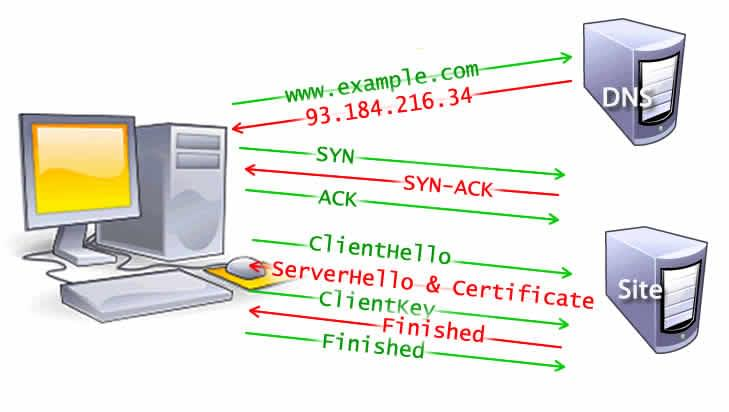

# Web性能优化方案

导致 Web 性能问题的原因主要有两种:
1.  **网络延迟**
2. **大部分情况下浏览器单线程执行**

### 网络延迟
网络延迟是将字节传输到计算机的时间

### 浏览器的单线程执行
浏览器在执行一个任务之前会从头到尾完成一个任务，然后才会接受另一个任务。

渲染时间非常关键,优化的考虑因素有:
1. 需要**确保主线程能够完成交给它的所有任务,例如:脚本执行、布局计算、重排（Reflow）和垃圾回收（Garbage Collection）**，并且始终能够处理用户交互。
2. 通过理解浏览器的单线程特性，并 **尽可能地减少主线程的责任**，可以提高网页性能，以确保渲染流畅，并且对交互的响应是即时的。

# 浏览器的工作原理

## 1. 导航

导航是加载 web 页面的第一步。

用户通过在地址栏**输入一个 URL、点击一个链接、提交表单**或者是其他的行为。

Web 性能优化的目标之一就是缩短导航完成所花费的时间，在理想情况下，它通常不会花费太多的时间，但是网络延迟和带宽会让它变久。

## 2. DNS 查询

导航的第一步是要去寻找页面资源的位置。

导航到 https://example.com，HTML 页面被定位到 IP 地址为 93.184.216.34 的服务器。

如果以前没有访问过这个网站，就需要进行 DNS 查询:
1.  浏览器向域名服务器发起 DNS 查询请求，最终得到一个 IP 地址。
- 第一次请求之后，这个 IP 地址会被缓存一段时间，通过从缓存里面检索 IP 地址来加速后续的请求.

2.  每个主机名 (hostname) 在页面加载时通常只需要进行一次 DNS 查询。但是，对于页面指向的不同的主机名，则需要多次 DNS 查询。
- 如果字体（font）、图像（image）、脚本（script）、广告（ads）和网站统计（metric）都有不同的主机名，则需要对每一个主机名进行 DNS 查询.

### 对于移动网络

DNS 查询可能存在性能问题。

当一个用户使用移动网络时，所有 DNS 查询必须从手机发送到基站，然后到达一个权威 DNS 服务器。
手机、信号塔、域名服务器之间的距离会显著增加延迟。

# 3. TCP 握手

一旦获取到服务器 IP 地址，**浏览器就会通过TCP“三次握手”与服务器建立连接。**意味着,当请求尚未发出的时候，终端与每台服务器之间还要来回多发送三条消息。

## TLS 协商

对于通过**HTTPS 建立的安全连接**，还需要另一次 "握手"。

这种握手为**TLS 协商**
- TLS协商中,决定使用哪种密码对通信进行加密
- 验证服务器，并在开始实际数据传输前建立安全连接。

这就需要在实际发送内容请求之前，再往返服务器五次。

建立安全连接的步骤增加了等待加载页面的时间，但建立一个安全的连接而增加延迟是值得的，因为 **在浏览器和 web 服务器之间传输的数据不可以被第三方解密。**



经过 8 次往返，浏览器终于可以发出请求。

# 4. 响应
一旦我们建立了和 web 服务器的连接，**浏览器就会代表用户发送一个初始的 HTTP GET 请求**，对于网站来说，这个请求通常是一个 **HTML文件**。

一旦服务器收到请求，它将使用相关的响应头和 HTML 的内容进行回复。

      <!doctype html>
      <html lang="zh-CN">
      <head>
          <meta charset="UTF-8" />
          <title>简单的页面</title>
          <link rel="stylesheet" href="styles.css" />
          <script src="myscript.js"></script>
      </head>
      <body>
          <h1 class="heading">我的页面</h1>
          <p>含有<a href="https://example.com/about">链接</a>的段落。</p>
          <div>
          
          </div>
          <script src="anotherscript.js"></script>
      </body>
      </html>

初始请求的响应包含所接收数据的第一个字节。

首字节时间（TTFB）是用户通过点击链接进行请求与收到第一个 HTML 数据包之间的时间。第一个内容分块通常是 14KB 的数据。

上面的示例中，这个请求肯定是小于 14KB 的，但是直到浏览器在解析阶段遇到链接时才会去请求链接的资源，下面有进行描述。

## 拥塞控制 / TCP 慢启动

在传输过程中，TCP 包被分割成段。

TCP 保证了数据包的顺序，服务器在发送一定数量的分段后，必须从客户端接收一个 ACK 包的确认。

两个性能方面的因素:
- 如果服务器在发送每个分段之后都等待 ACK，那么客户端将频繁地发送 ACK，并且可能会增加传输时间，即使在网络负载较低的情况下也是如此。

- 另一方面，一次发送过多的分段会导致在繁忙的网络中客户端无法接收分段并且长时间地只会持续发送 ACK，服务器必须不断重新发送分段的问题。

为了平衡传输分段的数量，**TCP 慢启动算法用于逐渐增加传输数据量，直到确定最大网络带宽，并在网络负载较高时减少传输数据量。**

# 5. 解析

一旦浏览器收到第一个数据分块，它就可以开始解析收到的信息。

**“解析”是浏览器将通过网络接收的数据转换为 DOM 和 CSSOM 的步骤，通过渲染器在屏幕上将它们绘制成页面。**

DOM 是浏览器标签的内部表示,但可以通过 JavaScript 中的各种 API 进行操作。

即使请求页面的 HTML 大于初始的 14KB 数据包，浏览器也将根据其拥有的数据开始解析并尝试渲染。

所以在前 14KB 中包含浏览器开始渲染页面所需的所有内容，或者至少包含页面模板（第一次渲染所需的 CSS 和 HTML）对于 web 性能优化来说是重要的。

但是在渲染到屏幕上面之前，HTML、CSS、JavaScript 必须被解析完成。

## 构建 DOM 树

第一步是处理 HTML标签并构造 DOM 树。
HTML 解析涉及到 **符号化(Tokenization)** 和 **DOM树的构造**。

### 符号化(Tokenization)
将 HTML 字符串拆解成一个个 Token(标记)

Token 不是 DOM 节点，而是 **带有类型和属性的临时对象**。主要类型有：

- **StartTagToken**：`<div>` 这样的开始标签
- **EndTagToken**：`</div>` 这样的结束标签
- **TextToken**：`<p>` 和 `</p>` 之间的文本内容
- **CommentToken**：`<!--` 和 `-->` 之间的注释内容
- **DoctypeToken**：`<!DOCTYPE html>` 这样的文档类型声明

这个阶段会**提取属性名和属性值**（比如 class="box" 被解析成键值对）。

示例：

输入 `<div id="main"><span>text</span></div>`
Token 序列大致为：

    StartTag:div (id:"main")
    StartTag:span
    Text:"text"
    EndTag:span
    EndTag:div

### 构造DOM树

解析器将 Token 按 HTML 嵌套规则组装成 DOM 树：

- **开始标记** → 创建 DOM 节点，压入栈中作为当前父节点。
- **文本标记** → 创建文本节点，挂载到当前父节点。
- **结束标记** → 弹出栈顶节点，闭合元素。

DOM 树以 `<html>` 为根节点，反映元素的层级关系。节点数量越多，建树耗时越长。

**解析过程中的资源处理：**
- 图片、CSS 等非阻塞资源：浏览器会请求并继续解析。
- **同步 `<script>`**（无 `async/defer`）：会阻塞 HTML 解析，暂停 DOM 构建。
- 预加载扫描器可缓解阻塞，但脚本过多仍是主要性能瓶颈。

# 预加载扫描器

---
DOM 构建在主线程进行，而**预加载扫描器**在后台并行工作：提前扫描 HTML，主动请求 CSS、JS、字体等高优先级资源，无需等主解析器读到引用位置。

这样，当主线程解析到资源引用时，文件可能已下载完成或正在下载中，从而**减少阻塞**。

示例：
```html
<link rel="stylesheet" href="styles.css" />
<script src="myscript.js" async></script>

<script src="anotherscript.js" async></script>
```
主线程解析 HTML/CSS 时，扫描器会提前下载脚本和图片。  
- 给脚本添加 `async` / `defer` 可避免阻塞解析。  
- CSS 下载不阻塞 HTML 解析，但会阻塞 JS 执行（因为 JS 常需查询 CSS 属性）。
--- 


# 构建 CSSOM 树
第二步：处理 CSS，构建 CSSOM 树。
CSSOM 与 DOM 是两棵独立的数据结构。

浏览器将 CSS 规则转换为样式映射：遍历每个规则集，根据 CSS 选择器构建包含父子、兄弟关系的节点树。

CSSOM 也包含用户代理样式表。浏览器从最通用的规则开始，递归地应用更具体的规则——这就是样式级联。

构建 CSSOM 非常快，在开发者工具中没有单独的颜色标识。

“重新计算样式”指标包含：**解析 CSS + 构建 CSSOM 树 + 递归计算样式的总时间。**

性能优化上，创建 CSSOM 的总耗时通常小于一次 DNS 查询，因此是相对容易实现优化的环节。


## 其他过程

### JavaScript 编译

在解析 CSS 和创建 CSSOM 的同时，包括 JavaScript 文件在内的其他资源也在下载（这要归功于预加载扫描器）。

JavaScript 会被解析、编译和解释:
1. 脚本被解析为抽象语法树。
2.  有些浏览器引擎会将抽象语法树输入编译器，输出字节码。

这就是所谓的 JavaScript 编译。大部分代码都是在主线程上解释的，但也有例外，例如在 web worker(ES6的api) 中运行的代码。


# 渲染

渲染包括：**样式 → 布局 → 绘制 → 合成**（部分情况）。

DOM 树 + CSSOM 树 → **渲染树**（只包含可见节点：排除 `<head>`、`display: none`，但包含 `visibility: hidden`）。  

1.  遍历渲染树，为每个可见节点匹配 CSSOM 规则，得到**计算样式**。
2.  **布局**：计算渲染树中每个节点的几何尺寸和位置。以视口为基础，从 body 开始确定所有盒模型大小。未知尺寸的替换元素（如图片）会预留占位符，图片加载后可能触发**重排**。
3.  **绘制**：将每个盒子转换为屏幕像素。首次绘制称为**首次有意义的绘制**。为保证流畅（60fps），所有主线程操作（样式、布局、绘制）需在 **16.67ms** 内完成。
4.  **分层与合成**：浏览器可将元素提升至 GPU 专用层（如 `video`、`canvas`、`opacity`、`3D transform`、`will-change`），减少主线程负担。分层提升性能但消耗内存，不宜滥用。当图层重叠时需**合成**以确保正确顺序。

# 交互

**可交互时间（TTI）**：从首次请求到页面能在 **50ms** 内响应用户交互。  
若主线程忙于解析/编译/执行 JS（如大脚本慢速加载），则无法及时响应滚动、触摸等操作，造成糟糕体验。应避免脚本长期占用主线程。
