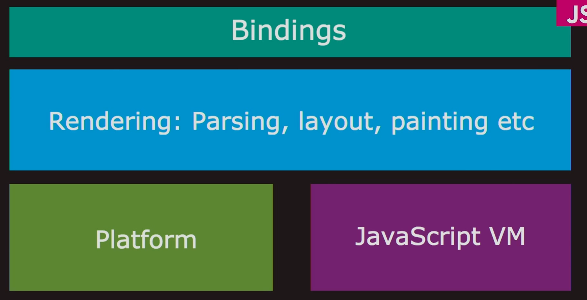

# 剖析Chorome浏览器的核心架构分层

## 首先,先了解一下Chorome 浏览器中,渲染的分层位置

这是一个**分层、解耦、职责明确**的模块化架构，从下到上分为 4 个核心层级，各层职责严格分离，通过标准化接口通信：

| 层级 | 颜色 | 核心定位 | 核心作用 |
| :--- | :---: | :--- | :--- |
| 底层 |  绿色 (Platform) | 平台抽象层 | 屏蔽操作系统差异，提供底层能力 |
| 底层 |  紫色 (JavaScript VM) | JS 执行引擎 | 执行 JS 代码，管理 JS 堆 / 调用栈 |
| 中层 |  蓝色 (Rendering) | 渲染引擎 | 解析 HTML/CSS/JS，完成页面布局、绘制、合成 |
| 上层 |  青绿色 (Bindings) | 绑定层 | 桥接 JS 引擎与渲染引擎，暴露 Web API |

# 各层的定义,关键作用和内在联系

1. **底层双核心：Platform（平台抽象层） + JavaScript VM（JS 虚拟机）**
这两个是浏览器的**底层执行底座**，并行运行，互不阻塞。

# Platform（平台抽象层）

**定义:** Chrome 浏览器的**底层平台抽象层**，也叫「Browser Platform Abstraction Layer」，是**浏览器内核与操作系统**之间的中间层。

**核心作用:**

1.  **跨平台兼容**：屏蔽 Windows、macOS、Linux、Android 等不同操作系统的 API 差异，让上层渲染引擎、JS 引擎无需关心底层系统细节，实现「一次编写，多平台运行」。

2.  **提供底层基础能力**：封装了网络请求、文件 I/O、线程管理、内存管理、定时器、硬件加速、系统事件（鼠标 / 键盘输入）等所有底层能力。

3.  **多线程调度**：管理浏览器的多线程模型（如渲染线程、网络线程、IO 线程、Web API 线程池），是 Web API 线程池的底层载体。

**核心关系:**

为上层的 **Rendering（渲染引擎）**和 JavaScript VM（JS 引擎）提供底层支撑，所有上层能力都依赖 **Platform 封装的系统接口。**

# JavaScript VM（JS 虚拟机）

**定义:** Chrome 内置的 V8 JavaScript 引擎,是执行JS代码的核心虚拟机.

**核心作用:**

1.  **JS 代码执行**：负责解析、编译、执行 JS 代码，管理 JS 调用栈、作用域、原型链、垃圾回收（GC）等核心逻辑。

2.  **JS 堆内存管理**：分配和回收 JS 对象的堆内存，处理闭包、变量提升、异步任务等 JS 执行机制。

3.  **Web API 回调调度**：接收来自 Bindings 层的 Web API 回调，将其推入事件循环的任务队列（宏任务 / 微任务），由**事件循环调度**执行。

**核心关系:**

与 **Platform 层**：依赖 Platform 提供的线程、内存、定时器等底层能力运行。

与 **Bindings 层**：通过 Bindings 桥接，调用渲染引擎的 DOM 操作、Web API 等能力；同时 **Bindings** 把 JS 引擎的执行结果反馈给渲染引擎。

与 **Rendering 层**：通过 Bindings 层间接交互，JS 引擎执行的 DOM 操作会通过 Bindings 传递给渲染引擎执行。

# 中层核心：Rendering（渲染引擎）

**定义:**
Chrome 的 **Blink 渲染引擎（基于 WebKit fork）**，是浏览器页面渲染的核心模块，也是我们常说的「浏览器内核」的核心组成。

**核心作用:**

1.  **解析（Parsing）：**
- 解析 HTML 生成 DOM 树，解析 CSS 生成 CSSOM 树，合并为渲染树（Render Tree）。
- 解析 JS 代码（但 JS 执行由 V8 引擎完成，渲染引擎仅负责加载和触发执行）。

2.  **布局（Layout / Reflow）：** 根据渲染树计算每个元素的几何位置（宽高、坐标），生成布局树。

3.  **绘制（Painting / Repaint）：** 根据布局树，将元素的样式（颜色、背景、阴影等）绘制到图层上。

4.  **合成（Compositing）：** 将多个图层合并为最终的页面画面，输出到屏幕（GPU 加速）。

5.  **其他能力：** DOM 操作、CSS 样式计算、动画处理、事件分发等。

**核心关系**

- 依赖 **Platform 层**的网络、线程、硬件加速等能力完成渲染。
- 通过 **Bindings 层**与 JS 引擎交互：JS 引擎通过 Bindings 调用渲染引擎的 DOM API，渲染引擎将 DOM 事件（如点击）通过 Bindings 传递给 JS 引擎,然后通过事件循环机制执行回调。

# 上层桥接：Bindings（绑定层）

**定义:**
**JS 绑定层（JavaScript Bindings）**，也叫「Web API 绑定层」，是 JS 引擎与渲染引擎之间的**核心桥接层**，是 Chrome 中 Blink 与 V8 交互的关键模块。

**核心作用:**

1.  **桥接双向通信：** 打通 JS 引擎（V8）与渲染引擎（Blink）的隔离，让 JS 可以调用浏览器的渲染能力，让渲染引擎可以触发 JS 回调。

2.  **暴露 Web API：** 将渲染引擎、Platform 层的能力封装为标准 Web API（如 setTimeout、fetch、DOM API、Canvas API 等），暴露给 JS 引擎，让 JS 可以调用浏览器的原生能力。

3.  **类型转换与安全隔离：** 在 JS 类型（V8 的对象模型）与 C++ 类型（Blink 的 DOM 对象模型）之间做转换，同时做安全校验，防止非法操作。

4.  **事件循环调度：** 管理 Web API 线程池的任务回调，将异步任务（如定时器、网络请求）的结果传递给 JS 引擎的事件循环。

核心关系:
是 **Rendering 层**与 **JavaScript VM 层**的唯一通信桥梁，所有 JS 操作 DOM、调用 Web API 的行为，都必须经过 Bindings 层。

依赖 **Platform 层**的底层能力，封装 Web API 供 JS 调用。

# 各层级完整交互流程（以「点击按钮」为例）

用一个完整的用户操作，把所有层级的关系串起来：

1.  **Platform 层**：接收操作系统的鼠标点击事件，分发给渲染引擎。

2.  **Rendering 层**：识别点击的 DOM 元素（按钮），生成C++的事件对象，通过 Bindings 层传递给 JS 引擎。

3.  **Bindings 层**：将 C++ 事件对象转换为 JS 事件对象，并将事件对象推入 JS 引擎的事件循环任务队列。
4.  **JavaScript VM 层**：让**事件循环调度执行按钮的 onclick 回调函数**，执行 JS 代码（如修改 DOM 样式）。

5.  **Bindings 层**：将 JS 的 DOM 操作转换为 C++ 调用，传递给渲染引擎。

6.  **Rendering 层**：执行重排（Layout）、重绘（Painting）、合成（Compositing），更新页面。

7.  **Platform 层**：将最终的画面输出到屏幕，完成交互。
