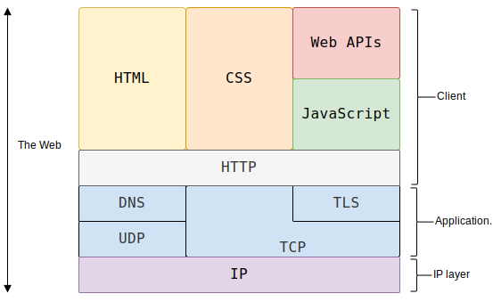

# HTTP协议

## 超文本传输协议（HTTP）是一个用于传输超媒体文档（例如 HTML）的OSI模型中的应用层协议。它是为 Web 浏览器与 Web 服务器之间的通信而设计的。HTTP 遵循经典的客户端—服务端模型(C/S模型)，客户端打开一个连接以发出请求，然后等待直到收到服务器端响应。HTTP 是无状态协议，这意味着服务器不会在两个请求之间保留任何数据（状态）。

有几个概念需要理清:

**1.  应用层**

- 应用层（英语：Application layer）位于OSI模型的第七层。
- 应用层直接和应用程序接口结合，并提供常见的网络应用服务。应用层也向第六层表示层发出请求。

**2.  客户端-服务端模型**
- 客户端-服务器架构（英语：Client-server model），也称C/S架构、主从zòng式架构[1]，是一种将客户端与服务器分割开来的分布式架构。[2]每一个客户端软件的实例都可以向一个服务器或应用程序服务器发出请求。有很多不同类型的服务器，例如文件服务器、游戏服务器等。

**3. 无状态协议**

无状态服务器是指一种把每个请求作为与之前任何请求都无关的独立的事务的服务器。也就是指一种把每个请求作为与之前任何请求都无关的独立的事务的服务器。
也叫做---**失忆服务器**

如何保留状态: 
- Cookie（浏览器自动带）
- Token（JWT）放在 Header
- Session ID

# HTTP 概述

**HTTP 是一种用作获取诸如 HTML 文档这类资源的协议。**
它是 Web 上进行任何数据交换的基础，同时，也是一种客户端—服务器（client-server）协议，也就是说，请求是由接受方——通常是 Web 浏览器——发起的。
**完整网页文档通常由文本、布局描述、图片、视频、脚本等资源**构成。

客户端与服务端之间通过交换一个个独立的消息（而非数据流）进行通信。由客户端发出的消息被称作请求（request），由服务端发出的应答消息被称作响应（response）。

万维网（The Web）的技术栈分层架构图:

## 基于 HTTP 的系统的组成

**HTTP 是一个客户端—服务器协议**：请求由一个实体，即 **用户代理（user agent），或是一个可以代表它的代理方（proxy）**发出。大多数情况下，这个用户代理都是一个 Web 浏览器，不过它也可能是任何东西，比如一个爬取网页来充实、维护搜索引擎索引的机器爬虫。

每个请求都会被发送到一个服务器，它会处理这个请求并提供一个称作响应的回复。在客户端与服务器之间，还有许许多多的被称为代理的实体，履行不同的作用，例如充当网关或缓存。

### 客户端：用户代理

用户代理是任何能够代表用户行为的工具。这类工具以浏览器为主，不过，它也可能是工程师和 Web 开发人员调试应用所使用的那些程序。

浏览器总是首先发起请求的那个实体，永远不会是服务端（不过，后来已经加入了一些机制，能够模拟出由服务端发起的消息）。

为了展现一个网页，需执行一下操作:
1.  浏览器需要通过URL发送最初的请求来获取描述这个页面的 HTML 文档。
2. 解析文档，并发送数个其他请求，相应地获取可执行脚本、展示用的布局信息（CSS）以及其他页面内的子资源（一般是图片和视频等）。
3. Web 浏览器将这些资源整合到一起，展现出一个完整的文档，即网页。在之后的阶段，浏览器中执行的脚本可以获取更多资源，并且浏览器会相应地更新网页。

### Web 服务器

在上述通信过程的另一侧是服务器，它负责提供客户端所请求的文档。服务器可以表现为仅有一台机器，但实际上，它可以是共享负载的一组服务器集群（负载均衡）或是其他类型的软件（如缓存、数据库服务、电商服务等），按需完整或部分地生成文档。

### 代理

在 Web 浏览器和服务器之间，有许多计算机和设备参与传递了 HTTP 消息。依靠 Web 技术栈的层次化的结构，传递过程中的多数操作都位于传输层、网络层或物理层，它们对于 HTTP 应用层而言就是透明的，并默默地对网络性能产生着重要影响。还有一部分实体在应用层参与消息传递，一般被称为代理（Proxy）。

代理可以是透明的，即转发它们收到的请求并不做任何修改，也可以表现得不透明，将它传递给服务端之前使用一些手段修改这个请求。代理可以发挥很多种作用：

- 缓存（可以是公开的也可以是私有的，如浏览器的缓存）
- 过滤（如反病毒扫描、家长控制...）
- 负载均衡（让多个服务器服务不同的请求）
- 认证（控制对不同资源的访问）
- 日志（使得代理可以存储历史信息）

## HTTP 的基本性质

1.  HTTP 是简约的,HTTP 被设计得简单且易读

2.  HTTP 是可扩展的,在 HTTP/1.0 中引入的 HTTP 标头(header)让该协议易于扩展和实验。

3.  HTTP 无状态，但并非无会话

HTTP 是无状态的：在同一个连接中，两个执行成功的请求之间是没有关系的。
尽管 HTTP 根本上来说是无状态的，但借助 HTTP Cookie 就可使用有状态的会话。利用标头的扩展性，HTTP Cookie 被加进了协议工作流程，每个请求之间就能够创建会话，让每个请求都能共享相同的上下文信息或相同的状态。

### HTTP 和连接
在互联网两个最常用的传输协议中，TCP 是可靠的而 UDP 不是。HTTP 因此而依靠于 TCP 的标准，即面向连接的。

在客户端与服务器能够传递请求、响应之前，这两者间必须建立 TCP 连接，这个过程需要多次往返交互。HTTP/1.0 默认为每一对 HTTP 请求/响应都打开一个单独的 TCP 连接。当需要接连发起多个请求时，工作效率相比于它们之间共享同一个 TCP 连接要低。

# HTTP 能控制什么

- **缓存**：文档如何被缓存可以通过 HTTP 来控制。服务端能指示代理和客户端缓存哪些内容以及缓存多长时间，客户端能够指示中间的缓存代理来忽略已存储的文档。
- **开放同源限制**：为了阻止网络窥听和其它侵犯隐私的问题，Web 浏览器强制在不同网站之间做了严格分割。只有来自于相同来源（same origin）的网页才能够获取一个网页的全部信息。这种限制有时对服务器是一种负担，服务器的 HTTP 标头可以减弱此类严格分离，使得一个网页可以是由源自不同地址的信息拼接而成。某些情况下，放开这些限制还有安全相关的考虑。
- **认证**：一些页面可能会被保护起来，仅让特定的用户进行访问。基本的认证功能可以直接由 HTTP 提供，既可以使用 WWW-Authenticate 或其他类似的标头，也可以用 HTTP cookie 来设置一个特定的会话。
- **代理服务器和隧道**：服务器或客户端常常是处于内网的，对其他计算机隐藏真实 IP 地址。因此 HTTP 请求就要通过代理服务器越过这个网络屏障。并非所有的代理都是 HTTP 代理，例如，SOCKS 协议就运作在更底层。其他的协议，比如 ftp，也能够被这些代理处理。
- **会话**：使用 HTTP Cookie 可以利用服务端的状态将不同请求联系在一起。这就创建了会话，尽管 HTTP 本身是无状态协议。这不仅仅对电商平台购物车很有用，也让任何网站都能够允许用户自由定制内容了。

# HTTP 工作流

当客户端想要和服务器——不管是最终的服务器还是中间的代理——进行信息交互时，过程表现为下面几步：

1.  打开一个 TCP 连接：TCP 连接被用来发送一条或多条请求，以及接受响应消息。客户端可能打开一条新的连接，或重用一个已经存在的连接，或者也可能开几个新的与服务器的 TCP 连接。

2.  发送一个 HTTP 报文：HTTP 报文（在 HTTP/2 之前）是人类可读的。在 HTTP/2 中，这些简单的消息被封装在了帧中，这使得报文不能被直接读取，但是原理仍是相同的。例如：

    GET / HTTP/1.1
    Host: developer.mozilla.org
    Accept-Language: zh

3.  读取服务端返回的报文信息：

    HTTP/1.1 200 OK
    Date: Sat, 09 Oct 2010 14:28:02 GMT
    Server: Apache
    Last-Modified: Tue, 01 Dec 2009 20:18:22 GMT
    ETag: "51142bc1-7449-479b075b2891b"
    Accept-Ranges: bytes
    Content-Length: 29769
    Content-Type: text/html
    
    <!DOCTYPE html>…（此处是所请求网页的 29769 字节）

4.  关闭连接或者为后续请求重用连接。

# HTTP 报文

HTTP/1.1 以及更早的 HTTP 协议报文都是语义可读的。

在 HTTP/2 中，这些报文被嵌入到了一个新的二进制结构，帧。帧允许实现很多优化，比如报文标头的压缩以及多路复用。

即使只有原始 HTTP 报文的一部分以 HTTP/2 发送出来，每条报文的语义依旧不变，客户端会重组原始 HTTP/1.1 请求。因此用 HTTP/1.1 格式来理解 HTTP/2 报文仍旧有效。

## 请求
HTTP 请求的一个例子：
图片
HTTP 方法，通常是由一个动词，像 GET、POST 等，或者一个名词，像 OPTIONS、HEAD 等，来定义客户端执行的动作。

典型场景有：客户端意图获取某个资源（使用 GET）；发送 HTML 表单的参数值（使用 POST）；以及其他情况下需要的那些其他操作。

要获取的那个资源的路径——去除了当前上下文中显而易见的信息之后的 URL，比如说，它不包括协议（http://）、域名（这里是 developer.mozilla.org），或是 TCP 的端口（这里是 80）。

HTTP 协议版本号。

为服务端表达其他信息的可选标头(header)。

请求体（body），类似于响应中的请求体，一些像 POST 这样的方法，请求体内包含需要了发送的资源。

## 响应

HTTP 响应的一个例子：
图片
响应报文包含了下面的元素：

-   HTTP 协议版本号。
-   状态码，来指明对应请求已成功执行与否，以及不成功时相应的原因。
-   状态信息，这个信息是一个不权威、简短的状态码描述。
-   HTTP 标头，与请求标头类似。
-   可选项，一个包含了被获取资源的主体。

# 基于 HTTP 的 API

**Fetch API** 是基于 HTTP 的最常用 API，其可用于在 JavaScript 中发起 HTTP 请求。Fetch API 取代了 XMLHttpRequest API。

另一种 API，server-sent 事件，是一种单向服务，允许服务端借助作为 HTTP 传输机制向客户端发送事件。

# 总结
HTTP 是一种简单、易用、具有可扩展性的协议，其客户端—服务器模式的结构，加上能够增加标头的能力，使得 HTTP 随 Web 中不断扩展的能力一起发展。

虽然增加了一些复杂度——为了提高性能，HTTP/2 将 HTTP 报文嵌入到帧中——但是报文的基本结构自 HTTP/1.0 起仍保持不变
