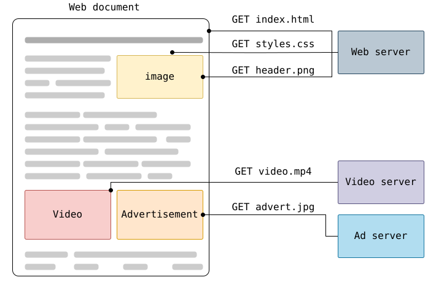
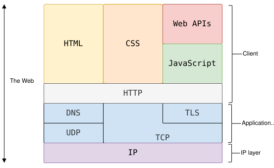
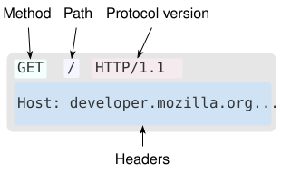
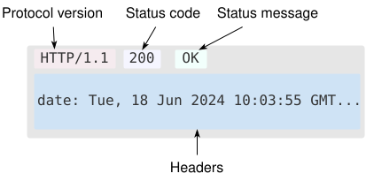

> 本文整理自 MDN 官方文档《HTTP》与《HTTP 概述》，梳理 HTTP 协议的核心概念、系统组成与工作机制。

## 一、HTTP 是什么

**超文本传输协议（HTTP）** 是用于传输超媒体文档（例如 HTML）的 **OSI 模型应用层协议**，专为 Web 浏览器与 Web 服务器之间的通信而设计。

HTTP 有两个核心特征：

- 遵循经典的**客户端—服务端模型（C/S 模型）**：客户端打开一个连接发出请求，然后等待直到收到服务器端响应
- 是**无状态协议**：服务器不会在两个请求之间保留任何数据（状态）

### 1. 应用层

- 应用层位于 **OSI 模型的第七层**
- 直接与应用程序接口结合，提供常见的网络应用服务，并向第六层表示层发出请求

### 2. 客户端—服务端模型

- 也称 **C/S 架构、主从式架构**，是一种将客户端与服务器分割开来的**分布式架构**
- 每一个客户端软件的实例都可以向一个服务器或应用程序服务器发出请求
- 服务器类型多种多样，例如文件服务器、游戏服务器等

### 3. 无状态协议

- 无状态服务器把**每个请求都作为与之前任何请求无关的独立事务**来处理
- 也叫做——**"失忆服务器"**

:::tip
无状态 ≠ 无法保留状态。HTTP 可以通过以下机制维持会话状态：
- **Cookie**（浏览器自动携带）
- **Token（JWT）**，放在 Header 中
- **Session ID**
:::

## 二、HTTP 概述

**HTTP 是一种用于获取诸如 HTML 文档这类资源的协议**，是 Web 上进行任何数据交换的基础，也是一种客户端—服务器协议——请求由接受方（通常是 Web 浏览器）发起。

**完整网页文档通常由文本、布局描述、图片、视频、脚本等资源构成**：



客户端与服务端之间通过交换一个个**独立的消息（而非数据流）**进行通信：

- 客户端发出的消息称为**请求（request）**
- 服务端发出的消息称为**响应（response）**

万维网（The Web）的技术栈分层架构：



## 三、基于 HTTP 的系统的组成

**HTTP 是客户端—服务器协议**：请求由**用户代理（user agent）**发出——大多数情况下是 Web 浏览器，也可能是爬虫等任何实体；每个请求被发送到**服务器**，服务器处理后返回**响应**。在客户端与服务器之间，还有大量被称为**代理（proxy）**的实体，承担网关、缓存等不同职责。

### 1. 客户端：用户代理

- 用户代理是任何能够代表用户行为的工具，以浏览器为主，也包括工程师和 Web 开发人员调试应用所使用的那些程序
- **浏览器总是首先发起请求的一方**，永远不会是服务端（虽然后来加入了一些机制，能够模拟出由服务端发起的消息）

展现一个网页需要执行以下操作：

1. 浏览器通过 URL 发送最初的请求，获取描述页面的 **HTML 文档**
2. 解析文档，并发送数个其他请求，获取**可执行脚本**、**布局信息（CSS）**以及其他页面内的子资源（一般是图片和视频）
3. 浏览器将这些资源整合，展现完整的网页；之后浏览器中执行的脚本可以继续获取更多资源，并相应地更新网页

### 2. Web 服务器

服务器负责提供客户端所请求的文档。它可以是单台机器，也可以是**共享负载的服务器集群（负载均衡）**，或其他类型的软件（如缓存、数据库服务、电商服务等），按需完整或部分地生成文档。

### 3. 代理（Proxy）

在 Web 浏览器和服务器之间，许多计算机和设备参与传递 HTTP 消息。依靠 Web 技术栈的层次化结构，多数操作位于**传输层、网络层或物理层**，对 HTTP 应用层透明；还有一部分实体在**应用层**参与消息传递，即**代理（Proxy）**。

代理可以是**透明**的（原样转发收到的请求、不做任何修改），也可以**不透明**（在传递给服务端之前修改请求）。代理可以发挥很多种作用：

- **缓存**（公开或私有，如浏览器缓存）
- **过滤**（如反病毒扫描、家长控制）
- **负载均衡**（让多个服务器服务不同的请求）
- **认证**（控制对不同资源的访问）
- **日志**（存储历史信息）

## 四、HTTP 的基本性质

1. **简约**——HTTP 被设计得简单且易读
2. **可扩展**——HTTP/1.0 中引入的 **HTTP 标头（header）** 让协议易于扩展和实验
3. **无状态，但并非无会话**——在同一个连接中，两个执行成功的请求之间没有关系；但借助 **HTTP Cookie** 可以创建有状态的会话，利用标头的扩展性，让每个请求共享相同的上下文信息或相同的状态

:::warning
**HTTP 依赖可靠的 TCP**：TCP 是面向连接的、可靠的传输协议，而 UDP 不是。在客户端与服务器传递请求、响应之前，必须先建立 TCP 连接，这个过程需要多次往返交互。
- HTTP/1.0 默认为每一对请求/响应都打开**单独的 TCP 连接**，需要接连发起多个请求时，效率远低于共享同一个 TCP 连接
:::

## 五、HTTP 能控制什么

- **缓存**——服务端能指示代理和客户端缓存哪些内容、缓存多长时间；客户端能指示中间的缓存代理忽略已存储的文档
- **开放同源限制**——为阻止网络窥听和其他侵犯隐私的问题，浏览器强制在不同网站之间做了严格分割，只有**同源（same origin）**的网页才能获取一个网页的全部信息；服务器的 HTTP 标头可以减弱这种分割，使网页由不同地址的信息拼接而成，某些情况下放开限制还有安全相关的考虑
- **认证**——一些页面可以被保护起来，仅允许特定用户访问；基本认证功能可以直接由 HTTP 提供（如 **WWW-Authenticate** 标头），也可以用 HTTP Cookie 设置特定会话
- **代理服务器和隧道**——内网中的服务器或客户端通过代理服务器越过网络屏障；并非所有代理都是 HTTP 代理（如 **SOCKS** 协议运作在更底层），ftp 等其他协议也能被这些代理处理
- **会话**——使用 HTTP Cookie 利用服务端状态将不同请求联系在一起，创建会话；这不仅是电商购物车的基础，也让任何网站都能允许用户自由定制内容

## 六、HTTP 工作流

当客户端想要与服务器（最终的服务器或中间的代理）交互时，过程表现为以下四步：

1. **打开 TCP 连接**——用于发送一条或多条请求、接受响应消息；客户端可能打开一条新连接、重用已有连接，或开几条新的连接

2. **发送 HTTP 报文**——HTTP/2 之前的报文是人类可读的；HTTP/2 中报文被封装在帧中，虽不能直接读取，但原理相同：

```http
GET / HTTP/1.1
Host: developer.mozilla.org
Accept-Language: zh
```

3. **读取服务端返回的报文**：

```http
HTTP/1.1 200 OK
Date: Sat, 09 Oct 2010 14:28:02 GMT
Server: Apache
Last-Modified: Tue, 01 Dec 2009 20:18:22 GMT
ETag: "51142bc1-7449-479b075b2891b"
Accept-Ranges: bytes
Content-Length: 29769
Content-Type: text/html

<!DOCTYPE html>…（此处是所请求网页的 29769 字节）
```

4. **关闭连接，或为后续请求重用连接**

## 七、HTTP 报文

HTTP/1.1 及更早版本的报文是**语义可读**的。在 HTTP/2 中，报文被嵌入到一个新的二进制结构——**帧**，帧允许实现很多优化，比如报文标头的压缩以及多路复用。

:::tip
即使原始 HTTP 报文只有一部分以 HTTP/2 发送，**每条报文的语义依旧不变**，客户端会重组出原始的 HTTP/1.1 请求——因此用 HTTP/1.1 格式来理解 HTTP/2 报文依然有效。
:::

### 1. 请求

HTTP 请求的一个例子：



请求报文包含以下元素：

- **HTTP 方法**——通常由动词（GET、POST 等）或名词（OPTIONS、HEAD 等）定义客户端要执行的动作；典型场景：用 **GET** 获取资源、用 **POST** 发送 HTML 表单的参数值
- **目标资源路径**——去除当前上下文中显而易见的信息之后的 URL（不包括协议 `http://`、域名、TCP 端口）
- **HTTP 协议版本号**
- **可选标头（header）**——为服务端表达其他信息
- **请求体（body）**——类似响应体；像 POST 这样的方法，请求体内包含需要发送的资源

### 2. 响应

HTTP 响应的一个例子：



响应报文包含以下元素：

- **HTTP 协议版本号**
- **状态码**——指明对应请求是否成功执行，以及不成功时相应的原因
- **状态信息**——简短、不权威的状态码描述
- **HTTP 标头**——与请求标头类似
- **可选的主体**——包含被获取的资源

## 八、基于 HTTP 的 API

- **Fetch API**——基于 HTTP 的最常用 API，用于在 JavaScript 中发起 HTTP 请求，取代了 **XMLHttpRequest** API
- **Server-Sent Events（SSE）**——一种单向服务，允许服务端借助 HTTP 作为传输机制向客户端推送事件

## 总结

**HTTP 是一种简单、易用、具有可扩展性的协议**。它的客户端—服务器模式结构，加上能够增加标头的能力，使得 HTTP 随 Web 中不断扩展的能力一起发展。

:::tip
虽然 HTTP/2 为了提高性能将 HTTP 报文嵌入帧中、增加了一些复杂度，但**报文的基本结构自 HTTP/1.0 起保持不变**。
:::

> 资料来源：[MDN — HTTP](https://developer.mozilla.org/zh-CN/docs/Web/HTTP) 与 [MDN — HTTP 概述](https://developer.mozilla.org/zh-CN/docs/Web/HTTP/Overview)
