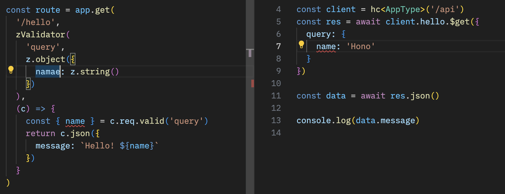

# RPC

Hono 的 RPC 功能允许在几乎不修改代码的情况下共享 API 规范。由 hc 生成的客户端将读取规范并安全地访问端点。

## 与传统 RPC 的区别

传统 RPC（如 gRPC）：基于 IDL（接口定义语言）生成代码，需单独维护协议文件，流程较重。

Hono RPC：基于 TypeScript 类型系统，直接复用服务端路由与校验逻辑，零额外契约文件，轻量且与 REST API 无缝兼容。

核心组件(Hono Stack):

- Hono - API Server (服务端API框架, 定义路由业务逻辑)
- Zod + Zod Validator Middleware (校验请求参数,生成强类型)
- hc - HTTP Client(客户端生成)

# 编写API

    import { Hono } from 'hono'
    
    const app = new Hono()
    
    app.get('/hello', (c) => {
      return c.json({
        message: `Hello!`,
      })
    })

# 使用 Zod 进行验证
使用 Zod 进行验证以获取查询参数的值。

    import { zValidator } from '@hono/zod-validator'
    import * as z from 'zod'
    
    app.get(
      '/hello',
      zValidator(
        'query',
        z.object({
          name: z.string(),
        })
      ),
      (c) => {
        const { name } = c.req.valid('query')
        return c.json({
          message: `Hello! ${name}`,
        })
      }
    )

# 分享类型

    const route = app.get(
      '/hello',
      zValidator(
        'query',
        z.object({
          name: z.string(),
        })
      ),
      (c) => {
        const { name } = c.req.valid('query')
        return c.json({
          message: `Hello! ${name}`,
        })
      }
    )
    
    export type AppType = typeof route

取出这个路由的TypeScript 类型定义。暴露客户端使用

# 客户端

通过将 AppType 类型作为泛型传递给 hc 来创建一个客户端对象。

    import { AppType } from './server'
    import { hc } from 'hono/client'
    
    const client = hc<AppType>('/api')
    const res = await client.hello.$get({
      query: {
        name: 'Hono',
      },
    })

**Response 与 fetch API 兼容，但可以使用 json() 检索的数据具有类型。**

共享 API 规范意味着可以了解服务器端的变化。

