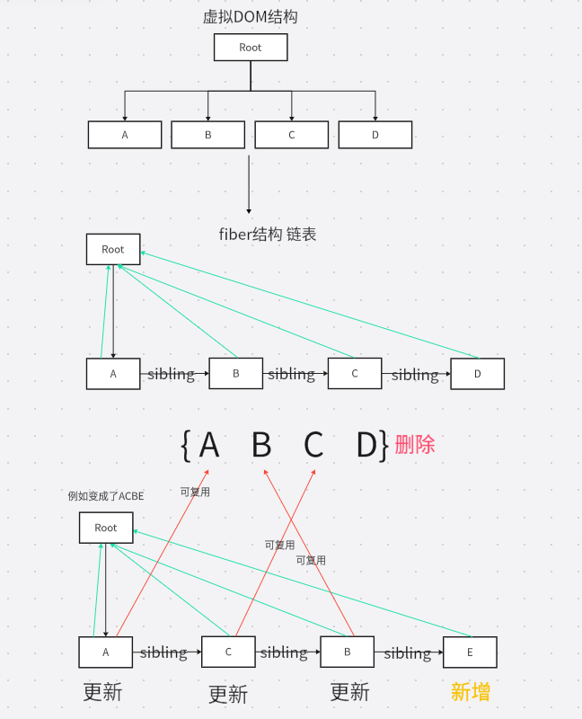

[学习底层原理之前,简单了解一下React的具体工作流程](React-library.md)
# React Fiber

## React Fiber 是 React 16 重写的「协调引擎（Reconciler）」，本质是一套基于链表结构、可中断、可恢复、带优先级的异步渲染调度机制，用来解决旧架构同步递归渲染阻塞主线程的问题。

## Fiber 的作用

**React15当中的缺陷:**
1.  传统虚拟 DOM 渲染、Diff 是同步递归；
2.  递归一旦开始，不能暂停、不能中断、不能插队；
3.  组件树庞大时，JS 计算耗时过长,阻塞主线程；
4.  主线程阻塞 → 页面卡顿、点击无响应、动画卡死。

fiber就是为了解决这些问题,它实现了4个具体目标:

1.  可中断的渲染：Fiber 允许将大的渲染任务拆分成多个小的工作单元（Unit of Work），使得 React 可以在空闲时间执行这些小任务。当浏览器需要处理更高优先级的任务时（如用户输入、动画），可以暂停渲染，先处理这些任务，然后再恢复未完成的渲染工作。

2. 优先级调度：在 Fiber 架构下，React 可以根据不同任务的优先级决定何时更新哪些部分。React 会优先更新用户可感知的部分（如动画、用户输入），而低优先级的任务（如数据加载后的界面更新）可以延后执行。

3. 双缓存树（Fiber Tree）：Fiber 架构中有两棵 Fiber 树: 
- current fiber tree（当前正在渲染的 Fiber 树)
- work in progress fiber tree（正在处理的 Fiber 树）。

React 使用这两棵树来保存更新前后的状态，从而更高效地进行比较和更新。

4. 任务切片：在浏览器的空闲时间内（利用 requestIdleCallback思想），React 可以将渲染任务拆分成多个小片段，逐步完成 Fiber 树的构建，避免一次性完成所有渲染任务导致的阻塞。

# Fiber中的双缓存

首先,双缓存是计算机图形学里非常经典的渲染优化手段：

- 前台缓存（Front Buffer）：正在屏幕上显示的画面。
- 后台缓存（Back Buffer）：在内存里悄悄绘制的下一帧画面。

当我们使用canvas进行绘画时,清空画布到新画面绘制完成存在时间差，会出现画面闪烁、白屏问题。

## React 16+ Fiber 架构里，同一时间内存里常驻两棵 Fiber 树：

1. Current Fiber Tree(当前树),表示当前正在渲染的fiber树
2. WorkInProgress Fiber Tree（WIP 树 / 工作树）:表示更新过程中新生成的fiber树，也就是渲染的下一次UI状态

两棵树通过 **alternate 指针**互相指向对方:
    
    currentFiber.alternate === workInProgressFiber
    workInProgressFiber.alternate === currentFiber

# 任务切片机制

**任务切片（Time Slicing）是 React Fiber 架构的核心能力：把超大的同步渲染任务**，拆成**5ms 左右的小任务单元**，在浏览器每一帧（约 16.6ms）的空闲时间里分片执行，可随时中断、恢复、优先级插队，保证主线程不被长期阻塞，页面永远可响应。

## 浏览器要在一帧做什么? 

1.  处理事件的回调click...事件
2.  处理计时器的回调
3.  开始帧
4.  执行requestAnimationFrame 动画的回调
5.  计算机页面布局计算 合并到主线程
6.  绘制
7.  如果此时还有空闲时间，执行**requestIdleCallback**

补充知识:
[requestIdleCallback介绍](react-schdule.md)

*个人理解,就是利用浏览器在一帧内处理,解析,布局,重绘,布局,合成等任务后,利用执行操作后的剩余时间去进行fiber树的解析,diff计算. 有点就像,你完成了老板的规定时间内的任务,然后拿剩余的一点时间去看开心元元.*

## 相关问题: 
### 1. 每次帧的剩余时间不够怎么办？
- **直接暂停，任务 “挂起”，下一帧继续**,不阻塞当前帧的主线程，浏览器依然能响应用户交互。
- **设置 timeout 兜底，防止任务“饿死**,requestIdleCallback 支持一个 timeout 参数，比如 { timeout: 1000 },设置任务超过1000ms都没剩余时间执行,浏览器强制在下一帧执行

## performUnitOfWork(执行工作单元)函数

performUnitOfWork = 处理一个 Fiber 工作单元 + 构建子 Fiber 链表 + 返回下一个要处理的 Fiber

    // 执行一个工作单元
    function performUnitOfWork(fiber) {
        // 如果没有 DOM 节点，为当前 Fiber 创建 DOM 节点
        if (!fiber.dom) {
            fiber.dom = createDom(fiber);
        }
        //确保每个 Fiber 节点都在内存中有一个对应的 DOM 节点准备好，以便后续在提交阶段更新到实际的 DOM 树中
    
        // 创建子节点的 Fiber
        // const vdom = React.createElement('div', { id: 1 }, React.createElement('span', null, '帝师'));
        // 子节点在children中
        const elements = fiber.props.children;
        reconcileChildren(fiber, elements);
    
        // 返回下一个工作单元（child, sibling, or parent）
        if (fiber.child) {
            return fiber.child;
        }
    
        let nextFiber = fiber;
        while (nextFiber) {
            if (nextFiber.sibling) {
                return nextFiber.sibling;
            }
            nextFiber = nextFiber.parent;
        }
        return null;
    }

# diff 算法

## reconcileChildren函数

拿着新的虚拟 DOM 列表，和旧的 Fiber 链表挨个对比，决定哪些节点要：复用更新、新增、删除，最后生成新的 Fiber 链表。

    // Diff 算法: 将子节点与之前的 Fiber 树进行比较
    function reconcileChildren(wipFiber, elements) {
        let index = 0;//
        let oldFiber = wipFiber.alternate && wipFiber.alternate.child; // 旧的 Fiber 树
        let prevSibling = null;
    
        while (index < elements.length || oldFiber != null) {
            const element = elements[index];
            let newFiber = null;
    
            // 比较旧 Fiber 和新元素
            const sameType = oldFiber && element && element.type === oldFiber.type
    
            //如果是同类型的节点，复用
            if (sameType) {
                newFiber = {
                    type: oldFiber.type,
                    props: element.props,
                    dom: oldFiber.dom,
                    parent: wipFiber,
                    alternate: oldFiber,
                    effectTag: 'UPDATE',
                };
    
            }
    
            //如果新节点存在，但类型不同，新增fiber节点
            if (element && !sameType) {
                newFiber = createFiber(element, wipFiber);
                newFiber.effectTag = 'PLACEMENT';
            }
    
            //如果旧节点存在，但新节点不存在，删除旧节点
            if (oldFiber && !sameType) {
                oldFiber.effectTag = 'DELETION';
                deletions.push(oldFiber);
            }
    
            //移动旧fiber指针到下一个兄弟节点
            if (oldFiber) {
                oldFiber = oldFiber.sibling;
            }
    
            // 将新fiber节点插入到DOM树中
            if (index === 0) {
                //将第一个子节点设置为父节点的子节点
                wipFiber.child = newFiber;
            } else if (element) {
                //将后续子节点作为前一个兄弟节点的兄弟
                prevSibling.sibling = newFiber;
            }
    
            //更新兄弟节点
            prevSibling = newFiber;
            index++;
        }
    }

### 与Vue的diff不同点

Vue的diff处理的新老VNode皆为数组结构,并支持使用key作为节点唯一标识符去追踪节点身份,并通过头头、尾尾、头尾、尾头交叉比对和最后使用最长递增子序列找到最少DOM移动,一次性使用patch函数全量更新.

React对比的数据结构是Fiber链表,不进行节点移动优化,不做全量更新,靠时间切片机制.

# Commit函数

**在Commit阶段,统一操作真实 DOM.** 在render阶段,performUnitOfWork,reconcileChildren等只在浏览器内存中进行对fiber数据结构的计算等操作,不能操作真实DOM
