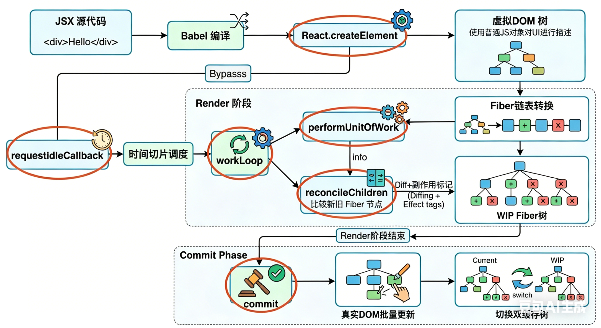

# 总结React库的工作流程

## 第一步
当 JSX 代码经 Babel 编译为React.createElement函数调用后，React 会在运行时执行该方法生成虚拟 DOM 树（纯 JS 对象构成的树形结构）；

## 第二步

### 进入Render 渲染阶段

1. **React 会将虚拟 DOM 树转换为Fiber 链表树**（以单个 Fiber 节点为最小工作单元，通过 child、sibling、return 指针实现可中断的链式结构）

2. 依托 Scheduler 调度器开启**时间切片任务处理机制**，该机制借鉴requestIdleCallback的空闲调度思想，以约 5ms 为一个时间片，在浏览器每一帧的空闲时段分批执行渲染任务，避免阻塞主线程；

- 核心工作循环workLoop会不断调用performUnitOfWork函数处理单个 Fiber 节点，完成 DOM 创建、子 Fiber 链表构建等基础工作

- 同时通过reconcileChildren函数执行**Diff 协调算法**，将新的虚拟 DOM 节点与旧 Fiber 树逐节点对比，根据类型是否相同标记UPDATE（更新）、PLACEMENT（新增）、DELETION（删除）等副作用

**整个 Render 阶段可中断、可恢复、可按优先级调度**

## 第三步

待所有 Fiber 节点处理完成、整棵 workInProgress Fiber 树构建完毕后,React 进入不可中断的Commit 提交阶段

## Commit阶段

遍历所有带副作用标记的 Fiber 节点，依次执行**真实 DOM 的增删改操作**，处理完成后切换双缓存 Fiber 树指针，将 workInProgress 树设为新的 current 树，最终完成页面更新，实现高效且流畅的 UI 渲染。
