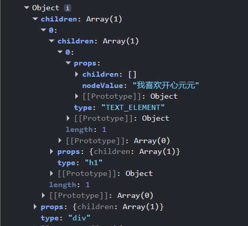

# 虚拟DOM(Virtual DOM)的定义

权威定义:虚拟 DOM（Virtual DOM，简称 vDOM） 是对真实 DOM 树的轻量级、内存化、结构化 **JavaScript 对象描述**，是前端框架为解耦视图渲染逻辑、屏蔽浏览器 DOM 原生 API 差异、**实现跨平台渲染与高效页面更新**，设计的抽象层虚拟文档模型。

# 核心优势

## 1. 跨平台能力

虚拟 DOM 是跨端渲染的底层基础：脱离浏览器 DOM 环境后，可通过不同渲染器（Renderer）将同一套虚拟节点结构，编译渲染为小程序节点、原生 App 视图、Canvas、SVG 等多端视图。
补充区分（权威避坑）

## 2.性能优化

框架通过差异化对比算法（Diff 算法） 对比新旧两份虚拟 DOM 树，精准计算出视图需要变更的最小范围，最终批量、按需操作真实 DOM，规避频繁全量 DOM 操作的性能问题。

# 实现虚拟DOM

    const App = () => {
      return (

          我喜欢开心元元
      
)
    }

通过babel或者swc转换成:

    const App = () => {
      return React.createElement('div', { id: 2 }, 
        React.createElement('span', null, '我喜欢开心元元')
      );
    };

# 文章《Build your own React--Rodrigo Pombo》中的react知识
**Link:https://pomb.us/build-your-own-react/**

一段react应用的代码:

    const element = <h1 title="foo">Hello</h1>
    const container = document.getElementById("root")
    ReactDOM.render(element, container)
    
## 1. React.createElement 函数

作用:

1.  用于生成虚拟 DOM 树，返回一个包含 type（元素类型）和 props（属性和子元素）的对象。 children 可以是文本或其他虚拟 DOM 对象。

2.  **React.createTextElement**:用于处理文本节点，将字符串封装成虚拟 DOM 对象。

3.  React.render: 将虚拟 DOM 转化为实际 DOM 元素。 使用递归的方式渲染所有子元素。 最后将生成的 DOM 节点插入到指定的容器中

代码:

    const React = {
      createElement(types, props, ...children) {
        return {
          type: types,
          props: { ...props, children },
          children: children.map((child) => {
            if (typeof child === "object") {
              return child;
            } else {
              return React.createTextElement(child);
            }
          }),
        };
      },
      createTextElement(text) {
        return {
          type: "TEXT_ELEMENT",
          props: { nodeValue: text, children: [] },
        };
      },
    };
    
    //创建一个 
<h1>我喜欢开心元元</h1>

    const element = React.createElement(
      "div",
      null,
      React.createElement("h1", null, "我喜欢开心元元"),
    );
    console.log(element);

浏览器运行结果:

# 创建React.render

代码: 

      //将虚拟DOM转换成真实DOM,渲染到页面上
      render(element, container) {
        const dom =
          element.type === "TEXT_ELEMENT"
            ? document.createTextNode("")
            : document.createElement(element.type);
    
        //把虚拟 DOM 上的属性，批量赋值给真实 DOM，并且跳过 children（因为 children 是子节点，不是 DOM 属性）
        const isProperty = (key) => key !== "children";
        Object.keys(element.props)
          .filter(isProperty)
          .forEach((name) => {
            dom[name] = element.props[name];
          });
    
        //递归渲染子节点
        element.props.children.forEach((child) => {
          this.render(child, dom);
        });
        container.appendChild(dom);
      },

**至此,实现了一个简单的react库去处理和渲染虚拟dom**
