# Full Walkthrough: Workflow for AI Coding — Matt Pocock--演讲回顾

## AI 辅助软件工程工作流

<iframe width="560" height="315" src="https://www.youtube.com/embed/-QFHIoCo-Ko?si=cYT3eOeFBvuAVeAI&amp;start=3" title="YouTube video player" frameborder="0" allow="accelerometer; autoplay; clipboard-write; encrypted-media; gyroscope; picture-in-picture; web-share" referrerpolicy="strict-origin-when-cross-origin" allowfullscreen></iframe>

Github仓库:https://github.com/makursi/ai-enginer-workshop-2026

---

## 目录 (Table of Contents)

1. [范式转变：AI 时代的软件工程](#1-范式转变ai-时代的软件工程)
   - 1.1 [传统软件工程 vs AI 辅助软件工程](#11-传统软件工程-vs-ai-辅助软件工程)
   - 1.2 [LLM 上下文窗口与 Token 管理](#12-llm-上下文窗口与-token-管理)
   - 1.3 [Smart Zone 与 Dumb Zone：注意力衰减模型](#13-smart-zone-与-dumb-zone注意力衰减模型)
2. [需求对齐：从模糊到清晰](#2-需求对齐从模糊到清晰)
   - 2.1 [Client Brief 客户需求文档](#21-client-brief-客户需求文档)
   - 2.2 [Grilling Session 需求追问](#22-grilling-session-需求追问)
   - 2.3 [Destination & Journey 文档化模式](#23-destination--journey-文档化模式)
3. [任务规划：从 PRD 到可执行切片](#3-任务规划从-prd-到可执行切片)
   - 3.1 [PRD 驱动开发](#31-prd-驱动开发)
   - 3.2 [垂直切片 vs 水平切片](#32-垂直切片-vs-水平切片)
   - 3.3 [Dumb Zone 驱动的切片粒度设计](#33-dumb-zone-驱动的切片粒度设计)
   - 3.4 [Kanban 与 HITL/AFK 任务分类](#34-kanban-与-hitlafk-任务分类)
4. [并行实施：Agent 编排与执行](#4-并行实施agent-编排与执行)
   - 4.1 [Sub-Agent 任务委派架构](#41-sub-agent-任务委派架构)
   - 4.2 [依赖图 (DAG) 与 Phase 编排](#42-依赖图-dag-与-phase-编排)
   - 4.3 [parallel() vs pipeline() 执行策略](#43-parallel-vs-pipeline-执行策略)
   - 4.4 [TDD 测试驱动开发循环](#44-tdd-测试驱动开发循环)
   - 4.5 [Pair Programming 人-AI 结对](#45-pair-programming-人-ai-结对)
5. [设计原则：贯穿全程的深层模块](#5-设计原则贯穿全程的深层模块)
   - 5.1 [Deep Modules 定义与度量](#51-deep-modules-定义与度量)
   - 5.2 [Deep Modules vs Clean Code 对比](#52-deep-modules-vs-clean-code-对比)
   - 5.3 [AI Agent/Skill 设计中的 Deep Modules](#53-ai-agentskill-设计中的-deep-modules)
6. [端到端集成：完整工作流](#6-端到端集成完整工作流)
   - 6.1 [Matt Pocock 四阶段工作流总览](#61-matt-pocock-四阶段工作流总览)
   - 6.2 [完整案例演示](#62-完整案例演示)
7. [术语表 (Glossary)](#7-术语表-glossary)
8. [交叉引用索引 (Cross-Reference Index)](#8-交叉引用索引-cross-reference-index)
9. [经典问题与练习 (Classic Problems & Exercises)](#9-经典问题与练习-classic-problems--exercises)
---

## 概念关系图

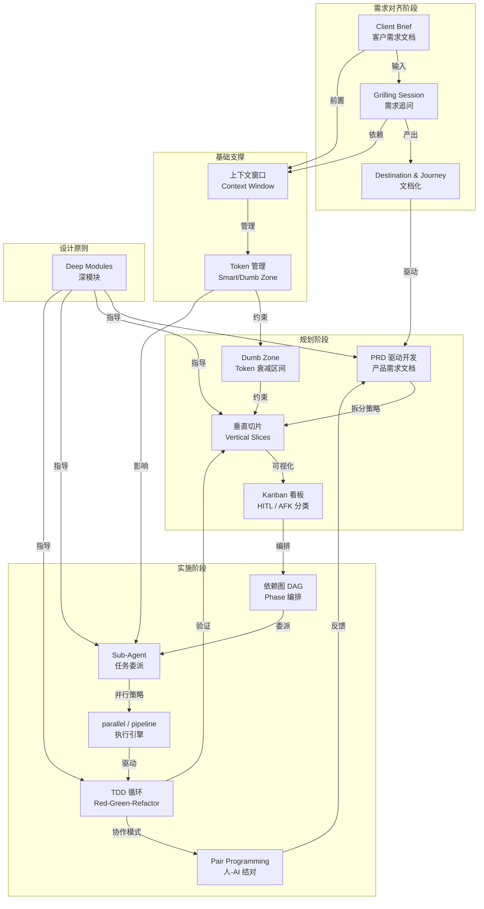


# 使用步骤总结
## 1. 使用真实的客户需求 -> 2. 使用/grill-me 逼问需求 -> 3. 使用/to-prd 写产品需求文档 -> 4. /to-issues 拆分任务 -> 5. /tdd 测试驱动开发 -> /diagnosing-bugs 调bug -> /import-codebase-architecture 做架构复习

---

## 1. 范式转变：AI 时代的软件工程

### 1.1 传统软件工程 vs AI 辅助软件工程

#### 1.1.1 传统软件工程的核心瓶颈

传统软件工程（Software Engineering）的根本挑战在于**将人类意图精确转化为机器可执行的指令**。这个转化过程经历了多个抽象层次的演进：机器码 → 汇编 → 高级语言 → 面向对象 → 框架与库。每一层抽象都试图降低"意图 → 代码"的转化成本，但核心瓶颈始终存在：

- **需求翻译损失**：产品经理的需求文档 → 开发者的技术规格之间存在语义鸿沟
- **编码带宽限制**：人类打字速度和思维速度之间的差距（~50 WPM vs 推理速度）
- **知识检索成本**：开发者在 Stack Overflow / 文档 / 源码之间频繁切换
- **上下文切换开销**：在多任务之间切换的心理成本约为每次 15-23 分钟恢复时间

#### 1.1.2 AI 辅助软件工程的范式转变

大语言模型（Large Language Model, LLM）的出现改变了上述每个瓶颈：

| 维度 | 传统模式 | AI 辅助模式 |
|------|---------|-----------|
| **需求→代码** | 人脑翻译，多轮沟通 | Agent 直接从自然语言 PRD 生成实现 |
| **编码速度** | 受限于打字速度 | Agent 以 token/s 级别输出代码 |
| **知识检索** | 手动搜索、筛选、评估 | Agent 内化训练知识 + 实时工具调用 |
| **上下文切换** | 人脑负担 | Agent 无状态，独立会话隔离 |
| **代码审查** | 人工逐行审阅 | Agent 做首轮审查，人类做战略性判断 |

> **关键洞察 (Matt Pocock)**：AI 时代没有淘汰软件工程的基本原理（共享理解、TDD、模块化、反馈循环），而是让这些原理变得**比以往任何时候都更重要**。Agent 可以写出代码，但只有遵循工程纪律才能确保代码的**正确性、可维护性和审美质量**。

#### 1.1.3 小结

AI 辅助软件工程不是"用自然语言替换编程语言"，而是将软件工程的方法论（需求、设计、实现、测试、评审）迁移到人-Agent 协作的新范式中。Agent 成为执行者，人类成为战略家和审美仲裁者。

---

### 1.2 LLM 上下文窗口与 Token 管理

#### 1.2.1 什么是 Token？

Token（标记）是 LLM 处理文本的最小语义单元。**Tokenization（分词）**是将原始文本转换为 token 序列的过程：

```text
原始文本: "Matt Pocock 的 AI 编程工作流"
Token序列: ["Matt", "Poc", "ock", "的", "AI", "编程", "工作", "流"]
```

Token 与自然语言字符的关系因语言而异：

| 语言 | 1 Token ≈ |
|------|----------|
| 英文 | ~0.75 个单词，~4 个字符 |
| 中文 | ~0.5 个汉字，~1.5 个字符 |
| 代码 | 变化较大，关键字通常为 1 token/个 |

常见的 Tokenizer 包括 OpenAI 的 `tiktoken`（基于 BPE — Byte Pair Encoding）和 Anthropic 的专用分词器。

#### 1.2.2 上下文窗口 (Context Window)

上下文窗口（Context Window）是 LLM 在单次推理中能"看到"的最大 token 数量。它是模型架构中的硬性限制，决定了：

- 单次对话能容纳多少历史消息
- 一次能处理多大的代码库/文档
- Agent 能维持多长时间的"记忆"

> **关键公式**：上下文窗口内的注意力计算复杂度为
>
> $$C_{\text{attention}} = O(n^2 \cdot d)$$
>
> 其中 $n$ 为 token 数量，$d$ 为每个 token 的嵌入维度。这意味着 token 数量翻倍，注意力计算量翻四倍。

#### 1.2.3 Token 管理策略

在实际 AI 编程工作流中，有效的 Token 管理决定了 Agent 的工作质量：

**策略一：/clear 重置**
当对话上下文超过有效推理区间时，使用 `/clear` 命令重置 Agent 状态。这会将 Agent 恢复到系统提示词（System Prompt）的初始态。

**策略二：持久文档化**
将对话中产生的关键决策、设计意图、未解决问题写入持久文档（如 `plan.md`、`prd.md`），使新会话的 Agent 可以重新加载这些"已知事实"。

**策略三：避免过度 Compaction**
Compaction（压缩/摘要）将长对话历史压缩为摘要。Matt Pocock **明确反对**这一做法：
- 压缩后的摘要丢失了精确的推理路径
- Agent 行为变得不确定（不同压缩产生不同行为）
- 问题难以复现和调试

```text
糟糕的做法:
  长对话 → compact → 摘要 → 继续工作（行为不确定）

好的做法:
  长对话 → 将关键决策写入文档 → /clear → 新会话加载文档 → 继续工作（行为确定）
```

#### 1.2.4 小结

Token 管理是 AI 编程工作流的"底层约束"——它决定了切片粒度、会话生命周期和文档化策略。理解上下文窗口的机制和限制，是设计高效 Agent 工作流的前提。

---

### 1.3 Smart Zone 与 Dumb Zone：注意力衰减模型

#### 1.3.1 概念定义

**Smart Zone（智能区间）**和 **Dumb Zone（退化区间）**是 Matt Pocock 对 LLM 上下文窗口内推理质量的实证划分模型。这一概念最初由 **Dex Horthy**（HumanLayer 创始人）提出。

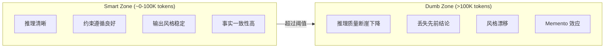

#### 1.3.2 注意力衰减的数学直觉

虽然 LLM 厂商宣传的上下文窗口可达 1M token（甚至更多），但**可用**上下文窗口远小于理论最大值。这源于两个因素：

1. **注意力稀释**：随着 token 数 $n$ 增加，每个 token 对序列中其他位置的注意力权重被稀释。有效注意力近似为：

   $$\text{EffectiveAttention}(n) \propto \frac{1}{\sqrt{n}}$$

2. **位置编码退化**：在超长序列中，位置编码（Positional Encoding）的区分度下降，导致模型难以精确区分序列中相距较远的两个位置。

**经验阈值**（基于 Matt Pocock 及社区实践）：
- **~100K token**：Smart Zone 的有效上限。在此范围内，Agent 推理质量稳定。
- **100K~200K token**：灰色过渡区。推理质量开始下降但不致命。
- **>200K token**：Dumb Zone。Agent 出现显著的"记忆碎片"效应——像电影《Memento》中的主角，无法将当前行为与早期上下文连贯起来。

#### 1.3.3 Dumb Zone 对工作流设计的约束

Dumb Zone 概念直接驱动了工作流中的多个关键设计决策：

| 设计决策 | 与 Dumb Zone 的关系 |
|---------|-------------------|
| **垂直切片粒度** | 每个切片必须在 ~100K token 内完成 |
| **/clear 时机** | 接近 Smart Zone 上限前主动重置 |
| **文档化策略** | 关键信息必须在进入 Dumb Zone 前持久化 |
| **Sub-Agent 分配** | 将大任务拆分给多个独立 Agent（各自拥有独立上下文窗口） |

#### 1.3.4 小结

"Dumb Zone"不是 LLM 的缺陷，而是当前注意力机制架构的**固有特征**。优秀的 AI 工程工作流不会试图"对抗"Dumb Zone，而是将其视为一个必须尊重的硬约束，围绕它设计切片粒度、会话管理和 Sub-Agent 分配策略。

---

## 2. 需求对齐：从模糊到清晰

### 2.1 Client Brief 客户需求文档

#### 2.1.1 定义与目的

**Client Brief（客户需求简报）**是需求对齐阶段的第一份输入文档。它的目标是**以用户（而非开发者）的语言**描述：

- 谁是这个功能的用户？
- 他们当前遇到了什么问题？
- 成功解决的标准是什么？
- 有哪些已知的约束条件？

#### 2.1.2 标准模板

```markdown
# Client Brief: [功能/项目名称]

## 背景 (Background)
[描述当前状态和用户痛点]

## 目标用户 (Target Users)
- 用户类型 A：[描述]
- 用户类型 B：[描述]

## 核心需求 (Core Needs)
1. [需求 1] — 优先级：P0/P1/P2
2. [需求 2] — 优先级：P0/P1/P2

## 成功标准 (Success Criteria)
- [ ] 用户可以在 [场景] 中完成 [动作]
- [ ] [量化指标] 达到 [目标值]

## 约束与假设 (Constraints & Assumptions)
- 技术栈：[已有技术栈]
- 时间约束：[如有]
- 已知限制：[如 API 限制、向后兼容]

## 范围外 (Out of Scope)
- [明确不做什么]
```

#### 2.1.3 Client Brief 在 AI 工作流中的角色

Client Brief 是整条流水线的**入口点**。它的质量决定了后续所有阶段的效率：

- **太模糊** → Grilling Session 需要大量追问
- **太技术化** → 过早收敛到实现细节，丢失设计空间
- **刚刚好** → 提供了足够上下文让 Agent 理解"为什么做"，但保留"怎么做"的探索空间

> **原则**：Client Brief 描述 **What & Why**，PRD 描述 **How**。

#### 2.1.4 小结

Client Brief 本质上是**需求捕获 (Requirements Elicitation)**在 AI 协作中的落地形式。它继承了传统软件工程中"用户故事 (User Story)"和"需求规格"的精神，但针对 Agent 可读性做了优化——更结构化、更显式化。

---

### 2.2 Grilling Session 需求追问

#### 2.2.1 什么是 Grilling Session？

**Grilling Session（需求追问会话）**是一种结构化的需求澄清方法：AI Agent 扮演"面试官"角色，对 Client Brief 中的每个主张进行**系统性追问**，直至消除所有歧义或到达不可约简的假设。

其核心理念源于传统需求工程（Requirements Engineering）中的**利益相关者访谈 (Stakeholder Interview)**方法，但在 AI 协作中被赋予新的形式——Agent 作为永不疲倦的追问者。

#### 2.2.2 Grilling 追问维度

| 维度 | 典型追问 | 目标 |
|------|---------|------|
| **边界条件** | "如果用户输入为空的场景怎么处理？" | 发现隐含假设 |
| **失败场景** | "最坏情况下会发生什么？" | 定义错误处理策略 |
| **权衡分析** | "如果牺牲 X 换取 Y，你能接受吗？" | 暴露价值排序 |
| **替代方案** | "你考虑过 [方案B] 吗？为什么不选？" | 验证设计决策 |
| **规模假设** | "当用户量增长 100 倍时这还能工作吗？" | 发现扩展性问题 |


#### 2.2.4 Grilling 的终止条件

Grilling 不能无限进行。终止条件包括：

1. **用户声明终止**："就先按这个方向做"（用户接受剩余的不确定性）
2. **到达原子决策**：剩余问题是"先做再看"级别的（无法在实施前决定）
3. **时间/Token 预算耗尽**：对话接近 Smart Zone 上限

#### 2.2.5 小结

Grilling Session 将传统需求工程中"需求分析师"的角色自动化了。它确保了在代码被写出之前，Agent 和人类已经对"要构建什么"达成了**共享理解 (Shared Understanding)**。

---

### 2.3 Destination & Journey 文档化模式

#### 2.3.1 概念定义

**Destination（目标状态）**和 **Journey（到达路径）**是 Grilling Session 后的两个互补文档产出：

- **Destination (目标状态文档)**：描述项目完成后、用户实际使用时的"最终状态"。用现在时态书写，仿佛一切已经完成。

- **Journey (路径文档)**：记录从当前状态到达 Destination 过程中的**关键决策、被否决的方案、放弃的想法及其原因**。这是一份"考古日志"。

#### 2.3.2 为什么要分离 Destination 和 Journey？

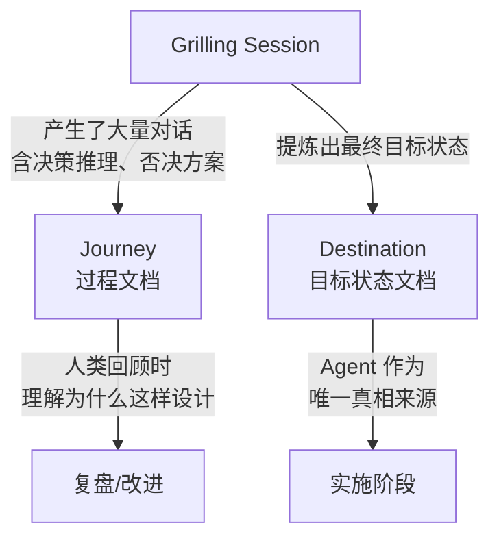

分离的理由：

| 文档 | 受众 | 生命周期 | Token 消耗策略 |
|------|------|---------|--------------|
| **Destination** | Agent（工作上下文）| 实施期间持续引用 | 必须保持在上下文中 |
| **Journey** | 人类（决策记录）| 归档参考，偶尔回顾 | 按需加载，不占上下文 |

#### 2.3.3 Destination 文档模板

```markdown
# Destination: [功能/系统名称]

## 用户视角
用户打开 [页面/应用]，可以：
- [功能清单 — 用现在时描述已完成的功能]
- ...

## 技术架构
- 前端使用 [框架]，路由结构如下：...
- 后端 API 端点列表：...
- 数据模型：[简要描述核心实体]

## 关键交互流
1. 用户点击 [按钮] → [发生什么]
2. 系统 [自动行为]

## 非功能特性
- 性能：[目标]
- 安全：[要求]
```

#### 2.3.4 Journey 文档的记录内容

```markdown
# Journey: [功能/系统名称]

## 决策记录

### 决策 1: [主题]
- **时间**: 2026-06-02
- **选项**: A / B / C
- **选择**: B
- **理由**: [为什么选 B]
- **被否决的选项及原因**:
  - A: [看似好但...]
  - C: [未来可能考虑，但当前...]

## 开放问题
- [ ] [问题描述] — 待后续验证
```

#### 2.3.5 小结

Destination & Journey 模式是对"把所有东西堆在对话历史里"的反模式的形式化纠正。它承认了当前 LLM 上下文窗口的有限性，通过文档化的方式将**隐性知识（对话历史）转化为显性知识（持久文档）**，从而对抗 Dumb Zone 的侵蚀。

---

## 3. 任务规划：从 PRD 到可执行切片

### 3.1 PRD 驱动开发

#### 3.1.1 PRD 的定义与演进

**PRD（产品需求文档，Product Requirements Document）**是传统产品管理中的核心文档。在 AI 辅助开发工作流中，PRD 的定位发生了转变：

| 维度 | 传统 PRD | AI 工作流中的 PRD |
|------|---------|-----------------|
| **受众** | 开发团队（人类） | Agent（机器）+ 人类 |
| **粒度** | 史诗级，跨多个 Sprint | 单个可独立交付的功能单元 |
| **生命周期** | 需求冻结后可能过时 | 持续更新，作为 Agent 的"单一真相来源" |
| **结构** | 叙事性为主 | 高度结构化，含显式验收标准 |

#### 3.1.2 PRD 标准结构

```markdown
# PRD: [功能名称]

## 1. 背景与目标
- 当前问题：[一句话描述]
- 目标：[解决什么]
- 用户价值：[量化收益]

## 2. 用户故事 (User Stories)
- 作为 [角色]，我想要 [动作]，以便 [价值]
- ...

## 3. 功能规格 (Functional Spec)
### 3.1 [功能点 A]
- 输入：[参数]
- 处理：[逻辑描述]
- 输出：[结果]
- 边界情况：[空值、极值、并发]

### 3.2 [功能点 B]
...

## 4. 非功能需求 (Non-Functional Requirements)
- **性能**: 页面加载 < 200ms (P95)
- **安全**: 用户数据加密存储
- **可访问性**: WCAG 2.1 AA

## 5. 验收标准 (Acceptance Criteria)
- [ ] Given [前提], When [动作], Then [预期结果]
- [ ] ...

## 6. 范围外 (Out of Scope)
- 明确不做的功能以防止范围蔓延
```

#### 3.1.3 从 Client Brief 到 PRD 的转化链

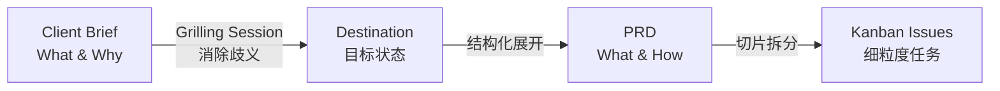

#### 3.1.4 小结

PRD 驱动开发（PRD-Driven Development）确保 Agent 在进入实施阶段之前，所有利益相关者（人类 + Agent）已经对**要构建什么**和**如何验证**达成了共识。PRD 是连接"模糊需求"和"精确代码"的桥梁。

---

### 3.2 垂直切片 vs 水平切片

#### 3.2.1 概念定义

**水平切片 (Horizontal Slice)**：按技术架构层拆分工作——先完成所有数据层，再完成所有 API 层，最后完成所有 UI 层。

**垂直切片 (Vertical Slice)**：按用户可见的功能单元拆分——每个切片同时穿透数据库、业务逻辑、API 和前端，端到端可验证。

#### 3.2.2 可视化对比


水平切片:

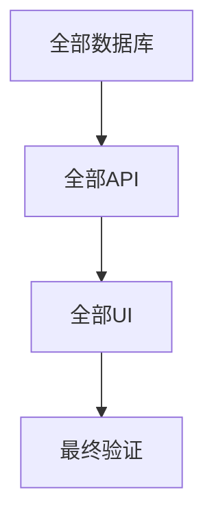

垂直切片:

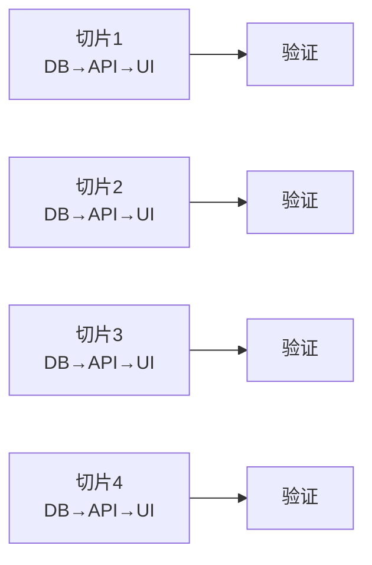
#### 3.2.3 详细对比

| 维度 | 水平切片 | 垂直切片 |
|------|---------|---------|
| **AI Agent 偏好** | 高（Agent 喜欢批量处理同类任务） | 低（需要人类引导拆分） |
| **可验证性** | 差 — 直到最后一层集成才能端到端验证 | 优 — 每个切片完成后立即可演示 |
| **反馈循环** | 长 — 问题可能隐藏到集成阶段才暴露 | 短 — 每个切片完成后立即获得反馈 |
| **并行度** | 低 — 层间有强依赖 | 高 — 独立切片可并行执行 |
| **回滚风险** | 高 — 问题影响整个层级 | 低 — 问题局限在单个切片内 |
| **认知负荷** | 高 — 需要同时理解整个层 | 可控 — 仅需关注当前切片的全部层 |

#### 3.2.4 Tracer Bullet（曳光弹）模式

垂直切片的方法论根源是 **Tracer Bullet（曳光弹）**——一种源自《程序员修炼之道》(The Pragmatic Programmer) 的实践：

> "曳光弹不是纸上设计，不是原型。它是真实代码，穿越了系统的所有层级，证明这些层级可以连接在一起工作。"

在 AI 辅助开发中，第一颗曳光弹的目标是：**用最薄的代码穿越所有技术层，证明架构可行，然后以此为骨架逐步添加血肉。**

```text
曳光弹示例（课程平台游戏化功能）:

切片 1 (曳光弹): "用户完成一节课 → 在仪表盘看到积分 +10"
  穿越: 数据库(新增积分字段) → 业务逻辑(积分计算) → API(积分查询/更新) → 前端(仪表盘显示)
  工作量: ~2-4 小时
  验证: 整个链路可演示

切片 2: "积分累积到 100 → 解锁徽章"
切片 3: "仪表盘排行榜"
...
```

#### 3.2.5 小结

垂直切片是**对抗 AI Agent "水平化思维"**的关键策略。Agent 天然倾向于同类任务批量处理（所有 DB schema → 所有 API → 所有 UI），因为这在单个对话上下文中效率最高。但垂直切片确保了：
1. 随时有**可演示的产出**
2. 问题**尽早暴露**
3. 多个切片**可并行推进**

---

### 3.3 Dumb Zone 驱动的切片粒度设计

#### 3.3.1 切片粒度的"金发姑娘约束"

切片既不能太大（进入 Dumb Zone，推理质量崩溃），也不能太小（切片的连接成本和上下文切换开销超过收益）。

$$
\text{切片粒度} = f(\text{功能复杂度}, \text{Token 预算}, \text{依赖耦合度})
$$

**Dumb Zone 驱动的粒度公式**：

假设每个切片的实施需要 Agent 消耗约 $T_{\text{code}}$ token 的代码生成，加上约 $T_{\text{context}}$ token 的任务上下文（PRD 摘要、技术栈信息、代码约定等），则该切片的上下文窗口消耗为：

$$T_{\text{total}} = T_{\text{context}} + T_{\text{code}} + T_{\text{error\_recovery}}$$

其中 $T_{\text{error\_recovery}}$ 为 Agent 犯错后纠正所需的额外 token。

**粒度约束**：

$$T_{\text{total}} \leq 100\text{K tokens} \quad \text{(Smart Zone 上限)}$$

#### 3.3.2 切片粒度的实践经验

| 切片类型 | 典型工作量 | Token 消耗估计 | 适合场景 |
|---------|-----------|---------------|---------|
| **微型切片** | 30min - 1h | ~5K-15K | 纯 CRUD 端点、简单 UI 组件 |
| **标准切片** | 2h - 4h | ~20K-50K | 含业务逻辑的功能模块 |
| **大型切片** | 半天 | ~50K-100K | 涉及多个实体交互的复杂功能 |
| **超出预算** | 1天+ | >100K | 需进一步拆分 |

#### 3.3.3 判断切片是否过大的"臭味检测"

如果符合以下任何一条，说明切片过大需要拆分：

1. Agent 在实施过程中开始**遗忘** PRD 中的验收标准
2. Agent 的代码**风格在切片后半段漂移**（变量命名、缩进风格变化）
3. 错误修复进入了**"修复 A → 引入 B → 修复 B → 重新引入 A"**的循环
4. 切片完成后需超过 **3 轮 /clear** 才能完成所有修正

#### 3.3.4 小结

Dumb Zone 不是"建议"，而是**物理定律级别的硬约束**。切片粒度设计本质上是在 Dumb Zone 的边界内分配有限的上下文窗口资源。宁可多切几个薄片，也不要让一个厚片滑入 Dumb Zone。

---

### 3.4 Kanban 与 HITL/AFK 任务分类


#### 3.4.1 Kanban 在 AI 工作流中的适配

传统 Kanban（看板）是精益制造中用于可视化工作流的工具。在 AI 辅助软件工程中，Kanban 用于将所有垂直切片组织为可视化的工作单元：


| Todo（待办） | In Progress（进行中） | Review（待审查） | Done（完成） | Blocked（阻塞） |
|:------------|:---------------------|:----------------|:------------|:---------------|
| **切片 3**<br>`[AFK]` | **切片 1**<br>`[AFK]` 🔄 | **切片 2**<br>`[HITL]` 👁 | **切片 0**<br>`[AFK]` ✅ | **切片 5**<br>🚫 等 API |
| **切片 4**<br>`[AFK]` | | | | |
| **切片 6**<br>`[HITL]` | | | | |


#### 3.4.2 HITL vs AFK 分类系统

这是 Matt Pocock 工作流中**最关键的切片分类维度**：

| 类型 | 全称 | 含义 | 示例 |
|------|------|------|------|
| **HITL** | Human in the Loop | 必须有人类介入才有意义的工作 | 架构决策、UI 视觉评审、不可逆数据迁移 |
| **AFK** | Away From Keyboard | Agent 可独立完成的工作 | 纯功能实现、CRUD 操作、单元测试编写 |

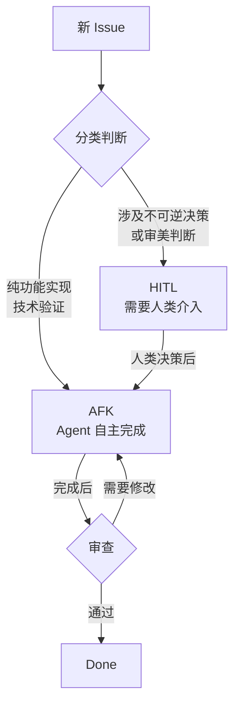

#### 3.4.3 HITL/AFK 分配策略

**最大化 AFK 占比**是提升团队吞吐量的核心策略。规则：

1. **每个 AFK 切片必须有明确的验收标准**（否则 Agent 不知道"做完"的定义）
2. **HITL 切片应在工作流早期**（架构决策前置，避免返工）
3. **AFK 切片可以夜间并行**（充分利用 Agent 的非工作时间批处理能力）

```text
工作流时间线:

09:00  人类完成所有 HITL 切片的决策工作
09:30  启动 AFK 切片 1-4 并行
12:00  AFK 切片全部完成
14:00  人类审查 AFK 产出
15:00  启动下一批 AFK 切片
        ...
次日:  夜间 AFK 批次的结果等待审查
```

#### 3.4.4 小结

HITL/AFK 分类将人类从"编码瓶颈"转变为"决策瓶颈"——这恰恰是人类最擅长而 Agent 最不擅长的分工。**让 Agent 做它擅长的（执行），让人类做人擅长的（判断）。**

---

## 4. 并行实施：Agent 编排与执行

### 4.1 Sub-Agent 任务委派架构

#### 4.1.1 什么是 Sub-Agent？

**Sub-Agent（子代理）**是将一个复杂任务委派给独立的 AI Agent 实例执行的架构模式。每个 Sub-Agent 拥有：

- **独立的上下文窗口**（对抗 Dumb Zone 的核心手段）
- **特定的工具集**（不是所有 Sub-Agent 都需要所有工具）
- **明确的任务描述和验收标准**

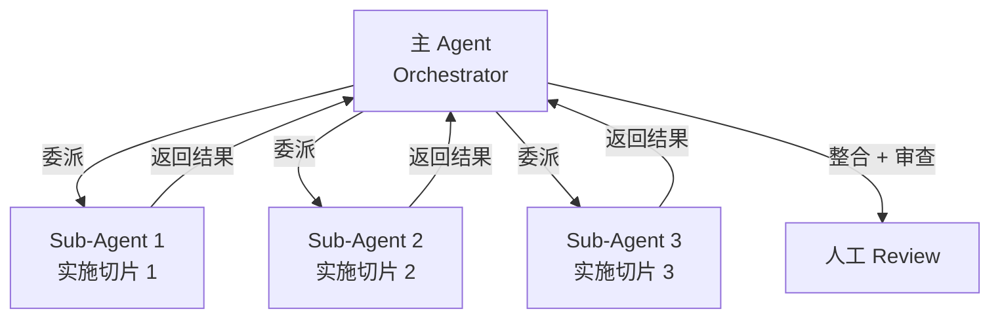

#### 4.1.2 Sub-Agent 的隔离级别

| 隔离级别 | 描述 | 适用场景 | 开销 |
|---------|------|---------|------|
| **共享上下文** | Sub-Agent 共享主 Agent 的对话历史 | 小任务，需要前期讨论上下文 | 低 |
| **独立会话** | 新会话 + 任务描述 + PRD 摘要 | 标准切片实施 | 中 |
| **Worktree 隔离** | 独立的 Git worktree + 独立文件系统 | 多个 Agent 并行修改代码时防止文件冲突 | 高 |

#### 4.1.3 Sub-Agent 任务描述模板

```markdown
# Sub-Agent Task: [任务标识]

## 背景 (Context)
[从 PRD 摘录的相关章节]

## 任务描述 (Task)
实现 [具体功能描述]。

## 输入
- 相关文件：[路径列表]
- 依赖的 Issue：[#issue-number]

## 验收标准 (Acceptance Criteria)
- [ ] Given [前提], When [动作], Then [预期]
- [ ] 所有现有测试继续通过
- [ ] 新增测试覆盖核心路径

## 约束
- 遵循项目中已有的 [代码风格/模式]
- 不要修改 [受保护的文件/目录]
- 使用 [指定的库/版本]
```

#### 4.1.4 小结

Sub-Agent 委派是**水平扩展 AI 开发能力**的核心机制。它不是简单地"让更多 AI 同时工作"，而是通过**隔离上下文窗口**来解决单个 Agent 在 Dumb Zone 中推理退化的问题。

---

### 4.2 依赖图 (DAG) 与 Phase 编排

#### 4.2.1 依赖图的形式化定义

在 AI 辅助开发中，**依赖图 (Dependency Graph)**描述切片任务之间的前置关系。它被建模为一个**有向无环图 (Directed Acyclic Graph, DAG)**：

$$G = (V, E)$$

其中：
- $V$ = 切片任务集合 $\{v_1, v_2, ..., v_n\}$
- $E$ = 依赖边集合 $\{(v_i, v_j) \mid v_i \text{ 必须在 } v_j \text{ 之前完成}\}$

**无环约束**：$\nexists$ 路径 $v_i \rightarrow ... \rightarrow v_i$（不存在循环依赖）

#### 4.2.2 DAG 示例：课程平台游戏化功能

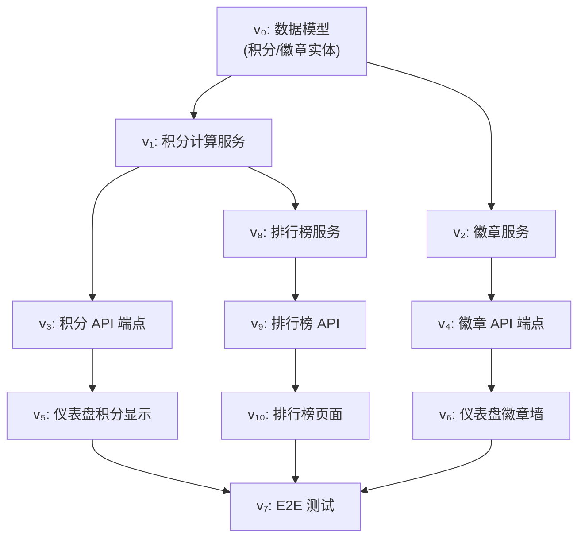

#### 4.2.3 Phase 分区算法

对于有依赖关系的任务集合，应将其划分为多个 **Phase（阶段）**，使得：
- 同一 Phase 内的任务**无相互依赖**（可并行）
- Phase 之间按依赖顺序执行（Phase $k$ 的所有任务完成后才进入 Phase $k+1$）

```pseudocode
COMPUTE_PHASES(tasks, dependencies)
 1  visited ← {}
 2  phases ← []
 3  while |visited| < |tasks|
 4      current_phase ← []
 5      for each task in tasks \ visited
 6          if all dependencies of task are in visited
 7              ADD(current_phase, task)
 8      if current_phase is empty
 9          ERROR "Circular dependency detected"
10      ADD(phases, current_phase)
11      visited ← visited ∪ current_phase
12  return phases
```

**示例输出**：

| Phase | 任务 | 并行度 |
|-------|------|--------|
| Phase 1 | $v_0$ | 1 (数据模型必须先行) |
| Phase 2 | $v_1, v_2$ | 2 (积分和徽章服务独立) |
| Phase 3 | $v_3, v_4, v_8$ | 3 |
| Phase 4 | $v_5, v_6, v_9$ | 3 |
| Phase 5 | $v_{10}$ | 1 |
| Phase 6 | $v_7$ | 1 (E2E 测试汇聚所有) |

#### 4.2.4 关键路径分析

**关键路径 (Critical Path)** 是 DAG 中从起点到终点的最长路径，决定了整个项目的最短完成时间：

$$\text{Makespan} = \max_{\text{path } p} \sum_{v \in p} \text{duration}(v)$$

在上述 DAG 中：$v_0 \rightarrow v_1 \rightarrow v_8 \rightarrow v_9 \rightarrow v_{10} \rightarrow v_7$ 是关键路径（包含排行榜功能），优化这条路径将直接缩短项目总工期。

#### 4.2.5 小结

DAG + Phase 编排将原本线性串行的开发过程转变为**拓扑排序驱动的并行执行**。这是将软件工程的依赖管理理论直接应用于 AI Agent 编排。

---

### 4.3 parallel() vs pipeline() 执行策略

> **难度**: 进阶
> **前置要求**: 4.2
> **类型**: 比较

#### 4.3.1 两种策略的定义

**`parallel()` — 屏障式并行 (Barrier Parallelism)**：
所有任务同时启动，等待**最后一个**完成后再进入下一阶段。

**`pipeline()` — 流水线式处理 (Pipeline Processing)**：
每个任务依次通过所有阶段，但不同任务可以同时处于不同阶段——任务 A 在 Phase 3 时，任务 B 可以在 Phase 2。

#### 4.3.2 可视化对比

```text
parallel() — 屏障式:
Phase 1: [A1] [B1] [C1]  ← 三个任务并行
         ═══ 屏障 ═══     ← 等待最慢的完成
Phase 2: [A2] [B2] [C2]
         ═══ 屏障 ═══
Phase 3: [A3] [B3] [C3]
时间:    |████████████████████████|  (串行阶段累加)

pipeline() — 流水线式:
Phase 1: [A1] [B1] [C1]
Phase 2:     [A2] [B2] [C2]
Phase 3:         [A3] [B3] [C3]
时间:    |██████████████████|  (更短！)
```

#### 4.3.3 策略选择决策树

```mermaid
flowchart TD
    Q1{阶段 N 是否需要<br/>阶段 N-1 的全部结果？}
    Q1 -->|是| PAR[使用 parallel()<br/>屏障式并行]
    Q1 -->|否| Q2{各任务的耗时<br/>差异大吗？}
    Q2 -->|差异大| PIPE[使用 pipeline()<br/>避免快任务等待慢任务]
    Q2 -->|差异小| EITHER[均可<br/>差异可忽略]
```

#### 4.3.4 策略对比

| 维度 | parallel() | pipeline() |
|------|-----------|------------|
| **阶段间** | 有屏障（同步点）| 无屏障（流水线）|
| **适用场景** | 需要汇总上一阶段全部结果（如去重、全局排序）| 各任务独立，不同任务速度不同 |
| **最慢任务影响** | 拖慢整个阶段 | 仅拖慢该任务自己的后续阶段 |
| **实现复杂度** | 低 | 中 |
| **资源占用的可预测性** | 高 | 中（可能某个任务遥遥领先）|

#### 4.3.5 在 AI Agent 编排中的应用

```text
//pipeline() — 正确的 AI 开发编排
pipeline(
  [slice1, slice2, slice3, slice4],      // 4 个垂直切片
  slice => agent("架构审查", {phase: "Review"}),  // 阶段 1: 架构审查
  review => agent("实现", {phase: "Implement"}),   // 阶段 2: 实现
  impl => agent("测试", {phase: "Test"})            // 阶段 3: 测试
)
// 切片 1 在测试时，切片 2 在实现中，切片 3 在审查中
// 无浪费的空闲时间！

// ❌ parallel() — 在不需要屏障时造成了空闲
parallel([...slices].map(s => () => agent("审查", s)))
//  ═══ 等待所有审查完成 ═══
parallel([...slices].map(s => () => agent("实现", s)))
//  ═══ 等待所有实现完成 ═══
// 快任务在每个阶段后都要空等慢任务！
```

#### 4.3.6 小结

**默认选择 pipeline()**——它让快任务不被慢任务阻塞。只有在确实需要跨任务汇聚信息时（如：收集所有切片的发现来去重），才使用 parallel() 屏障。

---

### 4.4 TDD 测试驱动开发循环

#### 4.4.1 定义与核心思想

**TDD（测试驱动开发，Test-Driven Development）**是由 Kent Beck 在 1990 年代从极限编程（Extreme Programming, XP）实践中提炼的开发方法论。其核心思想是：**在写任何产品代码之前，先写一个会失败的测试。**

#### 4.4.2 TDD 的三条法则 (Three Laws)

Kent Beck 定义了 TDD 的三条不可妥协的法则：

| 法则 | 含义 |
|------|------|
| **法则 1** | 在编写一个失败的单元测试之前，不允许编写任何产品代码 |
| **法则 2** | 只允许编写刚好让测试失败的测试（编译失败也算失败） |
| **法则 3** | 只允许编写刚好让当前失败测试通过的产品代码 |

这三条法则创建了一个极短的反馈循环（通常 < 30 秒），确保每一步都有可验证的进展。

#### 4.4.3 Red-Green-Refactor 循环

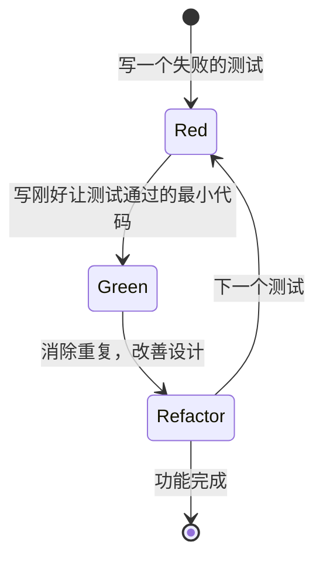

#### 4.4.4 TDD 循环示例（完整代码）

以课程平台"用户完成课程获得积分"为例：

```typescript
// ══════ STEP 1: RED — 写一个失败的测试 ══════
// points_service.test.ts
import { describe, it, expect } from "vitest";
import { PointsService, PointsRepository } from "./points_service";

class InMemoryPointsRepo implements PointsRepository {
  private data: Map<string, number> = new Map();

  save(userId: string, points: number): void {
    this.data.set(userId, points);
  }

  get(userId: string): number {
    return this.data.get(userId) ?? 0;
  }
}

it("用户首次完成课程，应获得 10 积分", () => {
  const repo = new InMemoryPointsRepo();
  const service = new PointsService(repo);

  service.completeLesson({ userId: "alice", lessonId: "math-01" });

  expect(repo.get("alice")).toBe(10);
});
```

```typescript
// ══════ STEP 2: GREEN — 写最小代码使测试通过 ══════
// points_service.ts
export interface PointsRepository {
  save(userId: string, points: number): void;
  get(userId: string): number;
}

export class PointsService {
  constructor(private repo: PointsRepository) {}

  completeLesson(opts: { userId: string; lessonId: string }): void {
    this.repo.save(opts.userId, 10); // 最小实现：不做任何检查
  }
}
```

```typescript
// ══════ STEP 3: REFACTOR + 添加新测试 ══════
// 添加：重复完成同一课程不能重复加分的测试
it("同一用户-课程对不重复计分（幂等性）", () => {
  const repo = new InMemoryPointsRepo();
  const service = new PointsService(repo);

  service.completeLesson({ userId: "alice", lessonId: "math-01" });
  service.completeLesson({ userId: "alice", lessonId: "math-01" });

  expect(repo.get("alice")).toBe(10); // 仍然是 10，不是 20
});

// 重构实现：
export class PointsService {
  private completed: Set<string> = new Set();

  constructor(private repo: PointsRepository) {}

  completeLesson(opts: { userId: string; lessonId: string }): void {
    const key = `${opts.userId}::${opts.lessonId}`;
    if (this.completed.has(key)) {
      return; // 幂等：已完成的课程不重复加分
    }
    this.completed.add(key);
    const current = this.repo.get(opts.userId);
    this.repo.save(opts.userId, current + 10);
  }
}
```

#### 4.4.5 测试金字塔 (Test Pyramid)

```text
        ┌─────┐
        │ E2E │  ← 少量：端到端用户场景
        │     │     确保核心流程不崩溃
       ┌┴─────┴┐
       │ 集成测试│  ← 中等：服务间交互
       │        │     验证 API 契约、DB 读写
      ┌┴────────┴┐
      │  单元测试  │  ← 大量：函数/类级别
      │           │     快速、精确、可并行
      └───────────┘
```

在 AI 辅助开发中，TDD 的角色从单纯的"测试代码"提升为"**验证 Agent 理解了需求**"。当 Agent 先写出测试，人类可以快速审查测试是否正确反映了需求——这比审查实现代码高效得多。

#### 4.4.6 TDD 与 AI Agent 协作流程

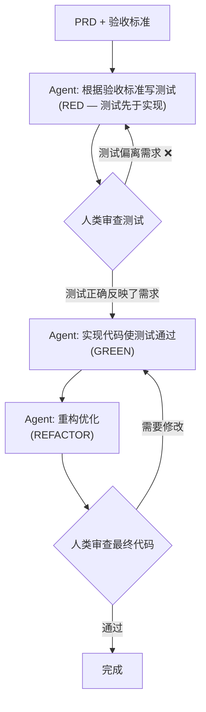

> **关键洞察 (Matt Pocock)**：在 AI 辅助开发中，**测试=对 Agent 的实现指令的精确定义**。如果人类无法写出验收测试，说明需求还不够清晰，需要回到 Grilling Session。

#### 4.4.7 小结

TDD 在 AI 时代从"一种好的实践"升级为"一种**必需的工程质量护栏**"。Agent 可以以极快的速度生成代码，但只有通过测试这个"客观验证器"，人类才能在不过度审查每一行代码的情况下信任 Agent 的产出。

---

### 4.5 Pair Programming 人-AI 结对

#### 4.5.1 传统结对编程回顾

**Pair Programming（结对编程）**是极限编程（XP）的核心实践之一。两个开发者共享一台计算机：

- **Driver（驾驶员）**：操作键盘，关注当前这行代码怎么写
- **Navigator（导航员）**：关注全局，思考战略方向、潜在问题和改进机会

角色每 20-30 分钟轮换一次。

#### 4.5.2 人-AI 结对模式

在 AI 辅助开发中，角色分配发生了本质变化：

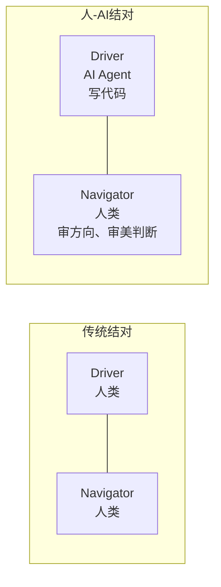

#### 4.5.3 人-AI 结对 vs 传统结对

| 维度 | 传统结对 | 人-AI 结对 |
|------|---------|-----------|
| **Driver 速度** | 受限于打字速度 (~50 WPM) | Token 级别输出 (~数百行/分钟) |
| **Navigator 关注点** | 代码正确性 + 战略方向 | 需求对齐 + 审美判断 + 架构一致性 |
| **角色轮换** | Driver ↔ Navigator 互换 | 无需轮换（AI 始终是 Driver） |
| **疲劳** | 双方都会疲劳 | AI 不会疲劳（但会进入 Dumb Zone） |
| **Taste (品味)** | Navigator 的品味直接影响代码 | **人类审美判断是最后防线** |
| **知识传递** | 双向学习 | 人类从 AI 的实现中学习新模式 |

#### 4.5.4 人-AI 结对的最佳实践

**人类的职责（Navigator）**：
1. **定义"好的代码"长什么样** — AI 没有审美观，需要人类通过示例和反馈来校准
2. **守住架构边界** — 防止 AI 为了一时方便而破坏模块边界
3. **识别"代码异味"** — AI 倾向于产生"功能正确但设计丑陋"的代码
4. **做出不可逆决策** — 架构范式、技术选型、数据库 Schema 设计

**AI 的职责（Driver）**：
1. 执行重复性编码任务（CRUD、样板代码）
2. 生成测试用例和边界条件组合
3. 快速探索多种实现方案供人类选择
4. 编写文档和注释（保持与实现同步）

#### 4.5.5 小结

人-AI 结对不是传统结对的替代品，而是一种**新的协作形式**——它继承了 Driver-Navigator 的分工精神，但将人类从"代码打字员"的角色中解放出来，升格为"架构师+审美仲裁者"。

---

## 5. 设计原则：贯穿全程的深层模块

### 5.1 Deep Modules 定义与度量

#### 5.1.1 核心定义

**Deep Modules（深模块）**是 John Ousterhout 在其 2018 年著作 *A Philosophy of Software Design* 中提出的核心设计原则：

> **深模块**：一个提供大量功能（庞大而复杂的实现），但只暴露极简接口的模块。它的复杂性被封装在内部，对外部不可见。

Ousterhout 用矩形隐喻来表达这一概念：

```text
深模块 (Deep Module)              浅模块 (Shallow Module)
┌──────────────┐                  ┌─────────────────────┐
│   接口 (小)   │  ← 学习成本低      │    接口 (巨大)       │  ← 学习成本高
├──────────────┤                  │                     │
│              │                  ├─────────────────────┤
│   实现 (大)   │                  │    实现 (小)         │
│              │                  │                     │
│   功能丰富    │                   │    功能有限          │
│   封装复杂    │                   │    未封装复杂性       │
└──────────────┘                  └─────────────────────┘

深度 = 功能收益 / 接口成本
```

#### 5.1.2 深模块的数学隐喻

Ousterhout 提出的"深度"度量虽然不能精确定量，但提供了有用的思维模型：

$$\text{Depth}(M) \propto \frac{\text{FunctionalityProvided}(M)}{\text{InterfaceComplexity}(M)}$$

其中：
- **分子** $\text{FunctionalityProvided}$：模块为用户解决的问题的"量"（非形式化）
- **分母** $\text{InterfaceComplexity}$：使用模块需要了解的概念、函数签名、配置选项的数量

#### 5.1.3 深模块的经典案例

**案例 1: Unix I/O 系统调用**

```c
// 仅 5 个系统调用，封装了整个文件系统栈的恐怖复杂性
int fd = open("/path/to/file", O_RDONLY);   // 打开 — 涉及路径解析、权限检查、inode 查找
ssize_t n = read(fd, buf, sizeof(buf));      // 读取 — 涉及页缓存、磁盘调度、预读
off_t pos = lseek(fd, 0, SEEK_END);          // 定位
ssize_t n = write(fd, buf, len);             // 写入 — 涉及延迟分配、日志、写回
close(fd);                                    // 关闭
```

这 5 个函数封装了：VFS（虚拟文件系统）、页缓存、Buffer Cache、磁盘调度器、文件系统格式（ext4/XFS/NTFS/ZFS...）、权限模型（ACL/Capabilities）、RAID 等——一层又一层的复杂性，全部隐藏在 5 个函数签名之后。

**案例 2: 反模式 — Java I/O（浅模块）**

```java
// 为了读取一个文件，需要理解并实例化多个类
FileInputStream fis = new FileInputStream("file.txt");
BufferedInputStream bis = new BufferedInputStream(fis);
DataInputStream dis = new DataInputStream(bis);
// 这种"装饰器链"强迫用户理解每一层的概念
```

Ousterhout 称之为 **Classitis（类炎症）**——过度拆分为无数小类，每个类都是浅模块。

#### 5.1.4 小结

深模块不是"把东西堆在一起"，而是**精心设计抽象边界**——把复杂性封装在接口后面，让使用者用最小的认知成本获得最大的功能收益。

---

### 5.2 Deep Modules vs Clean Code 对比

#### 5.2.1 两种哲学的对立

Ousterhout 的 *A Philosophy of Software Design* 和 Robert C. Martin 的 *Clean Code* 代表了软件设计中的两条路线：

| 维度 | Clean Code (Robert C. Martin) | Deep Modules (John Ousterhout) |
|------|------------------------------|-------------------------------|
| **核心原则** | 函数要短、类要小、单一职责 | 接口要小、实现要大、深层封装 |
| **方法长度** | "函数不应超过 20 行" | 函数可以长，只要接口清晰 |
| **类数量** | 多而小（每个类一个职责） | 少而深（每个模块完整解决问题） |
| **复杂度管理** | 通过**分解**消除复杂度 | 通过**封装**隐藏复杂度 |
| **抽象方式** | 层层抽象，每次添加一层 | 一次性抽象，在接口后搞定一切 |
| **变化应对** | 通过小类组合应对变化 | 通过深度封装减少变化传播 |
| **典型反模式** | God Class（上帝类 — 做太多的事） | Classitis（类炎症 — 无意义的拆分） |

#### 5.2.2 实际选择：不是二选一

在实践中，两条路线不是互斥的。一种有效的折中策略是：

```text
┌─────────────────────────────────────────┐
│  对外接口层面：Deep Modules 思维           │
│  → 暴露尽可能少的概念，隐藏内部结构           │
│  → 一个 package 只暴露 1-3 个关键类/函数    │
├─────────────────────────────────────────┤
│  内部实现层面：Clean Code 思维             │
│  → 在模块内部，使用小而清晰的私有函数         │
│  → 保持内部代码的可读性和可测试性            │
└─────────────────────────────────────────┘
```

#### 5.2.3 小结

Deep Modules 关注的是**模块间**的架构决策（耦合、抽象边界），而 Clean Code 关注的是**模块内**的代码质量。两者可以在不同层面共存。

---

### 5.3 AI Agent/Skill 设计中的 Deep Modules

#### 5.3.1 Deep Modules 原则在 Agent Skill 设计中的映射

在 AI 辅助开发中，"深模块"的概念直接适用于 **Agent Skill** 的设计。一个 Skill 本质上就是一个"模块"：它接收一些输入（用户指令），执行内部实现（Agent 推理 + 工具调用），返回输出。

| Deep Modules 原则 | Skill 设计中的应用 |
|-------------------|-------------------|
| **窄接口** | Skill 名应该简短、易记；参数极少（1-3 个） |
| **深实现** | Skill 内部封装了完整的领域知识、工作流、错误处理 |
| **信息隐藏** | 用户调用 `/tdd` 时不需要知道内部的红-绿-重构循环细节 |
| **完整解决问题** | 一个 Skill 应覆盖其领域内所有常见场景，而非只做 80% |

#### 5.3.2 Skill 设计的"深度"度量

```text
浅 Skill（反模式）:
/setup-test-file → 只做"创建一个测试文件"
/run-tests → 只做"运行测试"
/check-coverage → 只做"检查覆盖率"
→ 用户需要记住 3 个命令，理解它们的依赖关系

深 Skill（推荐）:
/tdd → 完整封装 TDD 循环：创建测试 → 运行 → 根据结果生成实现 → 再次运行 → 检查覆盖率
→ 用户只用一个命令，Skill 内部自动处理所有步骤
```

#### 5.3.3 Matt Pocock Skills 库的 Deep Module 实践

Matt Pocock 开源的 [Skills 库](https://github.com/mattpocock/skills)（30K+ stars）是 Deep Modules 原则在 Agent 设计中的规模化应用。关键特征：

1. **每个 Skill 是一个`/`命令**：窄接口（一个词），深实现（完整的工程方法论）
2. **Skill 内可以调用 Sub-Agent**：类似模块内部的私有函数调用
3. **Skill 之间通过文档通信**：类似模块间的 API 契约（PRD → Issues → TDD）
4. **组合优于分解**：用 pipeline() 组合多个 Skill，而不是把每个步骤都做成独立 Skill

#### 5.3.4 设计原则总结

```text
Deep Module Skill 设计清单:

这个 Skill 封装了一个完整的工程方法论（不只是"一个步骤"）
用户用一个直观的 /command 就能触发全套流程
Skill 内部处理了所有边界条件和错误恢复
Skill 的产出是有持久价值的文档或代码（不只是"一次性的输出"）
多个 Skill 可以通过 pipeline 组合，每个 Skill 保持独立和可替换

❌ 这个 Skill 只是对现有 CLI 命令的薄封装（那是 alias，不是 Skill）
❌ Skill 做的事情太少，用户需要记住另一个 Skill 才能完成工作流
❌ Skill 的实现泄露到了接口（用户需要了解内部工作方式才能使用）
```

#### 5.3.5 小结

Deep Modules 原则为 Agent Skill 设计提供了"北极星"：**每一个 Skill 都应该是一个深模块**。如果发现自己在为工作流中的每个原子步骤创建独立的 Skill，说明你正在制造"Skillitis"（技能炎症）——回头看看 Ousterhout 怎么说。

---

## 6. 端到端集成：完整工作流

### 6.1 Matt Pocock 四阶段工作流总览

#### 6.1.1 完整工作流概览

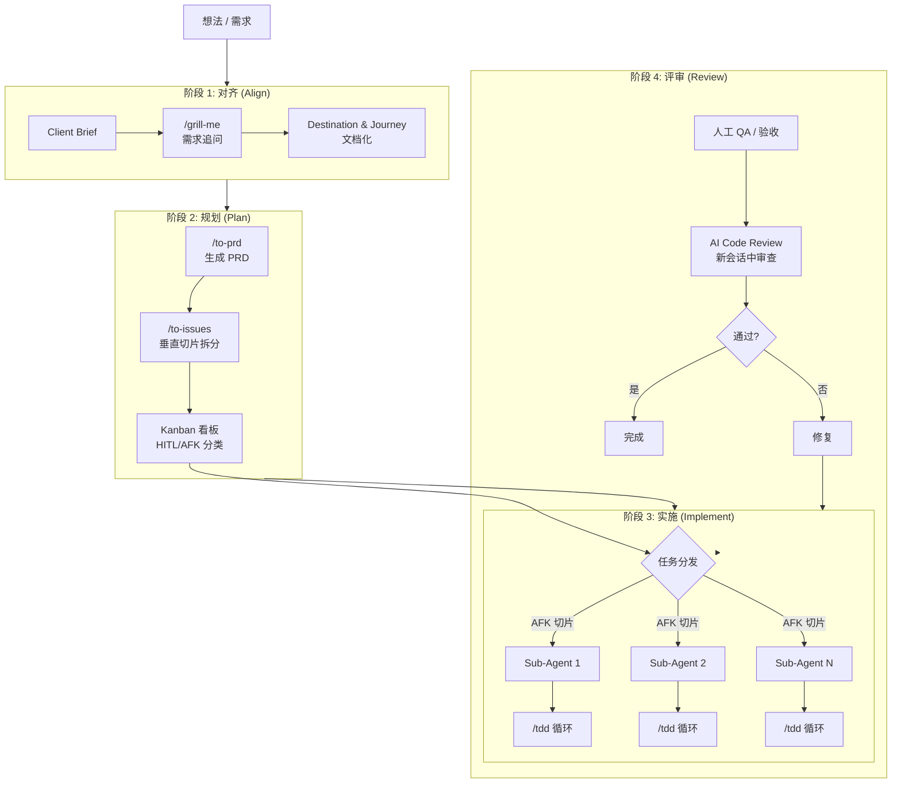

#### 6.1.2 四阶段总结

| 阶段 | 核心活动 | 人类角色 | Agent 角色 | 产出 |
|------|---------|---------|-----------|------|
| **1. 对齐** | 需求挖掘与澄清 | 决策者（回答追问）| 面试官（追问）| Destination, Journey |
| **2. 规划** | 编写 PRD，拆分切片 | 架构师（分类 HITL/AFK）| 执行者（生成 PRD, 生成 Issues）| PRD, Kanban Issues |
| **3. 实施** | AFK 自动化执行 | 监督者（夜间批处理）| 实现者（TDD 循环）| 代码, 测试 |
| **4. 评审** | 人工 QA + AI Review | 审美仲裁者 | 审查者 | 通过/修复决定 |

#### 6.1.3 核心哲学

> **"不是 Vibe Coding，是 Real Engineering"** — Matt Pocock

AI 时代不但没有淘汰软件工程的基本原理，反而让它们变得更加重要。整条流水线的核心是：

$$\text{idea} \rightarrow \text{/grill-me 对齐} \rightarrow \text{/to-prd PRD} \rightarrow \text{/to-issues 垂直切片看板} \rightarrow \text{AFK TDD 实施} \rightarrow \text{人工 QA/Code Review}$$

---

### 6.2 完整案例演示

#### 6.2.1 场景设定

**需求**：为一个在线课程平台增加"游戏化"功能——用户完成课程后获得积分、徽章和排行榜。

这是 Matt Pocock 在演讲中使用的实际案例。

#### 6.2.2 阶段 1: 对齐 — Client Brief

```markdown
# Client Brief: 课程平台游戏化功能

## 背景
当前平台是纯内容消费型——用户看完课程就结束了。
缺乏激励机制导致完课率仅 32%。

## 目标用户
- 学习者：需要成就感和进度可视化
- 讲师：需要了解学生参与度

## 核心需求
1. 积分系统 — 完成课程获得积分 — P0
2. 徽章系统 — 达到里程碑解锁徽章 — P1
3. 排行榜 — 显示积分排名 — P2

## 成功标准
- [ ] 完课率从 32% 提升到 45%+ (A/B test)
- [ ] 用户平均学习时长增加 20%+

## 范围外
- 不包含社交功能（评论、好友）
- 不包含实物奖励
```

#### 6.2.3 阶段 1（续）: Grilling Session 关键追问

```text
Grilling 追问记录（节选）:

Q: 用户重复完成同一课程可以重复得分吗？
A: 不可以。每个用户-课程对只计分一次。

Q: 如果用户在后台修改课程完成时间怎么办？（作弊）
A: 积分以首次完成时间为准。后端验证，不以客户端时间为准。

Q: 排行榜需要实时更新吗？
A: 不需要。5 分钟延迟可接受。用缓存。

Q: 如果两个用户积分相同怎么排名？
A: 谁先到达该积分谁排前面（时间戳 tiebreak）。

Q: 徽章的逻辑是什么？是规则引擎还是硬编码？
A: MVP 阶段硬编码 3 个徽章规则。未来可能抽象为规则引擎，
   但先不建过早的抽象。
```

#### 6.2.4 阶段 2: 规划 — PRD 摘要

```markdown
# PRD: 课程平台游戏化功能 v1

## 功能 1: 积分系统 (P0)
- 完成课程 → +10 积分（幂等）
- 积分存储在 `user_points` 表
- API: `POST /api/points/award`, `GET /api/points/{userId}`

## 功能 2: 徽章系统 (P1)
- 3 种徽章规则：
  a. "初学者" — 累计 50 积分
  b. "学霸" — 累计 200 积分
  c. "完美主义者" — 连续 7 天完成课程
- 徽章在数据库中预定义，逻辑在业务层判断

## 功能 3: 排行榜 (P2)
- 全局积分排行 TOP 100
- 缓存策略：Redis，5 分钟 TTL
- API: `GET /api/leaderboard?limit=100`
```

#### 6.2.5 阶段 2（续）: 垂直切片拆分

```text
切片拆分 (DAG 结构):

Phase 1: v₀ — 数据模型 (HITL: 需人工确认 Schema 设计)
Phase 2: v₁ — 积分计算服务 + API (AFK)
         v₂ — 积分仪表盘显示 (AFK)
Phase 3: v₃ — 徽章判定服务 + API (AFK)
         v₄ — 徽章展示组件 (AFK)
Phase 4: v₅ — 排行榜服务 + API (AFK)
         v₆ — 排行榜页面 (AFK)
Phase 5: v₇ — E2E 测试 (AFK)
         v₈ — 性能测试 (HITL: 需人工设定吞吐量目标)
```

#### 6.2.6 阶段 3: 实施 — TDD 示例（切片 v₁：积分计算）

```typescript
// ═══ Sub-Agent 1: 切片 v₁ — RED 阶段 ═══
// Agent 首先根据 PRD 中的验收标准生成测试:

// points_service.test.ts
import { describe, it, expect } from "vitest";
import { PointsService, PointsRepository } from "./points_service";

const makeRepo = (): PointsRepository => {
  const data = new Map<string, number>();
  return {
    save: (userId, points) => data.set(userId, points),
    get: (userId) => data.get(userId) ?? 0,
  };
};

describe("PointsService", () => {
  it("用户完成未完成过的课程 → 收到 10 积分", () => {
    const service = new PointsService(makeRepo());
    service.completeLesson({ userId: "alice", lessonId: "lesson-1" });
    expect(service.getPoints("alice")).toBe(10);
  });

  it("同一用户-课程对不重复计分（幂等性）", () => {
    const service = new PointsService(makeRepo());
    service.completeLesson({ userId: "alice", lessonId: "lesson-1" });
    service.completeLesson({ userId: "alice", lessonId: "lesson-1" });
    expect(service.getPoints("alice")).toBe(10);
  });

  it("不同课程积分累加", () => {
    const service = new PointsService(makeRepo());
    service.completeLesson({ userId: "alice", lessonId: "lesson-1" });
    service.completeLesson({ userId: "alice", lessonId: "lesson-2" });
    expect(service.getPoints("alice")).toBe(20);
  });
});
```

```typescript
// ═══ Sub-Agent 1: 切片 v₁ — GREEN 阶段 ═══
// Agent 实现使测试通过的代码:

// points_service.ts
export interface PointsRepository {
  save(userId: string, points: number): void;
  get(userId: string): number;
}

export class PointsService {
  private awarded: Set<string> = new Set();

  constructor(private repo: PointsRepository) {}

  completeLesson(opts: { userId: string; lessonId: string }): void {
    const key = `${opts.userId}::${opts.lessonId}`;
    if (this.awarded.has(key)) {
      return; // 幂等守卫
    }
    this.awarded.add(key);
    const current = this.repo.get(opts.userId);
    this.repo.save(opts.userId, current + 10);
  }

  getPoints(userId: string): number {
    return this.repo.get(userId);
  }
}
```

#### 6.2.7 阶段 4: 评审

```text
人工 QA:
  正常流程：完成课程 → 积分增加
  边界条件：重复完成 → 积分不变
  并发场景：同时完成两门课 → 积分正确累加
  UI 反馈：积分变化的动画时长需要调整（审美判断）

AI Code Review (新会话中):
  幂等性守卫到位
  建议：_awarded 集合在服务重启后会丢失 —— 需持久化到数据库
  测试覆盖了 PRD 中的所有验收标准

修复 → 本轮完成
```

---

## 7. 术语表 (Glossary)

| English Term | 中文术语 | 定义 |
|-------------|---------|------|
| Acceptance Criteria | 验收标准 | 用 Given-When-Then 格式描述的功能完成条件，是 Agent 判断任务是否完成的客观依据 |
| AFK (Away From Keyboard) | 离开键盘模式 | Agent 自主完成无需人类实时介入的任务类型 |
| Attention Mechanism | 注意力机制 | Transformer 架构核心组件，计算序列中所有 token 之间的关联权重，复杂度为 $O(n^2)$ |
| BPE (Byte Pair Encoding) | 字节对编码 | 一种子词分词算法，通过统计频率迭代合并字符对来构建词表 |
| Classitis | 类炎症 | John Ousterhout 创造的术语，指过度将代码拆分为过多无意义的小类 |
| Clean Code | 整洁代码 | Robert C. Martin 倡导的代码质量哲学，强调小函数、小类、高可读性 |
| Client Brief | 客户需求简报 | 需求对齐阶段的第一份输入文档，以用户语言描述问题、目标和约束 |
| Compaction | 上下文压缩 | 将长对话历史压缩为摘要以节省 token 的操作，Matt Pocock 反对此做法 |
| Context Window | 上下文窗口 | LLM 在单次推理中能处理的最大 token 数量，是模型架构硬性限制 |
| Critical Path | 关键路径 | DAG 中决定项目最短完成时间的最长依赖路径 |
| DAG (Directed Acyclic Graph) | 有向无环图 | 用于建模切片任务依赖关系的图结构，确保不存在循环依赖 |
| Deep Modules | 深模块 | John Ousterhout 提出的设计原则：接口极小、实现极深的模块 |
| Destination & Journey | 目标状态与路径文档 | 一对互补文档：Destination 描述最终目标状态，Journey 记录到达过程中的关键决策 |
| Driver-Navigator | 驾驶员-导航员 | 结对编程的角色分工模式 |
| Dumb Zone | 退化区间 | Token 数量超过约 100K 后模型推理质量显著下降的区间 |
| Grilling Session | 需求追问会话 | Agent 扮演面试官系统性追问直至消除所有歧义的需求澄清方法 |
| HITL (Human in the Loop) | 人类在回路中 | 必须有人类实时决策或判断的任务类型 |
| Horizontal Slice | 水平切片 | 按技术架构层拆分工作的方式（先全部 DB → 再全部 API → 再全部 UI）|
| Kanban | 看板 | 精益制造中的可视化工作流工具，在 AI 开发中用于组织垂直切片任务 |
| LLM (Large Language Model) | 大语言模型 | 基于 Transformer 架构的大规模语言模型，如 GPT-4、Claude |
| Navigator | 导航员 | 结对编程中关注全局战略和代码审查的角色 |
| Phase | 阶段 | DAG 中的任务分组，同 Phase 内任务无依赖可并行 |
| pipeline() | 流水线执行 | 无屏障的并行执行策略，快任务不被慢任务阻塞 |
| PRD (Product Requirements Document) | 产品需求文档 | 描述功能需求、验收标准、范围外的结构化文档，是 Agent 的"单一真相来源" |
| Red-Green-Refactor | 红-绿-重构 | TDD 的核心循环：写失败测试 → 最小实现 → 重构优化 |
| Shallow Module | 浅模块 | 接口复杂但功能有限的模块，是 Deep Module 的反模式 |
| Smart Zone | 智能区间 | Token 数量在约 100K 以内时模型推理质量稳定的区间 |
| Sub-Agent | 子代理 | 被主 Agent 委派执行独立任务的隔离 Agent 实例 |
| System Prompt | 系统提示词 | LLM 在对话开始前加载的底层行为指令，定义 Agent 的角色和能力边界 |
| TDD (Test-Driven Development) | 测试驱动开发 | Kent Beck 创立的开发方法论：先写测试，再写实现，最后重构 |
| Test Pyramid | 测试金字塔 | 测试策略模型：大量单元测试 + 中等集成测试 + 少量 E2E 测试 |
| Token | 标记 | LLM 处理文本的最小语义单元，1 token ≈ 0.75 英文单词 ≈ 0.5 中文字 |
| Tokenization | 分词 | 将原始文本转换为 Token 序列的编码过程 |
| Tracer Bullet | 曳光弹 | 一种垂直切片模式：用最薄的代码穿越所有技术层，证明架构可行 |
| Vertical Slice | 垂直切片 | 按用户可见功能单元拆分，每个切片同时穿透数据库、API 和 UI 层 |
| Worktree | 工作树隔离 | Git 提供的独立工作目录机制，用于 Agent 并行时防止文件冲突 |
| XP (Extreme Programming) | 极限编程 | Kent Beck 创立的敏捷软件开发方法论，TDD 和结对编程的发源地 |

---
