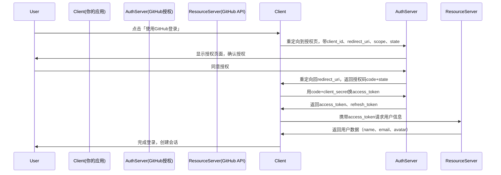
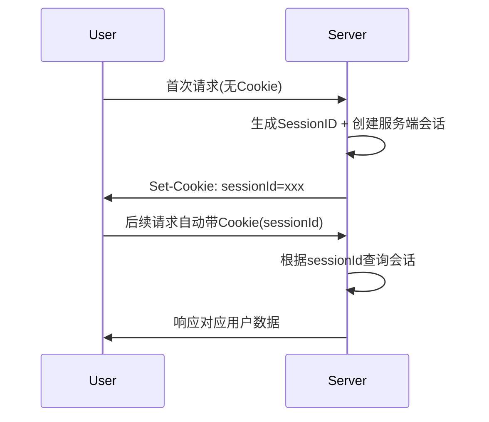

# 本次面试项目经历提问偏多, 在项目经历中穿插加入计算机与JS基础知识

## 项目地址:https://github.com/makursi/Nuxt-travel-log

# 1. 项目介绍
这是一个使用Nuxt4 + drizzle + turso 采用severless架构的一个全栈旅行日志应用,用户可以通过这个项目使用github执行OAuth第三方登录,并可以创建自己的旅行地点日志,并通过可视化地图查看旅行地点.

# 2. 项目难点
  1.  使用Nuxt等框架去编写代码,都要考虑Nuxt4的混合渲染模式以及它的数据获取策略.
- 何时使用useFetch和useAsyncFetch,需要决定哪些数据在服务端获取（SSR），哪些在客户端获取。
  2.  鉴权和中间件保护的搭建
- 在本项目中使用到了better auth 这个面向TS auth框架,使用它处理了用户信息数据传输类型安全,以及前端用户会话状态管理
  3. Maplibre地图组件库的使用,以及地图渲染性能优化
- 通过设定地图显示边界,只显示用户创建locations的最小地图.并对密集location图标的显示进行聚合化处理,将相近的location渲染为一个圆圈在地图中显示
并为地图移动事件添加防抖优化,防止地图频繁触发图标移动事件导致页面地图卡顿

# 3.基础知识

## 获取cookie的方法:
使用JS代码获取当前域下的cookie

// 获取全部Cookie字符串
    console.log(document.cookie);
    
    // 转成对象
    function getCookies() {
      let cookies = {};
      document.cookie.split('; ').forEach(item => {
        let [k, v] = item.split('=');
        cookies[k] = v;
      });
      return cookies;
    }
    console.log(getCookies());

2. 使用浏览器控制台在Application中查看cookie

## OAuth2.0原理,在项目中是如何使用的?

OAuth 2.0 是**授权框架**，核心是：**第三方应用（客户端）在不拿到用户账号密码的前提下，获得用户授权，用临时令牌访问服务商的用户资源**。

#### 1. 核心角色
- **资源所有者（Resource Owner）**：用户，拥有GitHub账号/数据
- **客户端（Client）**：你的应用，想登录/获取用户GitHub信息
- **授权服务器（Authorization Server）**：GitHub的授权服务，发授权码、令牌
- **资源服务器（Resource Server）**：GitHub API，存储用户数据（头像、邮箱等）

#### 2. 授权码流程（Authorization Code Grant）完整步骤


1. **发起授权**：客户端跳转到GitHub授权页，参数：`client_id`、`redirect_uri`、`scope`（权限范围）、`state`（防CSRF）
2. **用户授权**：用户登录GitHub、同意授权
3. **获取授权码**：GitHub重定向回你的回调地址，带上一次性**授权码code**
4. **兑换令牌**：后端用code+client_secret向GitHub请求**access_token**（临时访问凭证）
5. **获取用户信息**：用access_token调用GitHub API获取用户资料
6. **登录/注册**：应用根据用户信息创建账号、建立会话

#### 关键概念
- **access_token**：短期有效（如1小时），用于访问资源，放在请求头 `Authorization: Bearer {token}`
- **refresh_token**：长期有效，用于刷新过期的access_token
- **scope**：权限范围（如`user:email`、`read:user`），控制能获取哪些数据
- **state**：随机字符串，校验回调请求合法性，防CSRF攻击

---

### 二、用 Better Auth 实现 GitHub OAuth 登录（Next.js 示例）
Better Auth 内置GitHub OAuth支持，自动处理授权流程、令牌交换、会话管理，只需配置+调用即可。

#### 1. 准备工作：GitHub OAuth App 创建
1. 打开 GitHub → Settings → Developer settings → OAuth Apps → **New OAuth App**
2. 填写：
   - Application name：你的应用名
   - Homepage URL：`http://localhost:3000`（开发）
   - Authorization callback URL：**必须填** `http://localhost:3000/api/auth/callback/github`（Better Auth默认回调路径）
3. 注册后，复制 **Client ID**、生成并复制 **Client Secret**

#### 2. 安装依赖
```bash
pnpm add better-auth @better-auth/next-js
# 数据库适配器（以Drizzle+SQLite为例）
pnpm add drizzle-orm better-sqlite3
pnpm add -D drizzle-kit
```

#### 3. 配置环境变量（.env.local）
```env
# Better Auth 密钥（至少32位随机字符串）
BETTER_AUTH_SECRET=your-long-random-secret-key-here
# 应用基础URL
BETTER_AUTH_URL=http://localhost:3000
# GitHub OAuth 凭证
GITHUB_CLIENT_ID=your-github-client-id
GITHUB_CLIENT_SECRET=your-github-client-secret
```

#### 4. 服务端配置（lib/auth.ts）
```typescript
import { betterAuth } from "better-auth";
import { drizzleAdapter } from "better-auth/adapters/drizzle";
import { db } from "./db"; // 你的Drizzle数据库实例

export const auth = betterAuth({
  // 数据库适配器（存储用户、会话、账号关联）
  database: drizzleAdapter(db, {
    provider: "sqlite",
  }),
  // 启用GitHub社交登录
  socialProviders: {
    github: {
      clientId: process.env.GITHUB_CLIENT_ID!,
      clientSecret: process.env.GITHUB_CLIENT_SECRET!,
      // 可选：自定义权限范围，默认user:email,read:user
      scope: "user:email read:user",
    },
  },
  // 可选：启用邮箱密码登录
  emailAndPassword: {
    enabled: true,
  },
});
```

#### 5. 创建API路由（Next.js App Router：app/api/auth/[...all]/route.ts）
```typescript
import { auth } from "@/lib/auth";
import { toNextJsHandler } from "better-auth/next-js";

// 导出所有auth相关API（登录、回调、登出、会话等）
export const { GET, POST } = toNextJsHandler(auth);
```

#### 6. 客户端配置（lib/auth-client.ts）
```typescript
import { createAuthClient } from "better-auth/client";

// 创建客户端实例，连接到后端auth API
export const authClient = createAuthClient({
  baseURL: process.env.NEXT_PUBLIC_APP_URL || "http://localhost:3000",
});
```

#### 7. 前端登录按钮组件（app/login/page.tsx）
```tsx
"use client";
import { authClient } from "@/lib/auth-client";
import { useRouter } from "next/navigation";

export default function LoginPage() {
  const router = useRouter();

  const handleGitHubLogin = async () => {
    // 调用GitHub OAuth登录，自动跳转授权
    await authClient.signIn.social({
      provider: "github",
      callbackURL: "/dashboard", // 登录成功跳转
      errorCallbackURL: "/login?error=auth_failed", // 失败跳转
    });
  };

  return (
    <div className="p-8 max-w-sm mx-auto">
      <h1 className="text-2xl font-bold mb-6">登录</h1>
      <button
        onClick={handleGitHubLogin}
        className="w-full bg-black text-white py-2 rounded flex items-center justify-center gap-2"
      >
        <svg className="w-5 h-5" fill="currentColor" viewBox="0 0 24 24">
          <path d="M12 0c-6.626 0-12 5.373-12 12 0 5.302 3.438 9.8 8.207 11.387.599.111.793-.261.793-.577v-2.234c-3.338.726-4.033-1.416-4.033-1.416-.546-1.387-1.333-1.756-1.333-1.756-1.089-.745.083-.729.083-.729 1.205.084 1.839 1.237 1.839 1.237 1.07 1.834 2.807 1.304 3.492.997.107-.775.418-1.305.762-1.604-2.665-.305-5.467-1.334-5.467-5.931 0-1.311.469-2.381 1.236-3.221-.124-.303-.535-1.524.117-3.176 0 0 1.008-.322 3.301 1.23.957-.266 1.983-.399 3.003-.404 1.02.005 2.047.138 3.006.404 2.291-1.552 3.297-1.23 3.297-1.23.653 1.653.242 2.874.118 3.176.77.84 1.235 1.911 1.235 3.221 0 4.609-2.807 5.624-5.479 5.921.43.372.823 1.102.823 2.222v3.293c0 .319.192.694.801.576 4.765-1.589 8.199-6.086 8.199-11.386 0-6.627-5.373-12-12-12z"/>
        </svg>
        使用 GitHub 登录
      </button>
    </div>
  );
}
```

#### 8. 获取/校验会话（服务端/客户端）
- 客户端获取会话：
```tsx
"use client";
import { authClient } from "@/lib/auth-client";

export function UserInfo() {
  const { data: session } = authClient.useSession();
  return session ? (
    <div>
      
      <p>{session.user.name}</p>
      <button onClick={() => authClient.signOut()}>登出</button>
    </div>
  ) : <p>未登录</p>;
}
```
- 服务端校验会话（Next.js Server Component）：
```tsx
import { auth } from "@/lib/auth";
import { headers } from "next/headers";

export default async function Dashboard() {
  const session = await auth.api.getSession({
    headers: await headers(),
  });
  if (!session) return <div>请先登录</div>;
  return <div>欢迎，{session.user.name}</div>;
}
```

#### 9. 数据库迁移（初始化用户/会话表）
```bash
# 生成迁移文件
npx @better-auth/cli generate
# 执行迁移
npx @better-auth/cli migrate
```

---

### 三、核心流程说明（Better Auth 做了什么）
1. 点击登录 → `authClient.signIn.social("github")` → 跳转到GitHub授权页
2. 用户授权 → GitHub重定向到 `/api/auth/callback/github`
3. Better Auth 后端：校验state → 用code换access_token → 调用GitHub API获取用户信息 → 创建/更新用户 → 生成会话Cookie → 跳转到callbackURL
4. 前端通过 `useSession` 读取会话，展示用户信息

---

#### 四、常见问题
- **回调URL不匹配**：必须和GitHub OAuth App里的`Authorization callback URL`完全一致（含`/api/auth/callback/github`）
- **权限不足**：调整`scope`参数，如需要公开仓库信息加`public_repo`
- **跨域/环境变量**：确保`BETTER_AUTH_URL`、`baseURL`正确，生产环境用HTTPS

## 说一说session

### 1. 什么是 Session
**Session（会话）** 是**服务端**存储用户临时数据的机制，用来标记「同一个用户的多次请求」。
> 前提：HTTP 是**无状态协议**，服务器默认不认识每一次请求是谁发的，不知道前后请求是否来自同一个人。

### 2. 核心组成
1. **SessionID**
   服务端生成的**唯一随机字符串**，全局唯一，用来标识单个用户。
2. **服务端 Session 存储空间**
   内存 / Redis / 数据库，存放：用户id、登录态、权限、临时数据等。
3. **客户端存储载体**
   一般通过 **Cookie** 存放 SessionID，每次请求自动携带。

### 3. 通俗类比
- Cookie：你去网吧的**临时手牌**（带编号，存在你身上）
- Session：网吧后台**登记记录**（编号对应你的上机信息、套餐）
- 每次刷手牌（请求带Cookie），前台查记录（服务端查Session）

---

## 二、关键作用
1. **解决 HTTP 无状态问题**
   让服务器能识别同一浏览器/设备的连续请求，记住用户。
2. **维持登录状态**
   登录后服务端写入 Session，后续请求免密识别用户。
3. **安全存储敏感数据**
   关键信息（用户权限、手机号、角色）**存在服务端**，不暴露在前端。
4. **临时数据共享**
   跨页面、跨接口共享用户临时数据（购物车、验证码、临时表单）。
5. **权限控制 & 单点校验**
   服务端校验 Session 有效性，拦截未登录请求。

---

## 三、Session 完整工作流程
1. 用户第一次访问网站
   - 服务端**生成唯一 SessionID**
   - 在服务端开辟一块空间，创建空 Session 数据
   - 通过 **Set-Cookie** 响应头，把 `sessionId` 下发到浏览器
2. 浏览器自动保存 `sessionId` 到 Cookie
3. 后续每次请求
   - 浏览器自动携带 Cookie 里的 `sessionId`
   - 服务端根据 `sessionId` 查找对应会话数据
4. 登录操作
   - 校验账号密码成功后
   - 往当前 Session 写入：`userId、isLogin、role`
5. 退出登录 / 过期
   - 服务端**销毁对应 Session**
   - 或客户端清除 Cookie，下次请求无 SessionID，重新变成游客



---

## 四、Session 如何实现（底层原理 + 代码示例）
### 1. 底层实现原理
1. 生成：服务端加密随机串作为 `sid`
2. 存储：
   - 开发环境：**内存**（重启丢失、集群失效）
   - 生产环境：**Redis**（高性能、过期淘汰、集群共享）
3. 传递：响应头 `Set-Cookie` 下发 sid
4. 校验：每次请求解析 Cookie，取 sid 查会话
5. 销毁：过期自动清理 / 主动删除会话

### 2. 极简手写实现（Node.js 原生）
#### ① 服务端存储（简易内存版）
```js
// 服务端Session容器
const sessionStore = new Map();

// 生成随机SessionID
function generateSid() {
  return Math.random().toString(36).slice(2);
}

// 登录时绑定用户到Session
function login(sid, user) {
  sessionStore.set(sid, {
    userId: user.id,
    username: user.name,
    isLogin: true,
    createTime: Date.now()
  });
}

// 根据sid获取会话
function getSession(sid) {
  return sessionStore.get(sid);
}

// 销毁会话（退出登录）
function destroySession(sid) {
  sessionStore.delete(sid);
}
```

#### ② 结合请求响应流程
```js
const http = require("http");

const server = http.createServer((req, res) => {
  // 1. 从请求Cookie中取出sid
  const cookies = Object.fromEntries(
    req.headers.cookie?.split("; ").map(c => c.split("=")) || []
  );
  let sid = cookies.sid;

  // 2. 无sid → 新建会话
  if (!sid || !sessionStore.has(sid)) {
    sid = generateSid();
    // 设置Cookie，过期时间、httpOnly
    res.setHeader("Set-Cookie", `sid=${sid}; HttpOnly; Path=/; Max-Age=86400`);
    // 初始化空会话
    sessionStore.set(sid, { isLogin: false });
  }

  const session = getSession(sid);

  // 3. 模拟登录接口
  if (req.url === "/login") {
    login(sid, { id: 1001, name: "test用户" });
    res.end("登录成功，已写入Session");
    return;
  }

  // 4. 校验登录态
  if (session.isLogin) {
    res.end(`已登录：${session.username}`);
  } else {
    res.end("未登录，请先登录");
  }
});

server.listen(3000);
```

### 3. 框架标准实现（Express）
```bash
npm install express-session
```
```js
const express = require("express");
const session = require("express-session");
const app = express();

app.use(session({
  secret: "自定义加密密钥",
  resave: false,
  saveUninitialized: false,
  cookie: {
    httpOnly: true, // 禁止JS读取，防XSS
    maxAge: 24 * 60 * 60 * 1000
  }
}));

// 登录写入session
app.get("/login", (req, res) => {
  req.session.user = { id: 1001, name: "admin" };
  res.send("登录成功");
});

// 读取session
app.get("/user", (req, res) => {
  res.send(req.session.user || "未登录");
});

// 退出销毁
app.get("/logout", (req, res) => {
  req.session.destroy();
  res.send("已登出");
});
```

---

## 五、Session 关键特性 & 优缺点
### 优点
1. 数据存在服务端，**安全性高**
2. 不受前端存储大小限制
3. 可主动销毁、过期管理
4. 适合存放登录态、权限等敏感信息

### 缺点
1. 内存模式**不适合集群/多服务器**（需要Redis共享）
2. 依赖 Cookie，用户禁用 Cookie 会失效
3. 服务端有存储压力

---

## 六、Session  vs  Cookie 核心区别
| 特性 | Cookie | Session |
|------|--------|---------|
| 存储位置 | 浏览器（客户端） | 服务器 |
| 容量 | 小（约4KB） | 无限制 |
| 安全性 | 低，可被JS篡改 | 高，数据在服务端 |
| 存放内容 | 非敏感标识 | 登录态、权限、敏感数据 |
| 依赖关系 | 独立 | **默认依赖Cookie存SessionID** |

---

## 七、生产环境最佳实践
1. 会话存储：**必须用 Redis**，替代内存
2. Cookie 配置：`HttpOnly + Secure + SameSite` 防 XSS、CSRF
3. 设置合理过期时间，自动清理无效会话
4. 敏感系统搭配 单点登录、JWT 混合使用


# 2026-04-10 16:00 面试结束

## 面试官提醒: 
**1. ai时代下,全栈开发能力被逐渐放大,用多学习常见的数据结构方面的知识,掌握链表,二叉树等数据结构. 还有多学习计算机基础知识**
**2. 要多学习后端的一些经验与技术,包括架构模式,api搭建等**
