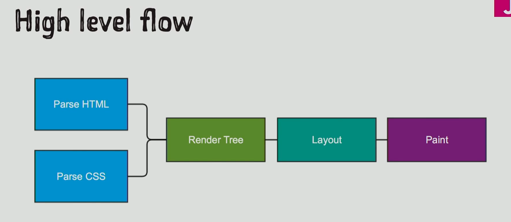

# 🧠 浏览器页面渲染全流程



这张图是 **W3C 标准定义的浏览器渲染引擎核心渲染流水线（Critical Rendering Path，关键渲染路径）**，完整描述了从 HTML/CSS 解析到页面最终绘制的全流程，是前端性能优化、浏览器原理的核心基础。


---

## 一、整体流程总览（官方标准定义）
浏览器渲染页面的完整流程，严格遵循以下顺序：

`解析 HTML → 解析 CSS → 构建渲染树（Render Tree） → 布局（Layout/Reflow） → 绘制（Paint/Repaint） → 合成（Composite）`

（图中省略了最后一步「合成」，但它是现代浏览器渲染的核心环节）

---

## 二、逐步骤深度拆解（含难点概念详解）
---

### 🔹 第一步：Parse HTML（HTML 解析）
#### 1. 官方定义
根据 **W3C HTML 5 规范**，HTML 解析器（HTML Parser）的核心任务是：**将 HTML 字节流转换为 DOM 树（Document Object Model）**，这是页面的结构化表示。

#### 2. 详细执行过程
1.  **字节解码**：浏览器从网络/缓存获取 HTML 字节流，通过字符编码（如 UTF-8）解码为 Unicode 字符。
2.  **词法分析（Tokenization）**：将字符流拆分为一个个「Token」（标签、属性、文本等），比如 `<div>`、`class="container"`、`Hello World`。
3.  **语法分析（Parsing）**：根据 HTML 语法规则，将 Token 构建为 **DOM 树（DOM Tree）**。
    - DOM 树是一个以 `document` 为根节点的树形结构，每个节点对应 HTML 中的一个元素/文本/注释。
    - HTML 是「容错性语法」，即使标签不闭合、结构错误，解析器也会自动修复，生成完整 DOM 树（这是 HTML 与 XML 的核心区别）。
4.  **预加载扫描器（Preloader）**：HTML 解析过程中，会启动一个并行的预加载扫描器，提前扫描 HTML 中的外部资源（`<script>`、`<link>`、`` 等），提前发起网络请求，加速页面加载（这是浏览器的核心优化手段）。

#### 3. 核心难点概念
- **DOM 树 vs HTML 源码**：DOM 树是浏览器解析后的「内存中结构」，和源码可能不一致（浏览器会自动修复错误标签、补全缺失的 `<html>`/`<body>` 等）。
- **`<script>` 阻塞解析**：根据 HTML 规范，**同步 `<script>` 会阻塞 HTML 解析**，因为 JS 可能通过 `document.write()` 修改 DOM 结构。只有当 JS 执行完成后，解析才会继续。
  - 解决方案：给 `<script>` 添加 `defer`/`async` 属性，让 JS 异步加载，不阻塞 HTML 解析。
- **增量解析**：HTML 解析是「流式、增量」的，浏览器不需要等整个 HTML 下载完成，就可以边下载边解析，边渲染页面（这就是为什么我们能看到页面「逐步加载」）。

---

### 🔹 第二步：Parse CSS（CSS 解析）
#### 1. 官方定义
根据 **W3C CSS 2.1/3 规范**，CSS 解析器（CSS Parser）的核心任务是：**将 CSS 字节流转换为 CSSOM 树（CSS Object Model）**，这是页面的样式结构化表示。

#### 2. 详细执行过程
1.  **字节解码**：和 HTML 一样，先将 CSS 字节流解码为 Unicode 字符。
2.  **词法与语法分析**：解析 CSS 规则（选择器、属性、值），构建 **CSSOM 树**。
    - CSSOM 树是一个以 `document.styleSheets` 为根的树形结构，包含所有样式规则（内联样式、`<style>`、外部 CSS 文件）。
    - CSS 是「阻塞渲染的资源」：**CSS 解析会阻塞渲染**，因为样式会影响页面布局，浏览器必须等 CSS 解析完成，才能进入下一步构建渲染树。
3.  **样式计算（Style Calculation）**：CSS 解析完成后，会执行「样式层叠与优先级计算」，为每个 DOM 元素计算最终生效的样式（Computed Style）。
    - 优先级规则（从高到低）：`!important` > 内联样式 > ID 选择器 > 类/伪类/属性选择器 > 标签选择器 > 通配符 > 浏览器默认样式（UA 样式）。
    - 继承规则：部分样式（如 `color`、`font-size`）会从父元素继承到子元素，无需显式声明。

#### 3. 核心难点概念
- **CSS 阻塞渲染 vs 不阻塞 HTML 解析**：CSS 会阻塞渲染，但**不会阻塞 HTML 解析**。HTML 解析会继续，但渲染会暂停，直到 CSS 解析完成。
- **CSSOM 是只读的**：和 DOM 不同，CSSOM 树是只读的，无法通过 JS 直接修改 CSSOM 节点，只能通过修改元素的 `style` 属性或添加 `<style>` 标签间接修改。
- **媒体查询优化**：带媒体查询的 CSS（如 `media="print"`、`media="(max-width: 768px)"`）**不会阻塞首屏渲染**，浏览器只会加载但不阻塞渲染，只有当媒体查询匹配时才会生效。

---

### 🔹 第三步：构建 Render Tree（渲染树）
#### 1. 官方定义
根据 W3C 渲染规范，**渲染树（Render Tree，也叫 Frame Tree/Layout Tree）** 是 DOM 树与 CSSOM 树的「融合产物」，是浏览器真正用于渲染页面的结构。

#### 2. 详细执行过程
1.  **树的融合**：遍历 DOM 树的每个可见节点，从 CSSOM 树中匹配对应的样式规则，生成渲染树节点。
    - **可见节点**：只有「视觉上可见」的节点才会进入渲染树，比如：
      - 正常显示的元素（`display: block/inline`）
      - 带 `visibility: visible` 的元素
    - **不可见节点**：不会进入渲染树，比如：
      - `display: none` 的元素
      - `<head>` 及其内部元素（除非有可见内容）
      - `script`、`meta` 等元数据元素
2.  **样式计算完成**：为每个渲染树节点计算最终的「计算样式（Computed Style）」，包含所有生效的 CSS 属性（继承、层叠后的最终值）。

#### 3. 核心难点概念
- **渲染树 ≠ DOM 树 + CSSOM 树的简单合并**：渲染树只包含「可见元素」，且顺序和 DOM 树一致，但结构可能不同（比如 `display: none` 的元素会被完全移除）。
- **重排/重绘的触发源**：渲染树是布局和绘制的基础，任何修改 DOM 或 CSSOM 的操作，都会导致渲染树更新，进而触发重排/重绘。
- **Shadow DOM 与渲染树**：Web Components 的 Shadow DOM 会生成独立的渲染子树，和主渲染树隔离，样式不会互相影响。

---

### 🔹 第四步：Layout（布局 / Reflow / 回流）
#### 1. 官方定义
根据 W3C CSS 布局规范，**布局（Layout，也叫 Reflow/回流）** 是渲染引擎根据渲染树，计算每个元素在页面上的「几何位置和大小」的过程，生成「布局树（Layout Tree）」。

#### 2. 详细执行过程
1.  **布局上下文（Layout Context）**：浏览器以「视口（Viewport）」为根，从渲染树的根节点（通常是 `<html>`）开始，**从上到下、从左到右**遍历每个节点，计算其位置和大小。
    - 布局是「递归」的：父元素的布局会影响子元素，子元素的布局也会反过来影响父元素（比如 `height: auto` 的元素，高度由子元素决定）。
2.  **盒模型计算**：为每个元素计算 CSS 盒模型（content、padding、border、margin）的最终尺寸，确定元素在页面中的坐标（x/y 轴位置、宽高）。
3.  **首次布局（First Layout）**：页面首次加载时的布局，是「全量布局」，会遍历整个渲染树，计算所有元素的位置。
4.  **增量布局（Incremental Layout）**：页面加载完成后，修改 DOM/CSS 触发的布局，浏览器会尽可能只重新计算受影响的节点，而非全量布局（性能优化）。

#### 3. 核心难点概念
- **回流（Reflow）**：就是「重新布局」，当修改元素的几何属性（宽高、位置、margin、padding 等）时，会触发回流，浏览器需要重新计算布局树。
  - 回流是「代价极高」的操作，会触发整个渲染树的重新计算，严重影响性能。
- **布局抖动（Layout Thrashing）**：连续多次读写 DOM 几何属性（如 `offsetHeight`、`clientWidth`），会导致浏览器强制多次回流，性能急剧下降。
  - 解决方案：批量读取 → 批量写入，避免读写交替。
- **脱离文档流的元素**：`position: absolute/fixed`、`float` 的元素，会脱离正常文档流，布局时单独计算，不影响其他元素的布局。
- **视口（Viewport）**：布局的根参考系，移动端的 `<meta name="viewport">` 会直接影响布局的基准尺寸，是移动端适配的核心。

---

### 🔹 第五步：Paint（绘制 / Repaint / 重绘）
#### 1. 官方定义
根据 W3C 绘制规范，**绘制（Paint，也叫 Repaint/重绘）** 是渲染引擎将布局树的每个节点，转换为屏幕上的「像素」的过程，生成「绘制树（Paint Tree）」。

#### 2. 详细执行过程
1.  **分层（Layerization）**：现代浏览器（Chrome Blink、Firefox Gecko）会将渲染树拆分为多个「图层（Layer）」，比如：
    - 普通内容层
    - 视频/Canvas 层
    - 3D 变换层（`transform: translateZ(0)` 会提升为独立图层）
    - 滚动层
    - 分层的核心目的：**只重绘需要更新的图层，而非整个页面**，大幅提升性能。
2.  **绘制顺序（Painting Order）**：按照「从后到前」的顺序绘制每个图层的元素，遵循 CSS 堆叠上下文（Stacking Context）规则：
    - 背景色 → 边框 → 阴影 → 内容 → 子元素 → 定位元素 → z-index 更高的元素
3.  **光栅化（Rasterization）**：将矢量的绘制指令，转换为 GPU 可识别的位图（像素），这个过程可以在 GPU 线程中异步执行，不阻塞主线程。
4.  **首次绘制（First Paint）**：页面首次加载时的绘制，是首屏性能的核心指标（FP/FCP）。
5.  **增量绘制（Incremental Paint）**：修改元素的非几何属性（如 `color`、`background-color`、`visibility`）时，触发「重绘」，只重绘受影响的图层，不触发回流。

#### 3. 核心难点概念
- **重绘（Repaint）**：修改元素的视觉样式（非几何属性），触发重新绘制，代价远低于回流，但仍会消耗性能。
- **回流一定触发重绘，重绘不一定触发回流**：回流会导致元素位置变化，必须重绘；但重绘只修改样式，不影响布局，无需回流。
- **堆叠上下文（Stacking Context）**：控制元素的绘制顺序，`z-index` 只在同一个堆叠上下文中生效，不同堆叠上下文的元素无法互相层叠，是解决「z-index 不生效」问题的核心。
- **GPU 加速绘制**：将图层上传到 GPU 内存，由 GPU 负责绘制和合成，主线程只负责发送指令，不阻塞页面交互，是动画性能优化的核心。

---

### 🔹 第六步：Composite（合成，图中省略但必须补充）
#### 1. 官方定义
根据 W3C 合成规范，**合成（Composite）** 是浏览器将所有图层的位图，按照正确的顺序合并为最终页面画面，输出到屏幕的过程，由 GPU 线程执行，完全不阻塞 JS 主线程。

#### 2. 详细执行过程
1.  **图层合并**：GPU 按照堆叠顺序，将所有图层的位图合并为一个完整的画面。
2.  **屏幕输出**：将合并后的画面发送到显示器，完成页面渲染。
3.  **合成线程（Compositor Thread）**：Chrome 等现代浏览器有独立的合成线程，负责图层的合成和滚动，即使 JS 主线程阻塞，页面依然可以滚动（这就是为什么「页面卡了还能滚动」的原因）。

#### 3. 核心难点概念
- **仅合成动画（Composite-only Animation）**：只修改 `transform` 和 `opacity` 属性的动画，只会触发合成，不会触发回流和重绘，是性能最优的动画方案。
  - 原理：`transform` 和 `opacity` 由 GPU 合成线程处理，不影响主线程，60fps 无压力。
- **图层爆炸（Layer Explosion）**：过度提升元素为独立图层（比如给每个元素加 `translateZ(0)`），会导致 GPU 内存占用过高，页面卡顿，是常见的性能优化误区。

---

## 三、各步骤的核心关系与阻塞规则（官方标准）
| 步骤 | 阻塞关系 | 核心影响 |
|------|----------|----------|
| HTML 解析 | 同步 `<script>` 会阻塞解析；CSS 不阻塞解析 | 决定 DOM 树的生成速度 |
| CSS 解析 | 阻塞渲染；不阻塞 HTML 解析 | 决定渲染树的生成，是首屏渲染的关键 |
| 渲染树构建 | 依赖 HTML 和 CSS 解析完成 | 布局和绘制的基础 |
| 布局（回流） | 阻塞主线程；任何 DOM/CSS 几何修改都会触发 | 性能代价最高的操作 |
| 绘制（重绘） | 阻塞主线程；非几何修改触发 | 代价低于回流 |
| 合成 | 不阻塞主线程；由 GPU 线程执行 | 性能最优的操作 |

---

## 四、关键难点概念深度澄清（面试必背）
### 1. 回流（Reflow） vs 重绘（Repaint） vs 合成（Composite）
| 操作 | 触发条件 | 性能代价 | 执行线程 |
|------|----------|----------|----------|
| 回流（Reflow） | 修改几何属性（宽高、位置、margin 等） | 极高 | JS 主线程 |
| 重绘（Repaint） | 修改视觉属性（颜色、背景等，非几何） | 中 | JS 主线程 |
| 合成（Composite） | 修改 `transform`/`opacity` | 极低 | GPU 合成线程 |

### 2. 关键渲染路径（Critical Rendering Path, CRP）
就是我们讲的这个完整流程，是前端性能优化的核心：
- 优化目标：**尽可能缩短 CRP 长度，减少回流/重绘，最大化利用 GPU 合成**。
- 核心优化手段：
  1.  减少阻塞资源：异步加载 JS/CSS，避免同步 `<script>` 阻塞解析。
  2.  压缩 HTML/CSS/JS，减少文件体积，加速解析。
  3.  避免不必要的回流：批量修改 DOM，使用 `DocumentFragment`，离线修改 DOM 后再插入。
  4.  优先使用合成动画：用 `transform` 替代 `top/left` 做动画。
  5.  合理分层：避免图层爆炸，只给动画元素提升图层。

### 3. 为什么 CSS 阻塞渲染，JS 阻塞解析？
- **CSS 阻塞渲染**：样式会影响页面布局，浏览器必须等 CSS 解析完成，才能保证渲染的样式正确，否则会出现「闪烁（FOUC，无样式内容闪烁）」。
- **JS 阻塞解析**：JS 可以通过 `document.write()` 修改 DOM 结构，浏览器必须等 JS 执行完成，才能继续解析 HTML，否则 DOM 结构会混乱。

### 4. 浏览器的「预渲染」优化
现代浏览器会在解析过程中做大量优化，比如：
- **预加载扫描器**：提前加载外部资源，加速页面加载。
- ** speculative parsing（推测解析）**：Chrome 等浏览器会在 JS 执行时，继续解析后续 HTML，提前加载资源，减少阻塞时间。
- **增量布局/绘制**：只更新受影响的节点，而非全量更新，提升性能。

---

## 五、完整流程示例（以一个简单页面为例）
```html
<!DOCTYPE html>
<html>
<head>
  <link rel="stylesheet" href="style.css">
</head>
<body>
  <h1>Hello World</h1>
  <script src="script.js"></script>
</body>
</html>
```
1.  浏览器下载 HTML，开始解析 HTML，生成 DOM 树。
2.  解析到 `<link>`，预加载扫描器提前下载 `style.css`，HTML 解析继续。
3.  `style.css` 下载完成，解析 CSS，生成 CSSOM 树。
4.  HTML 解析到 `<script>`，暂停解析，等待 `script.js` 下载并执行。
5.  JS 执行完成，HTML 解析继续，生成完整 DOM 树。
6.  DOM + CSSOM 融合，生成渲染树。
7.  执行布局（Layout），计算 `h1` 的位置和大小。
8.  执行绘制（Paint），绘制 `h1` 的文字和样式。
9.  执行合成（Composite），合并图层，输出到屏幕，页面渲染完成。

---
