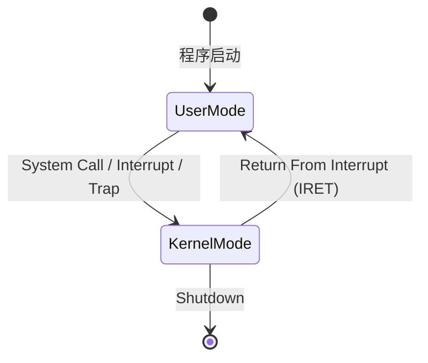
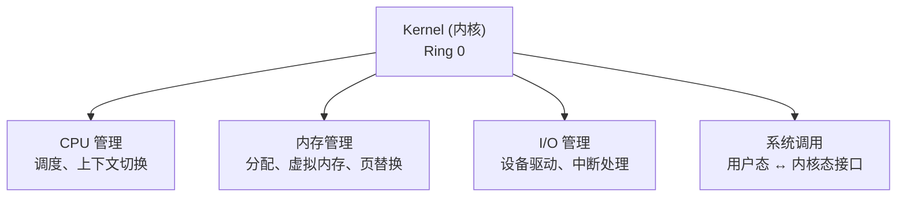

学习操作系统方面的知识源于一个Reddit的帖子, 我在Reddit上发现了一位印度开发者在r/nodejs论坛上发表了他总结的Nodejs的[开源书籍](https://www.thenodebook.com/). 书中的第一章部分是关于Nodejs的架构知识, 它介绍了Nodejs的架构基础,事件循环机制, Nodejs中的V8引擎和libuv库. 这其中涉及到很多关于操作系统的概念, 进程, 线程, 文件系统, I/O等, 并且这些知识十分的琐碎抽象. 我的知识浅薄,并且我发现即使我向gpt进行提问,得到了这些知识的定义, 但却无法将它们联系在一起.

所以我就想系统的学习一下操作系统方面的知识,顺便应付本学期的操作系统课程...

# CS162 Lecture 1 What is an Operating System?

<iframe width="560" height="315" src="https://www.youtube.com/embed/pPzVV2kkGHc?si=8cfcK8I34v7pDMoH" title="YouTube video player" frameborder="0" allow="accelerometer; autoplay; clipboard-write; encrypted-media; gyroscope; picture-in-picture; web-share" referrerpolicy="strict-origin-when-cross-origin" allowfullscreen></iframe>


# 操作系统的定义

如果你有读过《Operating System Concepts》 这本书的话, 书中的导论部分对于操作系统的定义十分复杂,科学家们明确表示了目前为止没有关于操作系统的统一定义.

但我们可以从操作系统的作用来寻找它的定义:

## 操作系统的作用是什么? 

计算机系统由处理器、内存、磁盘、网卡、GPU 等大量异构硬件组成。如果每个应用程序（Application）都直接操作这些硬件，开发者将不得不处理几千种设备驱动、手动管理物理内存页、自行调度 CPU——这不仅极其低效，而且稍有差错就会导致系统崩溃。操作系统（Operating System, OS）正是为了解决这个问题而诞生的一层系统软件（System Software）:它在硬件之上运行，为上层应用程序提供一个统一、安全、易用的执行环境。

所以我们可以明确操作系统的简单定义为:**操作系统是计算机管理硬件并为应用程序提供运行环境的的系统软件**

## 我们为什么需要操作系统?

没有 **OS(Operating System)** 的计算机只能一次运行一个程序，且程序必须内置所有设备驱动。这在 1940–50 年代的批处理系统中勉强可接受；但在多用户、多任务、网络互联的现代计算环境中，OS 是必需品

四个核心驱动的元素为:

### Complexity（复杂性）

随着计算机的不断发展,硬件和软件的复杂性不断增加。

复杂性就体现在这些方面:
- 硬件多样性: 市面上的 CPU（x86 / ARM / RISC-V）、内存类型（DDR4 / DDR5 / HBM）、存储协议（SATA / NVMe / SCSI）、外设接口（USB / PCIe / Thunderbolt）组合呈指数级。
- 规格文档规模: Intel Software Developer's Manual 共 4 卷，总页数 > 4700 页。
- 驱动数量: Linux Kernel 中驱动代码占比超过 70%。

OS 的任务是封装这种复杂性，让应用只需调用 write() 就能向任意存储设备写入数据，无需关心底层是 NVMe SSD 还是机械硬盘。


### Sharing（共享）

单用户独占硬件是对资源的浪费。一台 128 核 CPU、256 GB 内存的服务器可以同时服务数万个用户请求。

OS 通过两种多路复用（Multiplexing）策略实现资源共享:
- 时分复用 (Time Multiplexing): 多个进程轮流占用 CPU，每个进程获得一个时间片（Time Slice）。
- 空分复用 (Space Multiplexing): 物理内存被划分给多个进程，每个进程占有不同的物理页。

### Protection（保护）

在共享环境中，一个恶意或 buggy 的程序可能造成一下问题:
- 读取/修改其他程序的内存（信息泄露、数据损坏）
- 执行特权指令（如 `HLT` 停机指令）
- 独占 CPU 不放（死循环）

所以,OS 必须保证**隔离（Isolation）**：每个进程运行在自己的沙盒（Sandbox）中，进程 A 不能访问进程 B 的内存，除非 OS 显式允许（如共享内存 IPC）。

### Abstraction（抽象）

应用程序的开发者不应关心硬件的物理细节。一个 Python 脚本调用 open("file.txt") 时，不需要知道文件在磁盘的哪个扇区、经过哪个 SATA 控制器、触发了几次 DMA 传输。

OS提供的抽象为:

| 物理资源 | OS 抽象 | 接口示例 |
|---------|--------|---------|
| CPU | 进程 (Process) / 线程 (Thread) | `fork()`, `pthread_create()` |
| 物理内存 | 地址空间 (Address Space) / 虚拟内存 (Virtual Memory) | `malloc()`, `mmap()` |
| 磁盘 | 文件系统 (File System) | `open()`, `read()`, `write()` |
| 网卡 | Socket | `socket()`, `send()`, `recv()` |
| 外设 | 设备文件 (Device File) | `/dev/sda`, `/dev/tty` |

抽象的核心价值在于**可移植性（Portability）**：同一个程序可以在不同硬件平台上运行，只要 OS 提供了相同的抽象接口。

# 操作系统扮演的三个角色

这是我觉得CS162 Lecture 1中最有意思的一部分, 他们把操作系统分为了三个角色, 分别为:**裁判（Referee）,魔术师（Illusionist）,胶水（Glue）**. 每个角色都在计算机中负责不同的职责

## 裁判（Referee）— 资源管理者

在单用户独占系统中, 我们不需要一个裁判来为我们判决资源的管理,因为整个机器都是属于我们自己的.
。但在多用户、多任务系统中，CPU、内存、磁盘、网络等资源是有限的。多个程序同时运行时，必须有一个
中立的“裁判“来决定谁使用什么资源、何时使用、使用多少。

它的核心机制是**资源多路复用（Resource Multiplexing）**:

### 被管理的资源如下:

| 资源类型 | 特点 | 管理策略 |
|---------|------|---------|
| **CPU** | 可分时共享，不可分空共享 | 进程/线程调度，时间片轮转 |
| **内存** | 可分空共享，需隔离 | 虚拟内存，页式管理 |
| **磁盘** | 大容量、慢速、持久化 | 文件系统，磁盘调度 |
| **网络** | 共享信道、带宽有限 | 协议栈，socket 管理 |

### 时分复用和空分复用

**时分复用 (Time Division Multiplexing)**:
```text
进程A: ████░░░░░░░░████░░░░
进程B: ░░░░████░░░░░░░░████
进程C: ░░░░░░░░████░░░░░░░░
       └── 时间轴 ──────────→
```
CPU 调度器在多个进程间快速切换（典型切换间隔 1–10 ms），利用人类感知的"慢"掩盖切换的事实——这就是"独占 CPU"幻觉的来源。

**空分复用 (Space Division Multiplexing)**:
```text
物理内存: [进程A | 进程B | 进程C | OS | 空闲]
           4 GB 物理 RAM 被划分给多个进程
```
每个进程获得一段连续的（虚拟）地址空间，但这些空间被映射到物理内存中分散的页帧（Page Frame）。


### 隔离与公平性

裁判必须同时满足:
- **公平性 (Fairness)**: 同等优先级的进程获得大致相等的资源份额。
- **效率 (Efficiency)**: 资源不应闲置——如果进程 A 在等待 I/O，CPU 应分给进程 B。
- **隔离 (Isolation)**: 进程 A 的资源消耗不应影响进程 B 的正确性。

## 魔术师（Illusionist）— 硬件抽象层

魔术师这个角色就是创造幻觉---**让每个程序以为它独占整个机器**,这句话很重要.

因为物理硬件有严格的限制:CPU 核心数固定（4 或 8 或 128），物理内存有限（8 GB 或 16 GB），磁盘被组织为扇区号而非有意义的文件名。直接面对这些限制会让编程变得痛苦且不可移植。

操作系统通过三种核心虚拟化技术实现:

### 虚拟内存->“无限内存“幻觉

这个过程很复杂,大体是这样的: 

1.  操作系统会让每个进程都拥有自己的虚拟地址空间(进程的概念可以简单理解为程序执行的实例化),大小为4 GB 虚拟内存,远大于RAM. 

2.  OS利用内存管理单元(MMU)将虚拟地址映射到物理地址,虚拟地址和物理地址之间做翻译,实现虚拟内存的管理.只在程序真正访问某地址时才分配物理内存（按需分页, Demand Paging）,不活跃的页面被交换到磁盘（Swap / Paging),从而创造了"我拥有远大于物理内存的连续内存"的幻觉。

### 进程调度-> "独占 CPU"幻觉

尽管只有 N 个物理核心，OS 通过快速上下文切换（Context Switch）可以让数百个进程"同时"运行。从一个进程的视角看，它占据了 100% 的 CPU——它看不到调度器、看不到其他进程、看不到自己被暂停和恢复的过程。


### 文件系统-> "文件替代磁盘扇区"幻觉

磁盘由若干扇区（Sector，通常 512 B 或 4 KB）组成。直接以扇区号访问数据极其不便。

文件系统（File System）将扇区组织为文件（File）和目录（Directory）的层次结构:

    裸磁盘视图:  [sector 0 | sector 1 | ... | sector N]
                  ↓ 文件系统抽象
    用户视图:    /home/user/report.pdf
                /usr/bin/python3
                /etc/config.yaml


##  胶水（Glue）— 公共服务平台


即使我们有了资源管理和抽象，程序之间仍然需要协作.

两个程序如何交换数据？如何共享文件？如何通过互联网通信？如果每个程序都自己实现 TCP 协议栈和文件系统驱动，这不仅浪费，还会导致兼容性灾难。

 OS 提供一套所有程序共用的公共基础服务（Common Infrastructure），以系统调用（System Call）为接口。这类似于城市基础设施——道路、水电、排水——每个建筑不需要自己建发电站。

胶水角色提供的公共服务:

| 服务类别 | 提供的功能 | 接口示例 |
|---------|-----------|---------|
| **文件系统** | 文件创建/读写/删除、目录管理、权限控制 | `open()`, `read()`, `write()`, `chmod()` |
| **网络通信** | TCP/UDP 协议栈、socket 抽象 | `socket()`, `bind()`, `connect()`, `send()` |
| **进程间通信 (IPC)** | 管道、信号、共享内存、消息队列 | `pipe()`, `signal()`, `shmget()` |
| **图形界面** | 窗口管理、图形渲染、输入事件 | X11, Wayland, Win32 GDI |
| **用户权限管理** | 用户/组管理、认证、访问控制列表 | `setuid()`, `/etc/passwd`, ACL |

# 保护机制

## Dual-Mode操作

假设所有代码都以同等权限运行——任意程序都可以执行 HLT（停机指令）、修改页表基址寄存器（CR3）、直接读写磁盘——那么系统安全就无从谈起。必须有一种机制划分“可信代码“和“不可信代码“的权力边界。

现代 CPU 至少提供两种执行模式,程序启动时进入用户模式,执行用户代码;系统调用/中断/陷阱时进入内核模式,执行内核代码:



## 内核态和用户态

在 Dual-Mode 系统中，CPU 提供两种执行模式：用户模式（User Mode）和内核模式（Kernel Mode）。

用户模式下的代码执行权限较低，只能访问用户空间的资源；内核模式下的代码执行权限较高，可以访问所有资源。

二者的特权对比:

| 维度 | 内核态 (Kernel Mode) | 用户态 (User Mode) |
|------|---------------------|-------------------|
| **特权级别** | Ring 0 (最高) | Ring 3 (最低) |
| **可执行指令** | 所有指令 (含特权指令) | 非特权指令子集 |
| **内存访问** | 所有物理内存 | 仅自己的虚拟地址空间 |
| **I/O 操作** | 直接访问 | 必须通过系统调用 |
| **代码示例** | OS Kernel, 设备驱动 | 浏览器, Python 解释器, 你的程序 |

# 内核（Kernel）

在操作系统中，不是所有代码都有同等重要性。内核（Kernel）是操作系统的核心部分——它始终驻留在内存中，以**最高特权级运行，直接操作硬件**。




## 内核架构类型

内核架构的选择深刻地影响 OS 的性能、可靠性、可扩展性和开发难度。“把所有东西塞进内核“和“尽量放在用户空间“是两种极端哲学，现实中的 OS 大多取折中。

### 宏内核（Monolithic Kernel）
 整个 OS（文件系统、网络栈、设备驱动、调度器）都在内核地址空间中运行。所有模块共享同一个地址空间，可以直接相互调用。
 
代表系统: Linux, FreeBSD, 传统 Unix (SVr4)

### 微内核（Microkernel）
只将最核心的功能放在内核态（IPC、地址空间管理、线程调度、最低级中断处理）。文件系统、网络栈、设备驱动等都运行在用户态的独立服务器进程中。

代表系统: MINIX, QNX, seL4

### 混合内核（Hybrid Kernel）
取宏内核的性能和微内核的模块化。内核包含调度器、内存管理、IPC，但将部分服务（如文件系统、网络）也放在内核态以提高性能。

代表系统:
Windows NT,macOS XNU:

## 系统调用（System Call）

用户程序不能直接访问硬件或修改内核数据结构。系统调用是 OS 向用户态暴露的受控入口——唯一的合法方式，让程序请求 OS 代表它执行特权操作。
