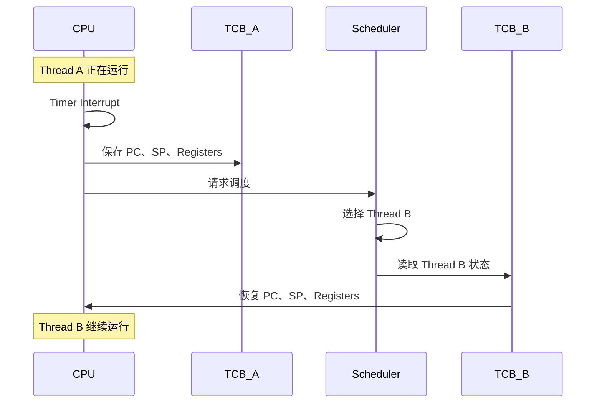
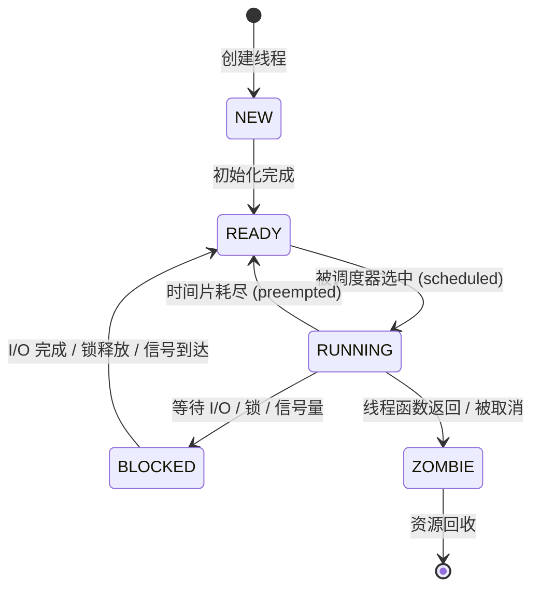
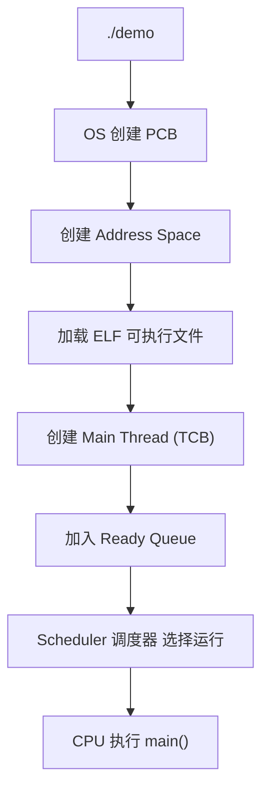

#  CS162 Lecture 2 Four Fundamental OS Concepts
  
<iframe width="560" height="315" src="https://www.youtube.com/embed/4FpG1DcvHzc?si=ACVbtxhbOcEOBix2" title="YouTube video player" frameborder="0" allow="accelerometer; autoplay; clipboard-write; encrypted-media; gyroscope; picture-in-picture; web-share" referrerpolicy="strict-origin-when-cross-origin" allowfullscreen></iframe>

# 操作系统的四大基本概念

回顾上一个Lecture1所讲的内容,我们可以把操作系统的的核心任务归结为一个词：**抽象 (Abstraction)**。它将裸机硬件的复杂性、丑陋性和危险性隐藏在一组干净、可编程的接口之后。

操作系统通过它扮演的三个角色,裁判,魔术师,胶水,给运行在计算机中的程序产生幻觉,将计算机硬件的复杂性统一封装为**系统调用接口 (System Call Interface)**

# 线程(Thread)-执行的抽象

## 并发与多处理幻觉

*有一个问题, 我们有一台计算机,它通常只有寥寥几个CPU核心,但是我们希望同时运行数十上百个程序（浏览器、编辑器、音乐播放器……）。如何在少量物理核心上“同时“执行大量程序？*

操作系统提出了**线程 (Thread)——一个独立的执行上下文。** 的概念. 

通过在多个线程之间快速切换（每秒钟数百到数千次），操作系统创造了多处理器幻觉 (Illusion of Multiple Processors)：每个程序仿佛独占一个 CPU。

## 线程的核心机制:线程控制块 (TCB) 与上下文切换

线程的核心机制在于：暂停时保存状态，恢复时还原状态。

### TCB 数据结构：字段解析与伪代码

**TCB (Thread Control Block，线程控制块)** 是操作系统内核中用于保存线程运行状态的**核心数据结构。**当一个线程被暂停时，它的全部“执行现场“被存入 TCB；当它恢复运行时，现场从 TCB 中还原

TCB 的关键字段(注意,是伪代码)：

    typedef struct TCB {
        // === 线程标识 ===
        tid_t        tcb_tid;          // 线程唯一 ID
        char         tcb_name[32];     // 线程名称（调试用）
    
        // === 执行状态 ===
        thread_state_t tcb_state;      // RUNNING / READY / BLOCKED / ZOMBIE
        int          tcb_priority;     // 调度优先级
    
        // === CPU 上下文（核心！）===
        struct {
            uint64_t  pc;              // 程序计数器 (Program Counter)
            uint64_t  sp;              // 栈指针 (Stack Pointer)
            uint64_t  regs[16];        // 通用寄存器 (General-Purpose Registers)
            uint64_t  flags;           // 状态标志寄存器 (EFLAGS / PSTATE)
        } tcb_context;
    
        // === 栈信息 ===
        void        *tcb_stack_base;   // 线程私有栈基址
        size_t       tcb_stack_size;   // 栈大小
    
        // === 调度信息 ===
        uint32_t     tcb_timeslice;    // 剩余时间片 (ticks)
        uint64_t     tcb_total_ticks;  // 累计运行时间
    
        // === 链接字段 ===
        struct TCB  *tcb_next;         // 链表指针（就绪队列）
        struct PCB  *tcb_owner;        // 所属进程
    } TCB;


**TCB 字段的四大组成**

| 原始笔记 | 英文 | TCB 中的体现 |
|---------|------|-------------|
| 线程状态 | Thread State | `tcb_state` — RUNNING / READY / BLOCKED / ZOMBIE |
| 线程优先级 | Thread Priority | `tcb_priority` — 供调度器决策 |
| 线程上下文 | Thread Context | `tcb_context` — PC, SP, 通用寄存器, 标志寄存器 |
| 线程调度信息 | Scheduling Info | `tcb_timeslice`, `tcb_total_ticks` |

### 上下文切换全流程

**上下文切换 (Context Switch)** 是操作系统最核心的运行时操作——保存当前线程的 CPU 寄存器到它的 TCB，然后从另一个线程的 TCB 中恢复 CPU 寄存器.上下文切换全流程如下:

假设:

我们的CPU当前正在运行线程A => 我们的CPU需要切换到线程B

1. 触发切换

导致CPU进行线程的切换的原因可能有: 

- 时间片用完: 线程A运行10ms,时间片耗尽,触发中断.(时间片 = 线程一次能独占 CPU 的最长时间。)
- 线程阻塞: 线程A调用了阻塞操作,如等待IO,导致CPU切换到其他线程.
- 线程调度: 调度器根据优先级或其他策略决定切换到其他线程.

2. 进入内核(kernel)

操作系统会从用户态进入到内核态, CPU会自动保存部分状态:

- PC: 程序计数器,保存当前指令的地址
- SP: 栈指针,保存当前栈帧的地址
- 通用寄存器: 保存通用寄存器的值
- 标志寄存器: 保存标志寄存器的值

3. 保存线程A的上下文

这个阶段, 操作系统会找到线程A的TCB,将当前寄存器中的状态写入到A的TCB中. 结果为TCB_A记录了A暂停时的全部状态. 

4. 调度器选择下一个线程

这个阶段, 调度器会根据优先级或其他策略选择下一个要运行的线程. 假设调度器选择了线程B,则进入下一个阶段.

5. 恢复线程B的上下文

这个阶段, 操作系统会找到线程B的TCB,将B的TCB中保存的状态恢复到寄存器中. 结果为CPU开始执行线程B.

6. 退出内核(kernel),返回到用户态

执行上下文切换的全流程,大致就可以总结为:
CPU运行A,遇到中断, 进入内核态, 保存A的执行执行上下文, 然后调度器根据优先级选择线程,例如B. 并将B的TCB中的状态恢复到寄存器中, 最后退出内核,返回到用户态, CPU运行B.

以下为一张简易的流程图:



## CPU的架构设计


目前CPU的架构设计主要分为两种,一种为**RISC(精简指令集)**,另一种为**CISC(复杂指令集)**.

RISC (Reduced Instruction Set Computer，精简指令集计算机)的指令集较为简单,秉承的设计哲学为:一条指令只做一件事情,执行效率高. 代表的架构有: ARM,RISC-V等.对线程的影响：寄存器更多 → TCB 保存的上下文更大 → 上下文切换开销更高；但流水线浅 → 中断响应延迟更可预测


CISC (Complex Instruction Set Computer，复杂指令集计算机)的指令集设计原则为一条指令要做很多件任务, 减少程序代码量,十分复杂. 代表的架构有: x86(Intel, AMD等). 对线程的影响：寄存器更少 → TCB 上下文更小 → 上下文切换更快；但通过微码 (Microcode) 将 CISC 指令拆解为类 RISC 的 μop 执行

## 线程的形式定义,状态和调度

线程的定义很简单, 线程是一个**独立的执行上下文**,由程序计数器 (PC)、寄存器集合 (Registers)、栈指针 (SP) 和私有栈 (Stack) 共同定义。一个线程正在执行时，其状态位于 CPU 的物理寄存器中；被挂起时，其状态保存在 TCB 中。

作为操作系统对于CPU工作单元的抽象,线程的状态机定义了线程在不同状态下的行为和转换.


### 线程状态机

线程的状态分为: 运行态 (Running)、就绪态 (Ready)、阻塞态 (Blocked) 和终止态 (Terminated).

状态转换图如下:



# 地址空间 (Address Space) — 内存的抽象

内存的抽象的核心为内存隔离与保护

核心问题: 如果操作系统直接让程序访问物理内存地址,会发生什么? 

答案肯定是会造成很多不好的结果,例如: 

- 程序 A 可能意外或恶意写入程序 B 的数据
- 程序可能破坏操作系统的内核数据结构
- 无法实现内存保护——多道程序设计的基石

因此,操作系统引入了**虚拟内存 (Virtual Memory)** 抽象: 每个程序拥有自己的独立地址空间,CPU硬件(MMU)负责将虚拟地址翻译为物理地址.


## 关于地址空间的定义

地址空间 (Address Space) 是一个进程可以访问（读/写/执行）的所有内存地址的集合，以及这些地址所关联的状态。

一个典型的地址空间由以下部分组成：
- 代码段 (Code Segment)：存放程序的指令
- 数据段 (Data Segment)：存放程序的全局变量和静态数据
- 堆 (Heap)：动态分配的内存区域
- 栈 (Stack)：函数调用时的局部变量和返回地址
```
高地址
┌───────────────┐
│ Stack         │
│ ↓             │
├───────────────┤
│               │
│   Free Space  │
│               │
├───────────────┤
│ Heap          │
│ ↑             │
├───────────────┤
│ Data          │
├───────────────┤
│ Code(Text)    │
└───────────────┘
低地址
```

地址空间提供了什么能力?

1. 隔离进程,让进程之间互不干扰.

程序创建的进程A和进程B之间井水不犯河水, 它们的地址空间相互独立. Chrome 不能修改VSCode中的内存

2. 提供保护,用户不能够随便访问内核

用户模式就不应该随便访问内核,否则会有普通程序,修改系统程序导致操作系统崩溃.

## 分页

在一般讨论的内存管理方案中,要求进程的物理地址空间是连续的. 但是我们需要一种允许进程的物理地址空间不连续的内存管理方案---分页.

分页同时避免了外部碎片和相关的压缩需求,这是困扰连续内存分配的两个问题.


## 分页的实现

实现分页的基本方法设计将物理内存分为固定大小的块, 称为**帧或页帧**,并将逻辑内存也分为同样大小的块,称为**页或页面**. 当需要执行一个进程的时候,其页从文件系统或备份储备等源处加载到内存的可用帧.

---

---
## 分段与页表的演进

| 特性         | 分段（Segmentation）               | 页表（Page Table / Paging）                    |
| ---------- | ------------------------------ | ------------------------------------------ |
| **出现时代**   | 早期 x86 等系统                     | 现代主流操作系统（Linux、Windows、macOS）              |
| **基本思想**   | 按程序逻辑划分内存                      | 按固定大小划分内存                                  |
| **划分方式**   | 代码段、数据段、堆段、栈段等                 | 固定大小的页（Page）                               |
| **地址转换**   | 通过每个段的 Base（起始地址）和 Bound（长度）转换 | 通过页表记录虚拟页到物理页帧的映射                          |
| **内存组织**   | 每个段大小不同                        | 所有页大小相同（通常 4KB）                            |
| **程序视角**   | 看到代码、数据、堆、栈等逻辑结构               | 看到连续的虚拟地址空间                                |
| **物理内存管理** | 需要寻找足够大的连续空间存放段                | 任意空闲页帧都可以存放页                               |          |
| **优点**     | 符合程序逻辑结构；支持权限控制与代码共享           | 无外部碎片；管理简单；支持虚拟内存                          |
| **缺点**     | 存在外部碎片（External Fragmentation） | 存在少量内部碎片（Internal Fragmentation）           |
| **典型问题**   | 空闲空间足够但不连续，导致大段无法分配            | 页表本身占用内存，需要 TLB 加速                         |

## 经典问题: 32位和64位地址空间的CPU区别

32位和64位的CPU区别可不简单是数字不同,CPU地址空间位数代表着CPU一次能够处理多宽的地址，以及能够寻址多大的虚拟地址空间。

32位 CPU 一次处理 32 位地址，寻址范围为 2^32 字节（约 4GB）, 而 64位 CPU 一次处理 64 位地址，寻址范围为 2^64 字节（约 16EB）

这其中,64位的CPU可以更快的处理完内存映射,而32位则无法一次映射.


# 进程 (Process) — 运行程序的抽象
进程 (Process) 的引入由三个核心需求驱动:

| 需求 | 说明 | 无进程的问题 |
|------|------|-------------|
| **可靠性** | Bug 程序不能影响其他程序 | 一个空指针解引用炸掉整个系统 |
| **安全性/隐私** | 恶意程序不能读取其他程序的数据 | 键盘记录器窃取银行密码 |
| **公平性** | 每个程序获得其应得的资源份额 | CPU/内存被一个程序垄断 |


## 在操作系统中,为什么单有线程不够?

线程只解决了"执行"的抽象，却不提供**隔离 (Isolation)**。同一地址空间的多个线程共享全部内存——一个线程的越界写入可以悄无声息地破坏另一个线程的数据（"无声的数据损坏"，最可怕的 bug 类型）。进程通过为每个运行程序赋予独立的地址空间，从根本上解决了这一问题。

**代价**：同一进程内的线程通过共享内存通信极其简单（读/写共享变量），而**跨进程通信 (IPC, Inter-Process Communication)** 则需要通过 OS 介入的机制（管道、消息队列、共享内存映射、Socket），代价高得多。这是保护与通信之间的根本权衡。

## 进程的诞生与 PCB

进程创建（Process Creation）的完整流程其实是在回答：

>**一个可执行文件（Program）是如何变成一个正在运行的进程（Process）的？**

### 一个简单的 C 例子

Linux 下最经典的进程创建方式：

    #include <stdio.h>
    #include <unistd.h>
    
    int main() {
        pid_t pid = fork();
    
        if (pid == 0) {
            printf("Child Process: PID=%d\n", getpid());
        } else {
            printf("Parent Process: PID=%d\n", getpid());
        }
    
        return 0;
    }

如果我们站在操作系统的角度去看,整个过程为: 

1.  Shell 创建进程

Shell 调用 `fork()` 创建子进程,子进程执行 `exec()` 加载程序,父进程等待子进程退出。

2.  内核创建 PCB
内核为每个进程创建一个 PCB（Process Control Block）,保存进程的状态和上下文信息。

PCB当中记录了PID,状态,打开文件,页表,调度信息等。

3.  创建地址空间

操作系统为新进程建立地址空间: 

```
┌─────────────┐
│ Code        │
├─────────────┤
│ Data        │
├─────────────┤
│ Heap        │
├─────────────┤
│ Stack       │
└─────────────┘
```

此时的进程就相当于 PCB + 地址空间的结合体


4.  加载可执行文件

操作系统读取ELF文件(Linux). 加载.text,.data, .heap, .stack 等段到地址空间中.

5. 创建主线程

每个进程都要至少有一个主线程,操作系统就会根据线程创建TCB,用来保存线程的执行上下文.

6. 放入就绪队列

操作系统将新创建的进程放入就绪队列,等待调度器分配CPU时间片.

7. 调度器分配 CPU 时间片

调度器从就绪队列中选择一个进程,分配给它一个 CPU 时间片,使其开始执行.

图解: 



# 双模式操作 (Dual Mode Operation) — 权限的抽象

用户程序是一段不可信的代码。如果任意程序都能执行特权指令（修改页表基址寄存器、禁用中断、直接访问磁盘控制器），那么整个系统的安全性和稳定性将荡然无存。一个恶意的或含有 bug 的程序就可以：

- 读取/修改任何进程的内存（破坏隐私和安全性）
- 篡改操作系统内核代码（夺取系统控制权）
- 通过死循环禁用中断来永久占据 CPU（破坏公平性）

所以我们需要使用双模式的操作模式的硬件强制机制来区分可信代码(内核)和不可信代码(用户程序).

## 系统调用 (System Call) 的全链路机制

系统调用（System Call）的全链路机制，本质是用户态程序访问内核态服务的一条受控通道：

1.  当应用程序（运行在用户态）需要执行文件读写、网络通信或进程管理等特权操作时，会先通过封装好的 API（如 Linux 的 glibc 包装函数）触发一条“系统调用指令”（例如 x86 的 `syscall` 或 `int 0x80`）

2. CPU 在执行该指令时会发生一次受控的特权级切换，从用户态（Ring 3）进入内核态（Ring 0），同时保存当前进程的上下文（寄存器、程序计数器、栈信息等），并跳转到操作系统预先定义好的系统调用入口（system call handler）

3. 内核随后根据系统调用号（syscall number）在系统调用表（syscall table）中查找对应的内核函数（如 `sys_read`、`sys_write`），执行具体的内核逻辑（可能涉及文件系统、设备驱动、网络栈或调度器），在完成后将结果写回寄存器或用户空间缓冲区

4. 最后内核执行“返回用户态”指令恢复之前保存的上下文，使 CPU 回到原来的用户程序继续执行。整个过程的关键在于：通过硬件支持的特权级切换 + 内核统一入口分发 + syscall table 映射 + 上下文保存与恢复，实现安全隔离下的受控资源访问。
