# Git代码回滚与找回的问题

背景: 2026-02-20 下午, 使用skills 搭配智能体编程时, 未设置.gitignore文件, 误将.skills文件进行上传,但不会回滚, 只能使用add加入暂存,然后提交

1.  # 认识Git的四个工作区域:

**·工作区** 

也称工作目录、工作副本，简单来说就是clone后我们看到的包含项目文件的目录。我们日常开发操作也是在工作区中进行的。  

**·本地仓库(.git)** 

在工作区中有个隐藏目录.git，这就是Git本地仓库的数据库。工作区中的项目文件实际上就是从这里签出（checkout）而得到的，修改后的内容最终提交后记录到本地仓库中。
## Tips: 不要手动修改.git目录的内容

**·暂存区** 

也称缓存区，逻辑上处于工作区和本地仓库之间，主要作用是标记修改内容，暂存区里的内容默认将在下一次提交时记录到本地仓库中。

**·远端仓库** 

团队协作往往需要指定远端仓库（一般是一个，也可以有多个），团队成员通过跟远端仓库交互来实现团队协作。

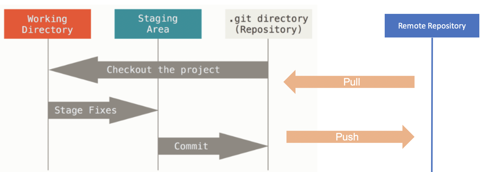
## 一个基本的Git工作流程如下：
1.在工作区中修改文件

2.暂存文件，将文件存放在暂存区

3.将改动从暂存区提交到本地仓库

4.从本地仓库推送到远端仓库

2.  # 常见的代码回滚场景

##  仅在工作区修改时
当文件在工作区修改，还没有提交到暂存区和本地仓库时，可以用 git checkout -- 文件名 来回滚这部分修改。
不过需要特别留意的是这些改动没有提交到Git仓库，Git无法追踪其历史，一旦回滚就直接丢弃了。

示例：
用 git status查看，还没提交到暂存区的修改出现在"Changes not staged for commit:"部分。

执行以下命令回滚工作区的修改：

    git checkout -- build.sh

##  回滚场景：已添加到暂存区时
即执行过 git add 添加到暂存区，但还没commit，这时可以用 git reset HEAD 文件名 回滚。
通过git status可以看到相关提示：

执行以下命令回滚暂存区的修改：

    git reset HEAD build.sh
回滚后工作区会保留该文件的改动，可重新编辑再提交，或者 git checkout -- 文件名 彻底丢弃修改。

##  回滚场景：已commit，但还没有push时
即已经提交到本地代码库了，不过还没有push到远端。这时候可用 git reset 命令，命令格式为：

    git reset <要回滚到的commit> 或者 git reset --hard <要回滚到的commit>

需注意的是，提供的是 要回滚到的commit，该commit之后的提交记录会被丢弃。
git reset 默认会将被丢弃的记录所改动的文件保留在工作区中，以便重新编辑和再提交。加上 --hard 选项则不保留这部分内容，需谨慎使用。

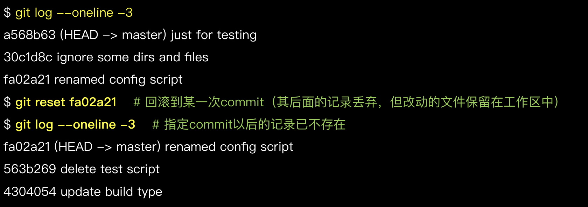

##  回滚场景：修改本地最近一次commit
有时commit之后发现刚才没改全，想再次修改后仍记录在一个commit里。利用 “git reset” 可达到这个目的，不过，Git还提供了更简便的方法来修改最近一次commit。
命令格式如下：

    git commit --amend [ -m <commit说明> ]

如果命令中不加-m <commit说明>部分，则Git拉起编辑器来输入日志说明。
请注意，**“git commit --amend” 只可用于修改本地未push的commit，不要改动已push的commit！**

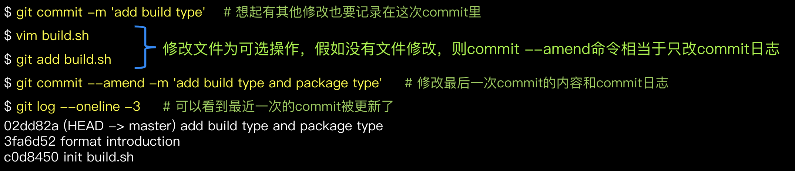

##  回滚场景：已push到远端时
**注意！此时不能用 “git reset”，需要用 “git revert”！**

之所以这样强调，是因为 "git reset"会抹掉历史，用在已经push的记录上会带来各种问题；而 “git revert” 用于回滚某次提交的内容，并生成新的提交，不会抹掉历史。

| 命令 | 是否抹掉历史 |  使用场景 |
|------|------|------|
| git reset | 是，回滚的历史将消失 |  本地未push的记录  |
| git revert | 否，历史记录保留，回滚后重新生成提交记录 |  回滚已push的内容 |

示例:

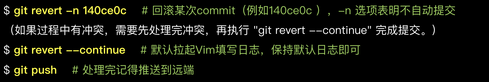

**过程中如果遇到问题（如处理冲突时搞乱了），可用 git revert --abort 取消本次回滚行为。**

如果要回滚的是一个合并commit，revert时要加上"-m <父节点序号>"，指定回滚后以哪个父节点的记录作为主线。合并的commit一般有2个父节点，按1、2数字排序，对于要回滚“分支合入主干的commit”，常用"-m 1"，即用主干记录作为主线。
回滚合并commit是一个较为复杂的话题，作为一般性建议，应避免回滚合并commit。

**reset与revert对比**

分支初始状态如下：

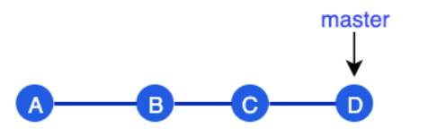

如果执行 git reset B ，工作区会指向 B，其后的提交（C、D）被丢弃。

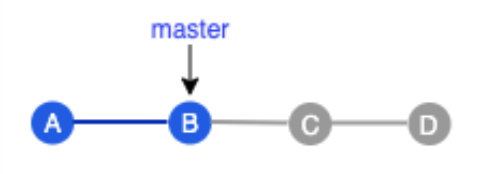

此时如果做一次新提交生成 C1，C1跟C、D没有关联。

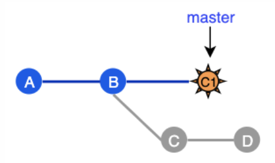

如果我们在第一次提交状态时执行 git revert B，回滚了B提交的内容后生成一个新commit E，原有的历史不会被修改。

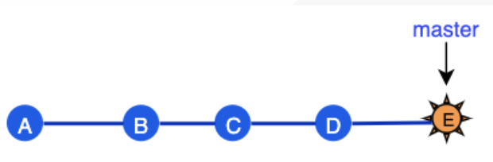

# 找到已删除的内容

虽说Git是一款强大的版本管理工具，一般来说，提交到代码库的内容不用担心丢失，然而某些特殊情况下仍免不了要做抢救找回，例如不恰当的reset、错删分支等。这就是 git reflog派上用场的时候了。

"git reflog"是恢复本地历史的强力工具，几乎可以恢复所有本地记录，例如被reset丢弃掉的commit、被删掉的分支等，称得上代码找回的“最后一根救命稻草”。

然而需要注意，**并非真正所有记录"git reflog"都能够恢复，有些情况仍然无能为力**：

1. 非本地操作的记录
"git reflog"能管理的是本地工作区操作记录，非本地（如其他人或在其他机器上）的记录它就无从知晓了。
2. 未commit的内容
例如只在工作区或暂存区被回滚的内容（git checkout – 文件 或 git reset HEAD 文件）。
3. 太久远的内容
"git reflog"保留的记录有一定时间限制（默认90天），超时的会被自动清理。另外如果主动执行清理命令也会提前清理掉

# reflog - 恢复到特定commit

一个典型场景是执行reset进行回滚，之后发现回滚错了，要恢复到另一个commit的状态。

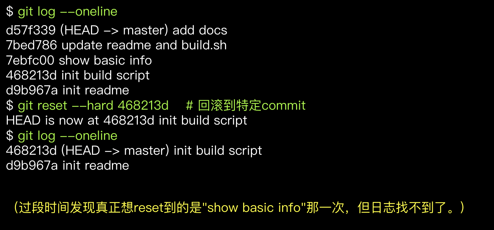

我们通过git reflog查看commit操作历史，找到目标commit，再通过reset恢复到目标commit。

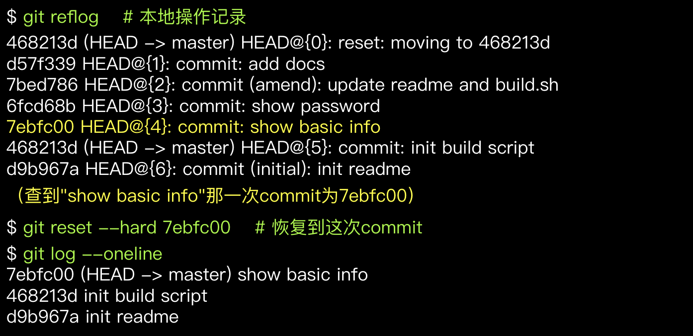

通过这个示例我们还可以看到清晰、有意义的commit log非常有帮助。假如commit日志都是"update"、"fix"这类无明确意义的说明，那么即使有"git reflog"这样的工具，想找回目标内容也是一件艰苦的事。

# reflog - 恢复特定commit中的某个文件

场景：执行reset进行回滚，之后发现丢弃的commit中部分文件是需要的。
解决方法：通过reflog找到目标commit，再通过以下命令恢复目标commit中的特定文件。

    git checkout <目标commit> -- <文件>

示例：
reset回滚到commit 468213d 之后，发现原先最新状态中（即commit d57f339）的 build.sh 文件还是需要的，于是将该文件版本单独恢复到工作区中。

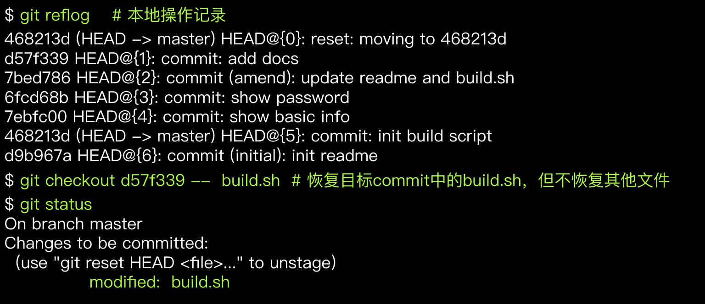

# reflog - 找回本地误删除的分支

场景：用"git branch -D"删除本地分支，后发现删错了，上面还有未合并内容！
解决方法：通过reflog找到分支被删前的commit，基于目标commit重建分支。

    git branch <分支名> <目标commit>

reflog记录中，“to <分支名>”（如 moving from master to dev/pilot-001） 到切换到其他分支（如 moving from dev/pilot-001 to master）之间的commit记录就是分支上的改动，从中选择需要的commit重建分支。
示例：

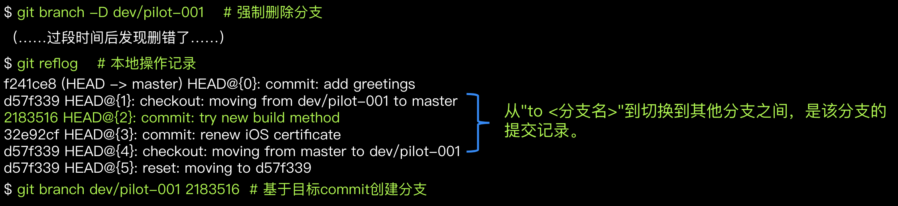

# 找回合流后删除的分支

>作为Git优秀实践之一，开发分支合流之后即可删掉，以保持代码库整洁，只保留活跃的分支。
>在合流后仍保留着分支，主要出于“分支以后可能还用得到”的想法。
>其实大可不必。
>已合入主干的内容不必担心丢失，随时可以找回，包括从特定commit重建开发分支。
>并且，实际需要用到旧开发分支的情况真的很少。
>一般来说，即使功能有bug，也是基于主干拉出新分支来修复和验证。

假如要重建已合流分支，可通过主干历史找到分支合并记录，进而找到分支节点，基于该commit新建分支，例如：

    git branch dev/feature-abc 1f85427

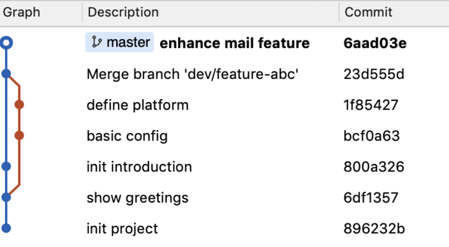

# 在本地使用git pull 拉取远程仓库后进行回滚

    git reset --hard ORIG_HEAD

当你执行 git pull（或 git merge）时，Git 会自动保存一个特殊引用：ORIG_HEAD，它指向 pull 之前的 HEAD 位置.

执行后:
1.  分支会完全回到 git pull 之前的状态
2.  远程拉取的提交、合并提交都会被丢弃
3.  文件内容恢复原样

*如果使用 git remote add <name> 不小心添加了错误的远程仓库, 使用这个命令取消绑定的远程仓库然后再回滚代码*
        git remote remove origin

# 最后关于代码回滚的一些建议:

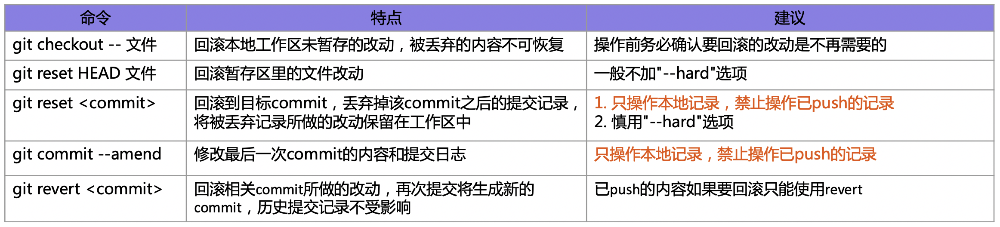

##  此外，总体来讲，回滚要谨填，不要过于依赖回滚功能，避免使用"git push -f"
