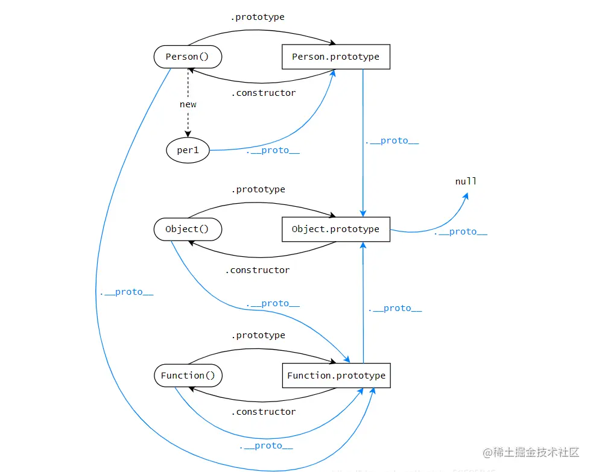

# 什么是JS原型继承

首先,继承这个词导致的歧义很大, 凯尔辛普森说:传统语言(Java/C++)的继承 = 复制

将父类的代码复制给子类一份

而JS中根本就不是复制,而是对象链接

## JS 里是两个对象互相链接，靠内部的 [[Prototype]] 链连接。

当我们去访问一个对象上的属性/方法时:

1.  js会先查看这个对象自己有没有这些属性方法
2.  如果没有的话 就会沿着原型链向上查找链接的对象
3.  如果查找到了就会进行获取使用, 找不到就会一直向上查找直到链顶部

## JS的原型继承的说法是TM扯淡, 它不是向下复制, 而是向上查找

JS不是向下继承,而是向上委托,叫做(Behavior Delegation)行为委托

然后这哥们自己造了一个词叫OLOO: Objects Linked to Other Objects(对象关联对象)

不管用 class,new ,prototype JS的底层永远都只是在:

**对象 ← 链接 → 原型对象**

所以我们使用ES2015的class 关键字时, JS底层其实还是在实现原型链查找,不是复制
class 就TM是个语法糖

# 原型链是怎么进行委托的
---

---
核心:
1. **每个对象都有 `__proto__`**（隐式原型）
2. **每个函数都有 `prototype`**（显式原型）
3. **原型链就是：对象的 __proto__ 指向它的构造函数的 prototype**

**对象 → __proto__ → 构造函数.prototype → __proto__ → Object.prototype → __proto__ -> null**

当你**访问对象的属性/方法**时，JS 会按这个顺序查找：
1. 先看**对象自己**有没有
2. 没有 → 去 `__proto__`（原型）里找
3. 还没有 → 继续去原型的 `__proto__` 找
4. 直到找到 `null`，返回 `undefined`

## 实际案例
1. `{}.__proto__ === ?`
   → `Object.prototype`
2. `[].__proto__ === ?`
   → `Array.prototype`
3. `Function.__proto__ === ?`
   → `Function.prototype`
4. 原型链的终点是什么？
   → `null`
