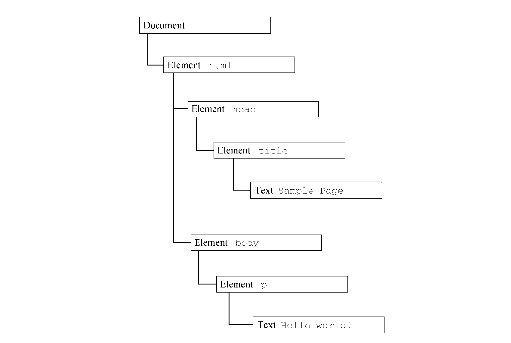

#  灵魂三问: DOM是什么? DOM有什么用? 我可以使用DOM做哪些事情?

## 1.  DOM是什么?

在<<JavaScript高级程序设计>>一书中, 关于DOM的描述是:"*文档对象模型（DOM，Document Object Model）是 HTML 和 XML 文档的编程接口。*"

所以通俗易懂的理解DOM,那么**DOM其实就是一个编程接口**, 一个可以让其他编程语言(js,java,python,c++等)通过这个接口去操作HTML以及XML文档的接口;

**关于DOM的构成:**

在任何 HTML 或 XML 文档都可以用 DOM 表示为一个由节点构成的层级结构。
节点又分为很多类型, 每种类型对应着文档中不同的value和（或）tap，也都有自己不同的特性、数据和方法，而且与其他类型有某种关系。

以下面的代码为例:
    
    <html>
    <head>
    <title>Sample Page</title>
    </head>
    <body>
    
Hello World!

    </body>
    </htm

则对应转换的DOM树结构应该为:

在这个层级结构中, document 节点表示每个文档的根节点.
根节点的唯一子节点是 html 元素，称之为文档元素（documentElement）。

文档元素相当于这个文档最外层的元素, 所有其他元素都存在于这个元素之内,也就相当于其他元素的父元素.

注意⚠️: *在 HTML 页面中，文档元素始终是<html>元素。在 XML 文档中，则没有这样预定义的元素，任何元素都可能成为文档元素。*

在HTML文档中, 我们看到的每一个标记,都可以表示为这个树形文档中的一个节点

>元素节点表示一个HTML元素 
>属性节点表示属性 
>文档类型节点表示文档类型 
>注释节点表示注释 

示例: 

    <!DOCTYPE html>  <!-- 文档类型节点 -->
    <html lang="zh-CN">
      <head>
        <meta charset="UTF-8">
        <title>DOM 节点示例</title>
      </head>
      <body>
        <!-- 这是一条注释  -->  <!-- 注释节点 -->
    
        
Hello DOM

        <!-- ↑ 元素节点      ↑ 属性节点 -->
      </body>
    </html>

**在JavaScript中实现的Node接口类型中一共有12种节点类型, 它们都继承Node类型作为一个基本类型,因此所有类型都共享相同的基本属性和方法。**

每个节点都有nodeType属性来表示它们的节点类型,
节点的类型由定义在 Node 类型上的 12 个数值常量表示,例如ELEMENT_NODE表示元素节点,TEXT_NODE表示文本节点等。

可以通过任意节点的nodeType属性来与数值常量进行比较,从而推断节点的类型

**重要的几个节点类型**

1.  Document类型
2.  Element类型
3.  Text类型
4.  Comment类型

其中, Text ,Comment 类型无子节点

## 2.  DOM有什么作用?

在<<JavaScript高级程序设计>>中,关于DOM最直观的作用就是：

*DOM 表示由多层节点构成的文档，通过它开发者可以添加、删除和修改页面的各个部分。*

换个角度来想, 如果没有DOM规范统一文档的编程接口,那么后果将会不堪设想:

如果没有 DOM：

**没有统一的编程接口**

   每个浏览器可能用完全不同的方式暴露页面结构（比如 Netscape 和 IE 在 90 年代就曾各自为政）。
   **开发者需要为不同浏览器写不同的代码，维护成本极高。**

**无法动态更新页面**

   页面一旦加载完成，内容就是“静态”的。想改变文字、图片或布局？只能重新请求整个页面（像早期 CGI 网站那样）。
   **无法实现现代 Web 应用的交互体验（如聊天窗口、实时搜索、拖拽排序等）。**

**脚本与内容耦合混乱**

   没有结构化的对象模型，JavaScript 只能通过字符串拼接或非标准方式操作 HTML，极易出错且难以调试。
   例如：手动拼接 ... 字符串插入到某个位置，容易破坏 HTML 结构或引发 XSS。

**事件处理难以绑定**

   **DOM 不仅管理结构，还定义了事件模型（如 addEventListener）**。没有它，点击、输入等交互行为无法可靠绑定到特定元素上。

**阻碍 Web 技术生态发展**

   **像 React、Vue、jQuery 等现代前端框架/库都建立在 DOM 之上。**
   没有 DOM，这些工具根本无法存在。
   自动化测试（如 Puppeteer、Cypress）也无法通过操作 DOM 来模拟用户行为。

## 3.  如何使用和操纵DOM?

**实现DOM编程,可以通过以下方式:**

**1. 动态脚本:**

   script元素用于向网页中插入 JavaScript 代码，可以是 src 属性包含的外部文件，也可以是作为该元素内容的源代码.
通过以下代码进行基础的DOM编程:
    
        // 1. 创建 <script> 元素
        const script = document.createElement('script');
        // 2. 设置属性
        script.src = 'https://example.com/script.js'; // 外部脚本
        // 或者
        script.textContent = 'console.log("动态执行的代码");'; // 内联脚本
        // 3. 监听加载状态（可选）
        script.onload = () => console.log('脚本加载成功');
        script.onerror = () => console.error('脚本加载失败');
        // 4. 插入到 DOM（通常插入到 <head> 或 <body> 末尾）
        document.head.appendChild(script);
        // 或
        document.body.appendChild(script);

**2. 动态样式**

CSS 样式在 HTML 页面中可以通过两个元素加载。
**link元素用于包含 CSS 外部文件，而style元素用于添加嵌入样式。**
       
       //这是一个基本的link元素
      <link rel="stylesheet" type="text/css" href="styles.css">

通过DOM编程, 可以创建一个相同功能的link元素:

    let link = document.createElement("link");
    link.rel = "stylesheet";
    link.type = "text/css";
    link.href = "styles.css";
    let head = document.getElementsByTagName("head")[0];
    head.appendChild(link);
    
注意⚠️: *应该把<link>元素添加到<head>元素而不是<body>元素，这样才能保证所有浏览器都能正常运行。*

为了方便整理元素结构, 也可以将以上抽象为一个函数:
    
      function loadStyles(url){
      let link = document.createElement("link");
      link.rel = "stylesheet";
      link.type = "text/css";
      link.href = url;
      let head = document.getElementsByTagName("head")[0];
      head.appendChild(link);
      }
      //然后调用函数
      loadStyles("styles.css")

**通过style元素添加内嵌样式**

例如:

    

相当于:

    let style = document.createElement("style");
    style.type = "text/css";
    style.appendChild(document.createTextNode("body{background-color:red}"));
    let head = document.getElementsByTagName("head")[0];
    head.appendChild(style);
    
    
**3. 操作表格**

通过 DOM 编程创建<table>元素，通常要涉及大量标签，包括表行、表元、表题，等等。
通过DOM创建一下表格的过程如下: 

    <table border="1" width="100%">
    <tbody>
    <tr>
    <td>Cell 1,1</td>
    <td>Cell 2,1</td>
    </tr>
    <tr>
    <td>Cell 1,2</td>
    <td>Cell 2,2</td>
    </tr>
    </tbody>
    </table>
    
相当于执行以下DOM操作: 

    // 创建表格
    let table = document.createElement("table");
    table.border = 1;
    table.width = "100%";
    
    // 创建表体
    let tbody = document.createElement("tbody");
    table.appendChild(tbody);
    
    // 创建第一行
    let row1 = document.createElement("tr");
    tbody.appendChild(row1);
    let cell1_1 = document.createElement("td");
    cell1_1.appendChild(document.createTextNode("Cell 1,1"));
    row1.appendChild(cell1_1);
    let cell2_1 = document.createElement("td");
    cell2_1.appendChild(document.createTextNode("Cell 2,1"));
    row1.appendChild(cell2_1);
    
    // 创建第二行
    let row2 = document.createElement("tr");
    tbody.appendChild(row2);
    let cell1_2 = document.createElement("td");
    cell1_2.appendChild(document.createTextNode("Cell 1,2"));
    row2.appendChild(cell1_2);
    let cell2_2= document.createElement("td");
    cell2_2.appendChild(document.createTextNode("Cell 2,2"));
    row2.appendChild(cell2_2);
    // 把表格添加到文档主体
    document.body.appendChild(table);
    
显而易见的,如果以这种方式去制作一个表格,我们将会累死
所有更推荐使用DOM HTML 中为tbody,table,tr 添加的属性和方法;

---
``<table>``元素添加了以下属性和方法：

 **caption**，指向``<caption>``元素的指针（如果存在）； 
 **tBodies**，包含``<tbody>``元素的 HTMLCollection； 
 **tFoot**，指向``<tfoot>``元素（如果存在）； 
 **tHead**，指向``<thead>``元素（如果存在）； 
 **rows**，包含表示所有行的 HTMLCollection； 
 **createTHead()** ，创建``<thead>``元素，放到表格中，返回引用； 
 **createTFoot()** ，创建``<tfoot>``元素，放到表格中，返回引用； 
 **createCaption()** ，创建``<caption>``元素，放到表格中，返回引用； 
 **deleteTHead()** ，删除``<thead>``元素； 
 **deleteTFoot()** ，删除``<tfoot>``元素； 
 **deleteCaption()** ，删除``<caption>``元素； 
 **deleteRow(pos)** ，删除给定位置的行； 
 **insertRow(pos)** ，在行集合中给定位置插入一行。 

``<body>``元素添加了以下属性和方法：

 **rows**，包含``<tbody``>元素中所有行的 HTMLCollection； 
 **deleteRow(pos)** ，删除给定位置的行； 
 **insertRow(pos)** ，在行集合中给定位置插入一行，返回该行的引用。 

``<tr>`` 元素添加了以下属性和方法：

 **cells**，包含``<tr>`` 元素所有表元的 HTMLCollection； 
 **deleteCell(pos)** ，删除给定位置的表元； 
 **insertCell(pos)** ，在表元集合给定位置插入一个表元，返回该表元的引用。 
 
---

通过以上提供的方法对表格创建进行重构:

    // 创建表格
    let table = document.createElement("table");
    table.border = 1;
    table.width = "100%";
    
    // 创建表体
    let tbody = document.createElement("tbody");
    table.appendChild(tbody);
    
    // 创建第一行
    tbody.insertRow(0);
    tbody.rows[0].insertCell(0);
    tbody.rows[0].cells[0].appendChild(document.createTextNode("Cell 1,1"));
    tbody.rows[0].insertCell(1);
    tbody.rows[0].cells[1].appendChild(document.createTextNode("Cell 2,1"));
    
    // 创建第二行
    tbody.insertRow(1);
    tbody.rows[1].insertCell(0);
    tbody.rows[1].cells[0].appendChild(document.createTextNode("Cell 1,2"));
    tbody.rows[1].insertCell(1);
    tbody.rows[1].cells[1].appendChild(document.createTextNode("Cell 2,2"));
    
    // 把表格添加到文档主体
    document.body.appendChild(table);
    
    
**4. 使用NodeList**
